# Python 101 For Hackers


# Introduction

## Welcome and course introduction


## What is Python?


## Why learn Python as a hacker?


## Python2 vs Python3


# Setup

## How to install VirtualBox

* https://www.virtualbox.org

## How to install Kali Linux

* https://www.kali.org/get-kali/

## The Python interpreter

### Python3


### Python2


### Show Help

`python3 man`


### Run Code Snippet 

`python3 -c 'print("hello world")'`


### New Bash Session

`python3 -c 'print("hello world")'`


## How to run a Python script 

### Python 3

`python3 calculate-demo.py`


### Python 2

`python2 calculate-demo.py`


### Run it directly

```
#!/bin/python3
print(1 + 1)
```

after 

`chmod +x calculate-demo.py`

and 

`./calculate-demo.py`


### Optional Main Function

> If there is '__main__', this will be executed first

```
#!/bin/python3

print(1 + 1)
print(__name__)

if __name__ == "__main__":
    print("do something")
```


## Python syntax

> Always use same Indentation. For Example double space or tab. Mixing it inside a script will cause error.


### Official Python Documentation

* https://docs.python.org/3/


### Included Help in Python

#### Search Help for specific function

`python3`


`help(print)`

> *print* ins this case what I want so search in help


#### See arguments for specific function

`dir(print)`


### Python Style Guide

PEP 8 – Style Guide for Python Code
https://peps.python.org/pep-0008/v

# Python 101

## Variables & data types

```
from xmlrpc.client import boolean


name  = "neut"

print(name)

name_length = 4
print(name_length)

name, name_length = "neut", 4

print(type(name))
print(type(name_length))

name_length = "4"
print(type(name_length))

name_length = int("4")
print(type(name_length))


name_length = 4
Name_length = 5

print(name_length)
print(Name_length)

name_list = ["neut", "247CTF", "blabla"]
print(type(name_list))

name1, name2, name3 = name_list
print(name1)
print(name2)
print(name3)

name_tuple = ("neut", "247CTF")
print(type(name_tuple))
print(name_tuple)

name_dictionary = {"neut": 4, "247CTF": 6}
print(type(name_dictionary))
print(name_dictionary)

name_boolean = False 
print(type(name_boolean))
print(name_boolean)

name_range = range(6)
print(type(name_range))
print(name_range)

name_bytes = b"neu2"
print(type(name_bytes))
print(name_bytes)

```

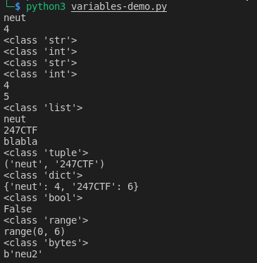


## Numbers

```
t1_int = 1
print(t1_int)
print(type(t1_int))

t1_float = 1.0
print(t1_float)
print(type(t1_float))

t1_complex = 3.14j
print(t1_complex)
print(type(t1_complex))

t1_hex = 0xa
print(t1_hex)
print(type(t1_hex))

t1_octal = 0o10
print(t1_octal)
print(type(t1_octal))

print(1 + 0x1 + 0o1)

# distance to 0
print(abs(4))
print(abs(-4))

print(round(8.4))
print(round(8.5))
print(round(8.6))

print(bin(8))

print(hex(8))
```

**Output:**

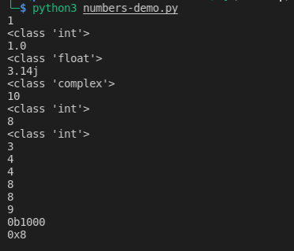

## String formatting

```
string1 = "I am a string!"
string2 = 'I am a string too!'

print(string1)
print(string2)

string3 = """I am a long
long
string!"""
print(string3)

string4 = "I\"m a string"
print(string4)

string4 = 'I\'m a string'
print(string4)

string5 = "I'm a string"
print(string5)

string6 = "I\" a string \nI\"m on a newline!"
print(string6)

string7 = "\\ \x41\x42\x43"
print(string7)

string8 = "aaaaaaaaaa"
print(string8)

string9 = "a" * 10
print(string9)

print(len(string9))


print("string" in string4)
print("blabla" in string4)

print(string4.startswith("I"))
print(string4.startswith("n"))

print(string4.index("string"))
print(string4.upper())
print(string4.lower())

messy_string = "      Messy string!      "
print(messy_string)
print(messy_string.strip())
print(messy_string.replace("!", "?").strip())
print(messy_string.replace("string", "example").strip())
print(messy_string.split())

messy_string2 = "Messy,string!"
print(messy_string2.split(","))
print(messy_string2.split())

string4 = "I am a string!"
print(string4)
print(string4.encode())
print(string4.encode("utf-8"))

print(string4.rjust(25))
print(string4.rjust(25, "X"))

print(string4.ljust(25))
print(string4.ljust(25, "X"))

print("I am " + "a string")
print("String 4 is " + str(len(string4)) + " characters long!")

print(1 + 1)
print("1" + "1")
print(type("1" + "1"))

print("string4 is {} characters long!".format(len(string4)))

print("{} {} {}".format(len(string4), 5.0, 0x12))
print("{0} {2} {1}".format(len(string4), 5.0, 0x12))
print("{length}".format(length=len(string4)))

length = len(string4)
print(f"string4 is {length} characters long!")

print(f"string4 is {length:.2f} characters long")
print(f"string4 is {length:.3f} characters long")
print(f"string4 is {length:.4f} characters long")

print(f"string4 is {length:x} characters long")
print(f"string4 is {length:b} characters long")
print(f"string4 is {length:o} characters long")

print("string4 is %d characters long!" % len(string4))
print("string4 is %f characters long!" % len(string4))
print("string4 is %x characters long!" % len(string4))
```

**Output:**

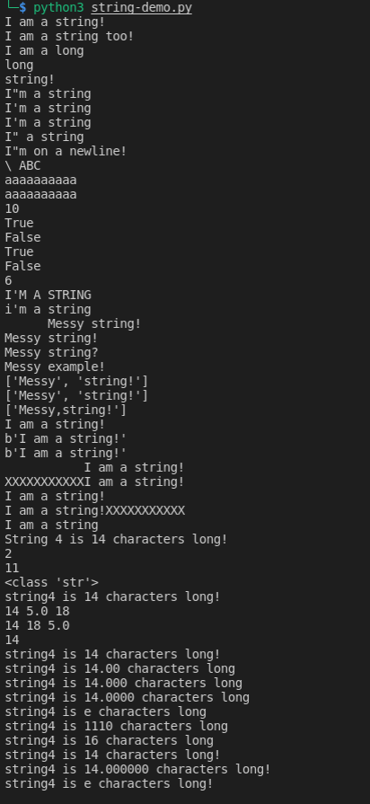

## Booleans & operators

```
valid = True
not_valid = False

print(valid)
print(not_valid)

print(valid == True)
print(not_valid == True)

print(valid != True)
print(not_valid != True)

print(not valid)
print(not not_valid)

# Not working in Python
# print(!valid)
# print(!not_valid)

print((10 < 9) == True)
print((10 == 10) == True)
print((10 != 10) == True)
print((10 >= 10) == True)
print((10 <= 10) == True)
print((10 > 9) == True)

print("------------")

print(10 > 5 and 10 < 5)
print(10 > 5 or 10 < 5)

print(bool(0))
print(bool(1))

print(bool(0) == False)
print(bool(1) == True)

print(10 + 10)
print(10 - 10)
print(10 / 10)
print(10 // 10)

print(10 / 3)
print(10 // 3)

print(10 * 10)
print(10 ** 10)

print(10 % 10)

print(10 % 3)

x = 10
print(x)

x = x + 1
print(x)

x += 1
print(x)

x -= 1
print(x)

x *= 5
print(x)

x /= 5
print(x)

x = 13
print(bin(x)[2:].rjust(4, "0"))

y = 5
print(bin(y)[2:].rjust(4, "0"))

print(bin(x & y)[2:].rjust(4, "0"))

print(x & y)

print(bin(x | y)[2:].rjust(4, "0"))

print("------------")

print(bin(x)[2:].rjust(4, "0"))
print(bin(x >> 1)[2:].rjust(4, "0"))
print(bin(x >> 2)[2:].rjust(4, "0"))
print(bin(x >> 3)[2:].rjust(4, "0"))
print(bin(x >> 4)[2:].rjust(4, "0"))

print(bin(x << 1)[2:].rjust(4, "0"))
```

**Output:**

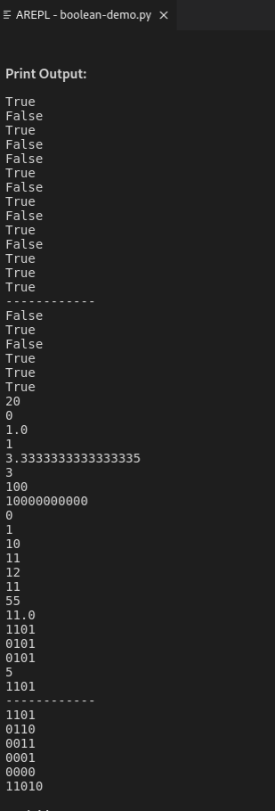

## Tuples

```
tuple_items = ("Item1", "Item2", "Item3")
print(tuple_items)
print(type(tuple_items))

tubple_numbers = (1, 2, 3)
print(tubple_numbers)
print(type(tubple_numbers))

tuple_repeat = ('Combine!',) * 4
print(tuple_repeat)
print(type(tuple_repeat))

mixed_tuple = ("A", 1, ("A", 1))
print(mixed_tuple)
print(type(mixed_tuple))

tuple_combined = tuple_items + tubple_numbers
print(tuple_combined)
print(type(tuple_combined))

item1, item2, item3 = tuple_items
print(item1)
print(item2)
print(item3)

print("Item2" in tuple_items)
print("Item3" in tuple_items)
print("Item4" in tuple_items)

print(tuple_items.index("Item2"))
 
print(tuple_items[0])
print(tuple_items[1])
print(tuple_items[2])

print(len(tuple_items))

print(tuple_items[-1])
print(tuple_items[-2])


print(tuple_items[0:2])
print(tuple_items[:2])
print(tuple_items[-3:-1])

string1 = "I am a string!"
print(string1[0:4])
print(string1[:-1])
print(string1[-1])
```

**Output:**

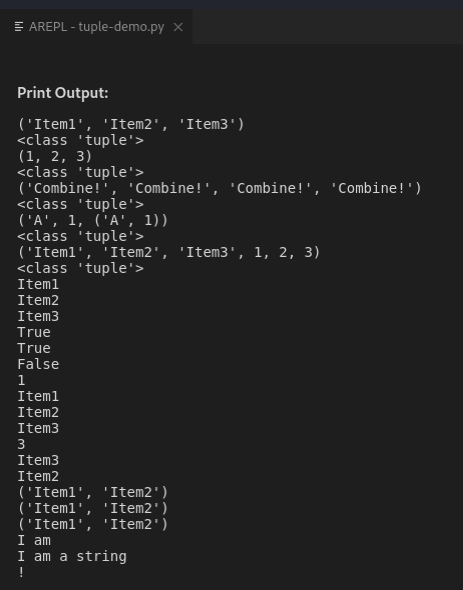


## Lists

```
list1 = ["A", "B", "C", "D", "E", "F"]
print(list)

list2 = ["A", 1, 2.0, ["H"], [], list(), ("A"), False]
print(list2)
print(type(list2))

print(list1[0])
print(list1[-1])
print(list2[3][0])
print(list2[3][-1])

list1[0] = "X"
print(list1)

del list1[0]
print(list1)

list1.insert(0, "A")
print(list1)

del list1[0]
print(list1)

list1 = ["A"] + list1
print(list1)

list1.append("G")
print(list1)

print(max(list1))
print(min(list1))

print(list1.index("C"))
print(list1[list1.index("C")])

list1.reverse()
print(list1)

list1 = list1[::-1]
print(list1)

print(list1.count("A"))
list1.append("A")
print(list1)
print(list1.count("A"))

list1.pop()
print(list1)

list3 = ["H", "I", "J"]
print(list3)

list1.extend(list3)
print(list1)

list1.clear()
print(list1)

list4 = [8, 12, 5, 6, 17, 2]
print(list4)

list4.sort()
print(list4)

list4.sort(reverse=True)
print(list4)

list5 = list4
print(list4)
print(list5)

list5[2] = "X" 
print(list5)
print(list4)

list6 = list4.copy()
print(list4)
print(list6)

list6[2] = "A"
print(list4)
print(list6)

list7 = ["1", "2", "3"]
print(list7)

list8 = list(map(float, list7))
print(list8)
```

**Output:**
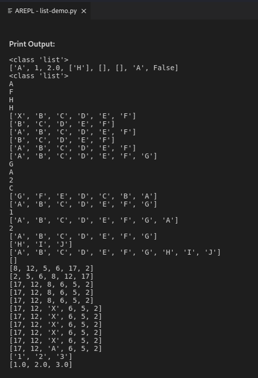

## Dictionaries

```
dict1 = {"a": 1, "b": 2, "c": 3}
print(dict1)
print(type(dict1))
print(len(dict1))

print(dict1["a"])
print(dict1.get("a"))

print(dict1.keys())
print(dict1.values())
print(dict1.items())

dict1["a"] = 1
print(dict1)

dict1["d"] = 4
print(dict1)

dict1["a"] = 0
print(dict1)

dict1.update({"a": 1})
print(dict1)

dict1.pop("d")
print(dict1)

del dict1['c']
print(dict1)

dict1['c'] = {"a": 1, "b": 2}
print(dict1)

dict2 = {}
print(dict2)

dict3 = dict()
print(dict3)
```

**Output:**


## Sets

```
set1 = {"a", "b", "c"}
print(set1)
print(type(set1))


set2 = {"a", "a", "a"}
print(set2)
print(len(set2))

set3 = {"a", 0, True}
print(set3)

set4 = set(("b", 1, False))
print(set4)

set1.add("d")
print(set1)

set3.update(set4)
print(set3)

list1 = ["a", "b", "c"]
set4 = {4, 5, 6}
print(list1)
print(set4)
set4.update(list1)
print(set4)

set5 = {4, 5, 6}
set6 = set4.union(set4)
print(set6)

set4.remove(4)
print(set4)

set4.discard(4)
print(set4)

print(set1)
set1.pop()
print(set1)
```

**Output:**
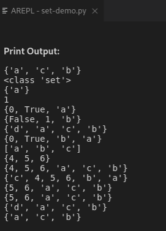


## Conditionals

```
if True:
    print("True")
    

if False:
    print("False")
    
if not False:
    print("not false")

if 1 < 1: 
    print("1 < 1")
elif 1 <= 1:
    print("1 <= 1")
else:
    print("else 1")
    
if 1 < 1:
    print("1 < 1")
elif 1 <= 1:
    print("1 <= 1")
elif 2 <= 2:
    print("2 <= 2")
else:
    print("else reached")
    
if 1 > 0 and 0 < 1:
    print("1 > 0 and 0 < 1")

if 1 < 0 and 0 < 1:
    print("1 < 0 and 0 < 1")
    
if 1 < 0 or 0 < 1:
    print("1 < 0 or 0 < 1")
    
if (1 < 0 or 0 < 1) and 1 == 1:
    print("(1 < 0 or 0 < 1) and 1 == 1")
    

if (1 < 0 or 0 < 1) or 1 == 2:
    print("(1 < 0 or 0 < 1) or 1 == 2")
    
if 0 < 1: print("0 < 1")

print("1 >= 1") if 1 >= 1 else print("1 < 1")

if 1 >= 1:
    print("1 >= 1")
else:
    print("1 < 1")

if 0 >= 1:
    print("1")
elif 0 < 1:
    print("2")
else:
    print("3")
    
print("1") if 0 > 1 else print("2") if 0 < 1 else print("3")
```

**Output:**

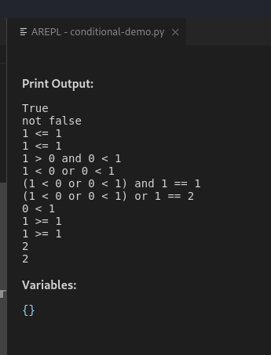


## Loops

```
a = 1
print(a)
a += 1
print(a)
a += 1
print(a)
a += 1
print(a)
a += 1
print(a)
a += 1
print(a)
a += 1
print(a)

print("---------")

a = 1
while a < 5:
    a += 1
    print(a)
    
    
for i in [0, 1, 2, 3, 4]:
    print(i + 6)

print("---------")

for i in range(5):
    print(i)
    
for i in range(3):
    for j in range(3):
        print(i,j)

for i in range(5):
    if i == 2:
        break
    print(i)
    
for i in range(5):
    if i == 2:
        continue
    print(i)
    
print("----")
    
for i in range(5):
    if i == 2:
        pass
    print(i)
    
for c in "string":
    print(c)

for key, value in {"a": 1, "b": 2, "c": 3}.items():
    print(key, value)
```

**Output:**

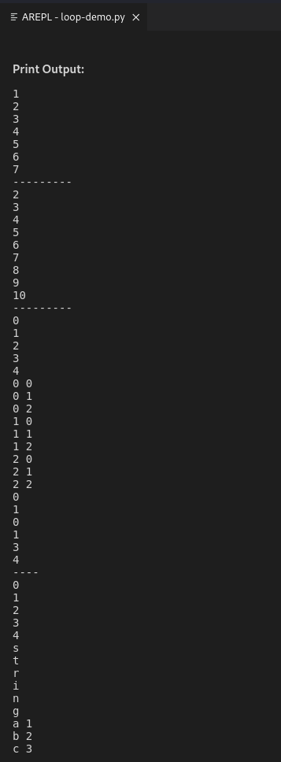


## Reading and writing files

```
f = open('top-100.txt')
print(f)

f = open('top-100.txt', 'rt')
print(f)

print(f.read())
print("----------")
print(f.readlines())
print("----------")
f.seek(0)
print("----------")
print(f.readlines())

f.seek(0)
for line in f:
    print("- " + line.strip())
    
f = open("test.txt", "w")
f.write("test line!")
f.close()

f = open("test.txt", "w")
f.write("test line two!")
f.close()

f = open("test.txt", "a")
f.write("test line two!")
f.close()

print(f.name)
print(f.closed)
print(f.mode)

with open('top-100.txt', encoding='latin-1') as f:
    for line in f:
        pass
```

**Output:**
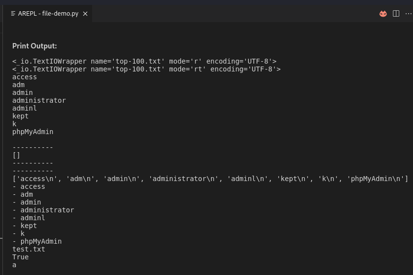


## User input

```
test = input()
print(test)

test = input("Enter the IP:")
print(test)

while True:
    test = input("Enter the IP:")
    print(">>> {}".format(test))
    if test == "exit":
        break
    else:
        print("exploiting..")
```

**Output:**

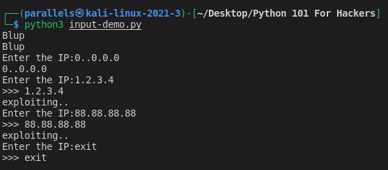


## Exceptions and error handling

```
print(1)
print(2)

try:
    f = open("adfasfadsfasdfs")
except:
    print("the file does not exist!")

try:
    f = open("dasfdasfsda")
except Exception as e:
    print(e)

try:
    f = open("dasfdasfsda")
except FileNotFoundError:
    print("the file does not exist!")
except Exception as e:
    print(e)
finally:
    print("this message!")
    
n = 100
if n == 0:
    raise Exception("n can't be 0!")
if type(n) is not int:
    raise Exception("n must be an int!")

print(1/n)

n = 10
assert(n != 0)
print(1/n)
```

**Output:**
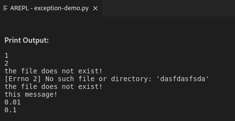


## Comprehensions

```
list1 = ['a', 'b', 'c']
print(list1)

list2 = [x for x in list1]
print(list2)

list3 = [x for x in list1 if x == 'a']
print(list3)

list4 = [x for x in range(5)]
print(list4)

list5 = [hex(x) for x in range(5)]
print(list5)

list6 = [hex(x) if x > 0 else "X" for x in range(5)]
print(list6)

list7 = [x * x for x in range(5)]
print(list7)

list8 = [x for x in range(5) if x == 0 or x == 1]
print(list8)

list9 = [[1, 2, 3], [4, 5, 6], [7, 8, 9]]
print(list9)

list10 = [y for x in list9 for y in x]
print(list10)

set1 = {x + x for x in range(5)}
print(set1)

list11 = [c for c in "string"]
print(list11)
print("".join(list11))
print("-".join(list11))

list12 = []
for c in "string":
    list12.append(c)
print(list12)
```

**Output:**

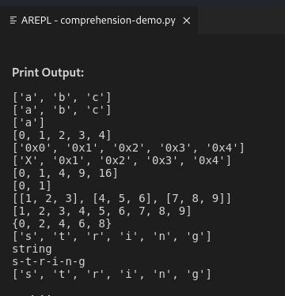

## Functions and code reuse

```
def function1():
    print("Hello from function!")

function1()
function1()

def function2():
    return "hello from function2!"

return_from_function2 = function2()
print(return_from_function2)

def function3(s):
    print("\t{}".format(s))

function3("parameter")

def function4(s1, s2):
    print("{} {}".format(s1, s2))

function4("hello", "world")
function4(s1="hello", s2="world")
function4(s2="hello", s1="world")
 
def function5(s1 = "default"):
     print("{}".format(s1))

function5()
function5("blub")

def function6(s1, *more):
    print("{} {}".format(s1, " ".join([s for s in more])))

function6("function6")
function6("function6", "a")
function6("function6", "a", "b")
function6("function6", "a", "b", "c")

def function7(**ks):
    for a in ks:
        print(a, ks[a])
        
function7(a="1", b="2", c="3", d="4")

def function8(s, f, i, l):
    print(type(s))
    print(type(f))
    print(type(i))
    print(type(l))
    
function8("string", 1.0, 1, ['l', 'i', 's', 't'])

print("----------")

v = 100
print(v)

def function9():
    print(v)
    
function9()
print(v)

print("----------")

v = 100
print(v)

def function9():
    v = 5
    print(v)
    
function9()
print(v)

print("----------")

v = 100
print(v)

def function9():
    global v
    v += 1
    print(v)
    
function9()
print(v)

def function10():
    print("hello from function 10")

function10()

def function11():
    function10()
    print("hello from function 11")

function11()

def function12(x):
    print(x)
    if x > 0:
        function12(x-1)

function12(5)

def function13(x):
    while x > 0:
        print(x)
        x -= 1
        
function13(5)
```

**Output:**

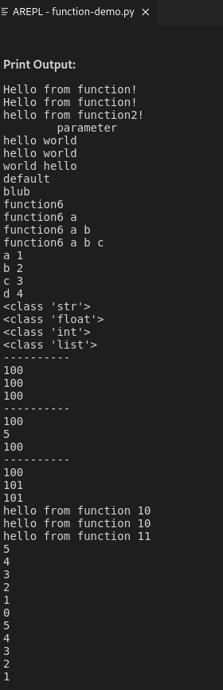


## Lambdas

```
add_4 = lambda x : x + 4
print(add_4(4))


add = lambda x, y: x + y
print(add(10, 4))

def addf(x, y):
    return x + y

print(add(10, 4))

print((lambda x, y: x + y)(10, 4))

is_even = lambda x: x % 2 == 0
print(is_even(2))
print(is_even(3))

blocks = lambda x, y: [x[i:i+y] for i in range(0, len(x), y)]
print(blocks("string", 2))

to_ord = lambda x: [ord(i) for i in x]
print(to_ord("ABCD"))

def to_ord2(x):
    ret = []
    for i in x:
        ret.append(ord(i))
    return ret

print(to_ord2("ABCD"))
```

**Output:**

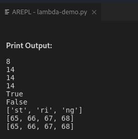


# Extending Python

## The Python package manager

Python Package Index: https://pypi.org

`pip install pwntools`

then
`python3`

then
`from pwn import *`

------

### Show installed libraries:
`pip list`

or:

`pip freeze`

### Install specific version of a libraries:

`pip install pwntools==4.5.1`

### Uninstall library:

`pip uninstall pwntools`


### requirements.txt

> Content of requirements.txt

E.g.

`pwntools==4.5.1`

### Install from requirements.txt

`pip install -r requirements.txt`


## Python virtual environments

`pip install virtualenv`

make new Folder for this project.

`mkdir virtal-demo && cd viral-demo`

then 

`python3 -m venv env`

then 

`python3 -m venv env`

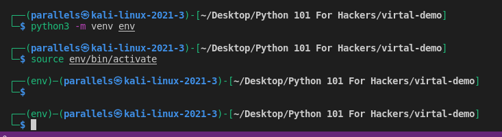

`which python3`

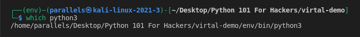

`pip freeze`

## Introduction to sys

### Script User Input:

```
import sys

print(sys.version)
print(sys.executable)
print(sys.platform)

for line in sys.stdin:
    if line.strip() == "exit":
       break
    sys.stdout.write(">> {}".format(line))
```

**Output:**

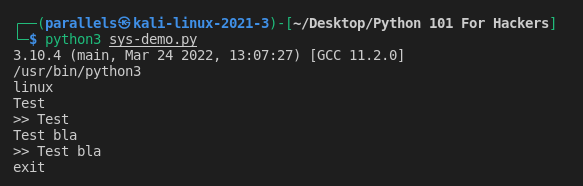


### Script Progress Bar

```
import sys

print(sys.version)
print(sys.executable)
print(sys.platform)
    
for i in range(1, 5):
    sys.stdout.write(str(i))
    sys.stdout.flush()
    
for i in range(1,5):
    print(i)

import time

for i in range(0, 51):
    time.sleep(0.1)
    sys.stdout.write("{} [{} {}]\r".format(i, '#'*i, "."*(50-i)))
sys.stdout.write("\n")
```

**Output:**

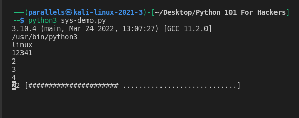

### User Arguments

```
import sys

print(sys.argv)

if len(sys.argv) != 3:
    print("[X] To run {} enter a username and password".format(sys.argv[0]))
    sys.exit(5)

username = sys.argv[1]
password = sys.argv[2]

print("{} {}".format(username, password))

sys.exit(0)
```

**Output:**

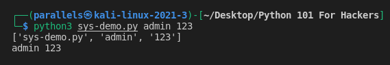


### Check sys.exit() error code

`echo $?`

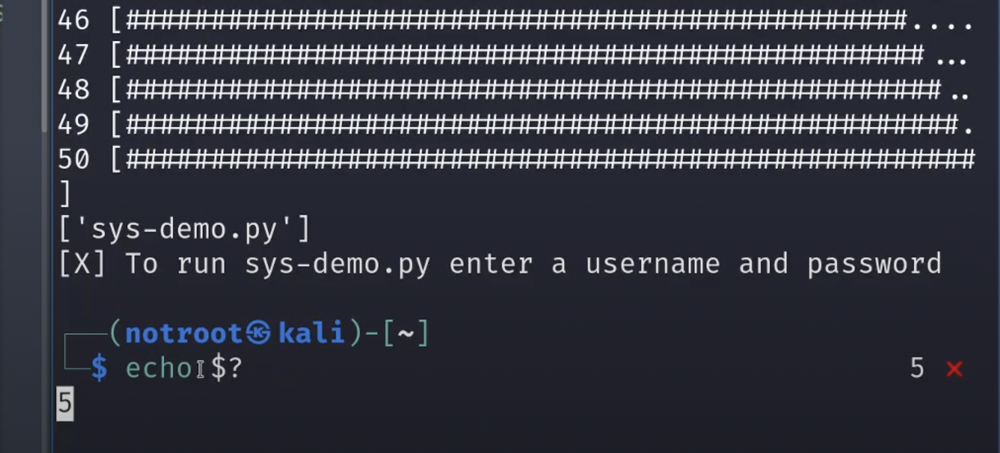


### sys.path() & sys.modules()

```
import sys

print(sys.path)
print(sys.modules)
```

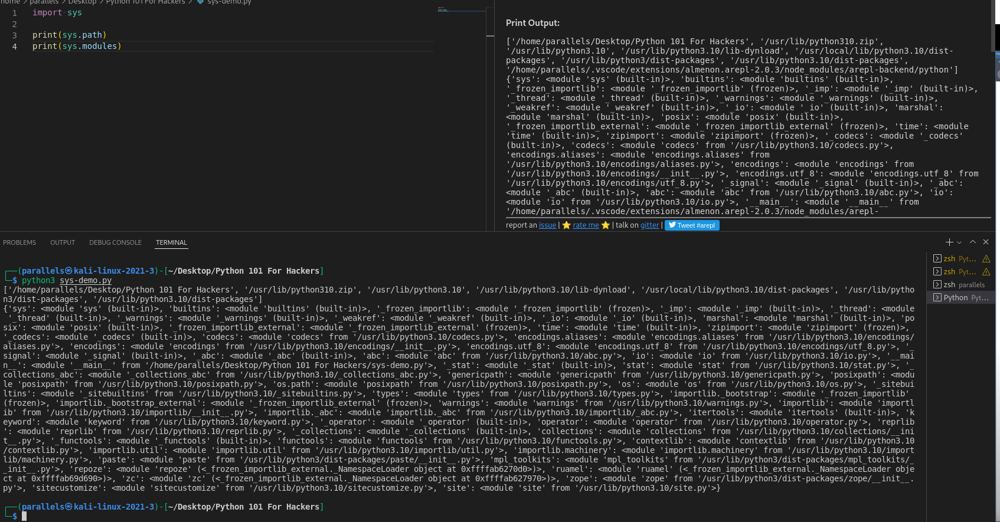


##  Introduction to requests

`pip install requests`

### Different Request Types

```
import requests

x = requests.get('http://httpbin.org/get')

print(x.headers)
print(x.headers['Server'])
print(x.status_code)

if x.status_code == 200:
    print("Success!")
elif x.status_code == 404:
    print("Not found!")
    
print(x.elapsed)
print(x.cookies)

print(x.content)

print(x.text)


x = requests.get('http://httpbin.org/get', params={'id': "1"})
print(x.url)

x = requests.get('http://httpbin.org/get?id=2')
print(x.url)

x = requests.get('http://httpbin.org/get', params={'id': "3"}, headers={'Accept': 'application/json', 'test-header': 'test'})
print(x.text)

x = requests.delete('http://httpbin.org/delete')
print(x.text)

x = requests.post('http://httpbin.org/post', data={'a': "b", 'c': 'd', 'e': 'f'})
print(x.text)

files = {'file': open('google.png', 'rb')}
x = requests.post('http://httpbin.org/post', data=files)
print(x.text)

x = requests.get('http://httpbin.org/get', auth=('username', 'password'))
print(x.text)


x = requests.get('https://expired.badssl.com', verify=False)
```

**Output:**

> Full Output is too long. Here start of output:

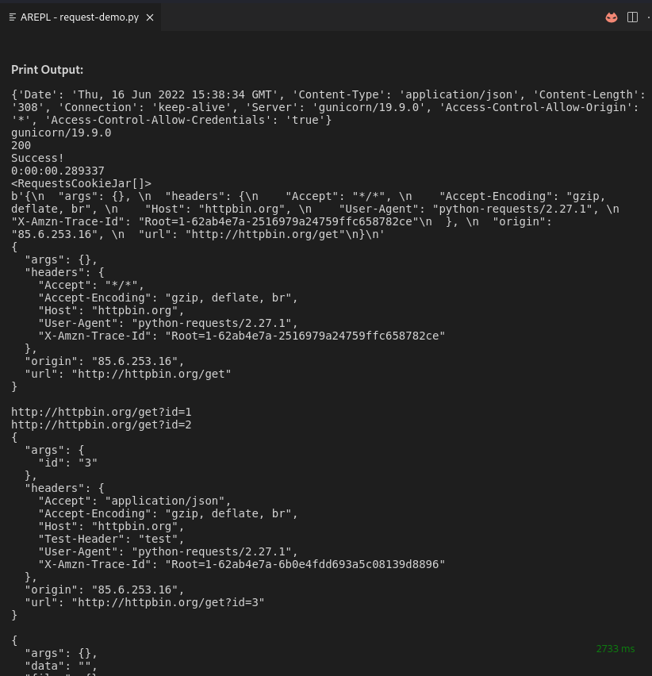


### Request with Cookies, JSON, Download & write Image to Disk

```
import requests

x = requests.get('http://httpbin.org/get')

print(x.headers)
print(x.headers['Server'])
print(x.status_code)

if x.status_code == 200:
    print("Success!")
elif x.status_code == 404:
    print("Not found!")
    
print(x.elapsed)
print(x.cookies)

x = requests.get('http://github.com')
print(x.headers)

print("-------")

x = requests.get('http://github.com', allow_redirects=False)
print(x.headers)

# x = requests.get('http://httpbin.org/get', timeout=0.01)
# print(x.content)

print("-------")


x = requests.get('http://httpbin.org/cookies', cookies={'a': 'b'})
print(x.content)

x = requests.Session()
x.cookies.update({'a': 'b'})
print(x.get('http://httpbin.org/cookies').text)
print(x.get('http://httpbin.org/cookies').text)

print("-------")

x = requests.get('https://api.github.com/events')
print(x.json())

print("-------")

x = requests.get('https://www.google.com/images/branding/googlelogo/1x/googlelogo_light_color_272x92dp.png')
with open('google2.png', 'wb') as f:
    f.write(x.content)
```

**Output:**

> Full Output is too long. Here start of output:

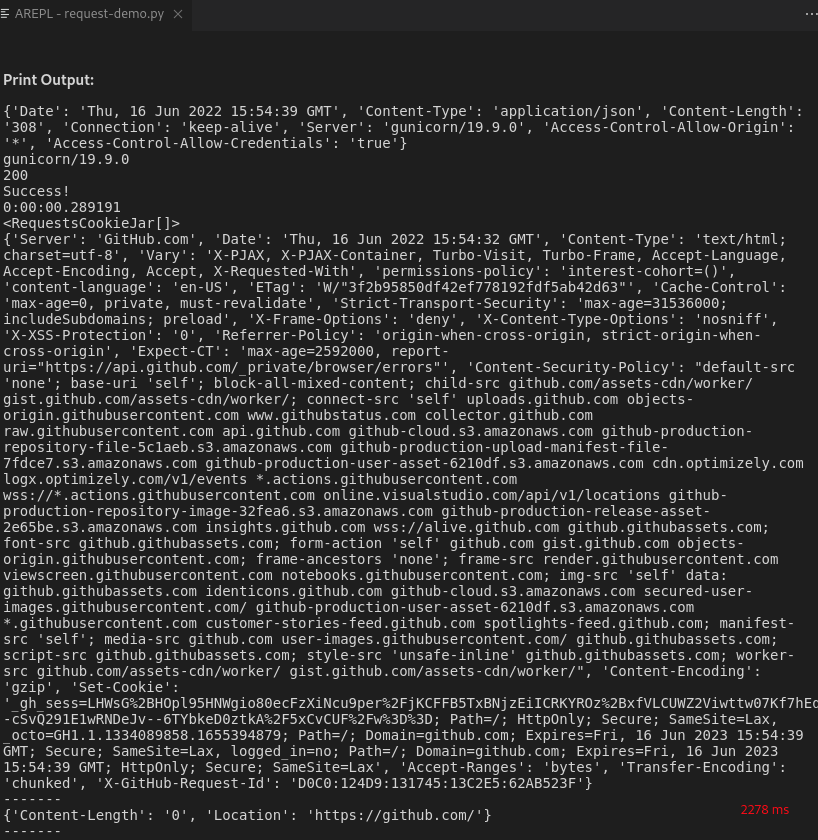

### Introduction to pwntools

Documentation: https://docs.pwntools.com/en/stable/#

### Buffer overlfow

```
from concurrent.futures import process
from itertools import cycle
from pwn import *

# for buffer overflow
print(cyclic(50))
print(cyclic_find("laaa"))

print(shellcraft.sh())

# Somehow don't work on ARM64
# print(hexdump(asm(shellcraft.sh())))
```

### Local Shell

```
from concurrent.futures import process
from itertools import cycle
from pwn import *

p = process("/bin/sh")
p.sendline("echo hello;")
p.interactive()
```


### Remote Shell

```
from pwn import *
 
 
r = remote("127.0.0.1", 1234)
r.sendline("hello!")
r.interactive()
r.close()
```

**Remote Session:**

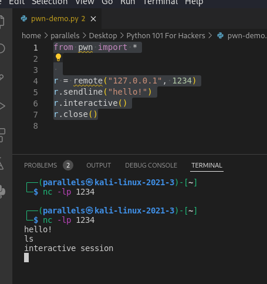

### Pack / Unpack data to send over network

```
from pwn import *
 
 # pack / unpack data
print(p32(0x13371337))
print(hex(u32(p32(0x13371337))))
```

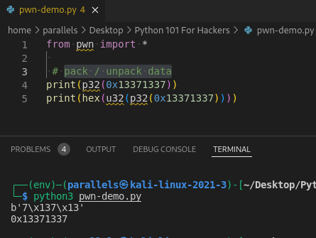

### Binary Infos useful for exploitation

```
from pwn import *
 
l = ELF('/bin/bash')
print(hex(l.address))
print(hex(l.entry))

print(hex(l.got['write']))
print(hex(l.plt['write']))

for address in l.search(b'/bin/sh\x00'):
    print(hex(address))
    
# not work on ARM64 ?
#print(hex(next(l.search(asm('jmp esp')))))

r = ROP(l)
print(r.rbx)

print(xor("A", "B"))

print(xor(xor("A", "B"), "A"))

# base 64 encoding / decoding
print(b64e(b"test"))
print(b64d(b"dGVzdA=="))

# md5
print(md5sumhex(b"hello"))

#sha1sum
print(sha1sumhex(b"hello"))

# bits
print(bits(b'a'))
print(unbits([0, 1, 1, 0, 0, 0, 0, 1]))
```

**Output:**

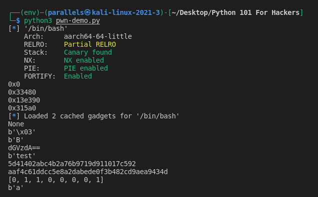


