# Python 101 For Hackers


# Introduction

## Welcome and course introduction


## What is Python?
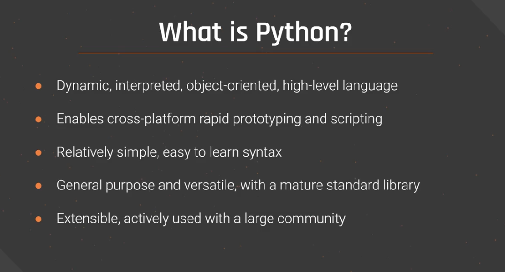


## Why learn Python as a hacker?

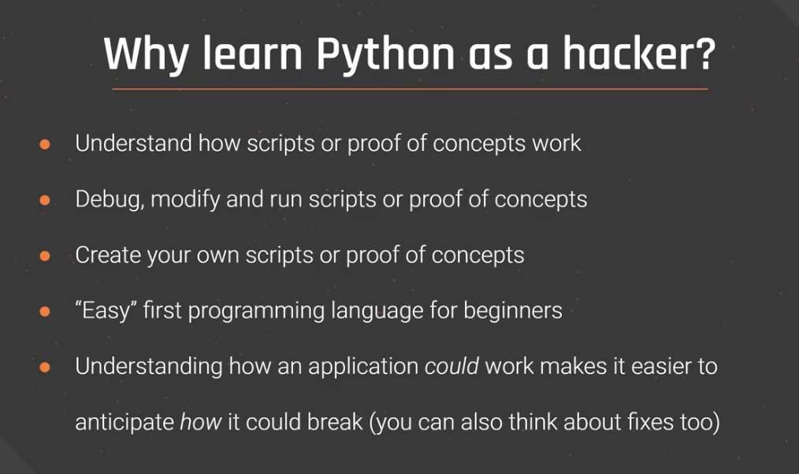


## Python2 vs Python3

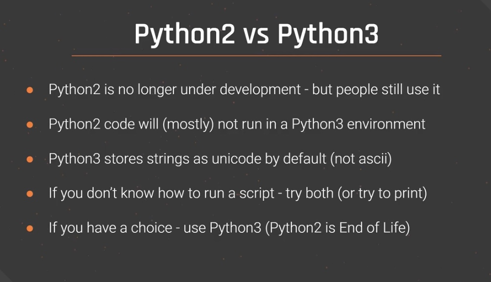


# Setup

## How to install VirtualBox

* https://www.virtualbox.org

## How to install Kali Linux

* https://www.kali.org/get-kali/

## The Python interpreter

### Python3
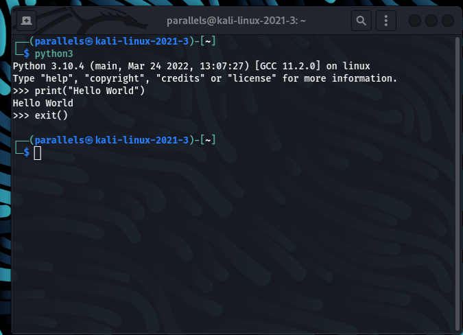

### Python2
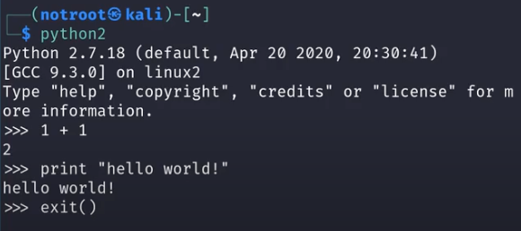


### Show Help

`python3 man`

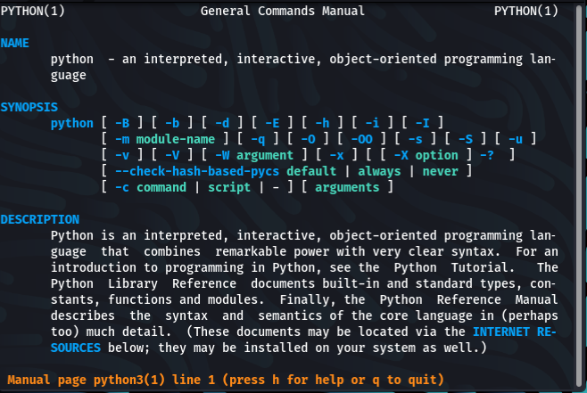

### Run Code Snippet 

`python3 -c 'print("hello world")'`

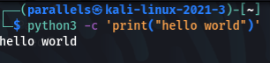

### New Bash Session

`python3 -c 'print("hello world")'`

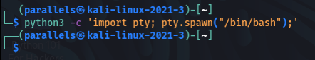

## How to run a Python script 

### Python 3

`python3 calculate-demo.py`

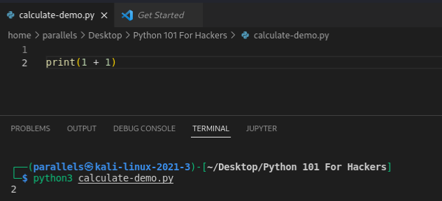


### Python 2

`python2 calculate-demo.py`

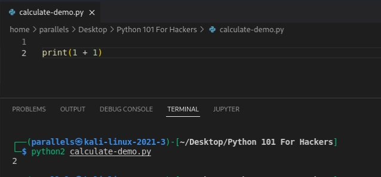

### Run it directly

```
#!/bin/python3
print(1 + 1)
```

after 

`chmod +x calculate-demo.py`

and 

`./calculate-demo.py`
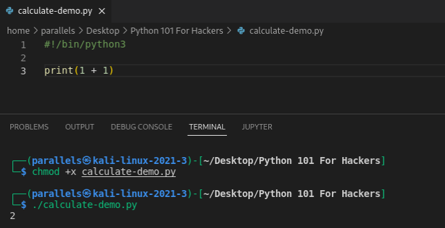


### Optional Main Function

> If there is '__main__', this will be executed first

```
#!/bin/python3

print(1 + 1)
print(__name__)

if __name__ == "__main__":
    print("do something")
```

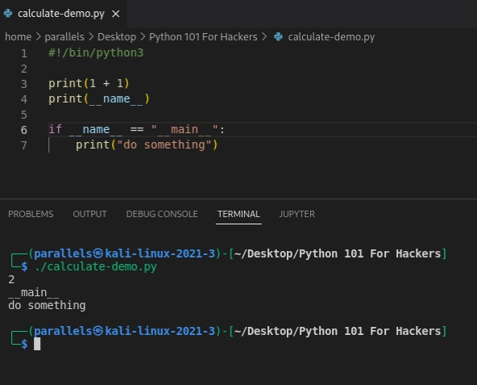


## Python syntax

> Always use same Indentation. For Example double space or tab. Mixing it inside a script will cause error.

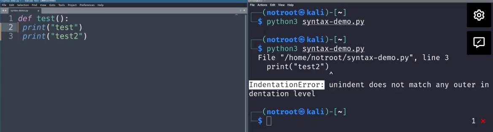


### Official Python Documentation

* https://docs.python.org/3/
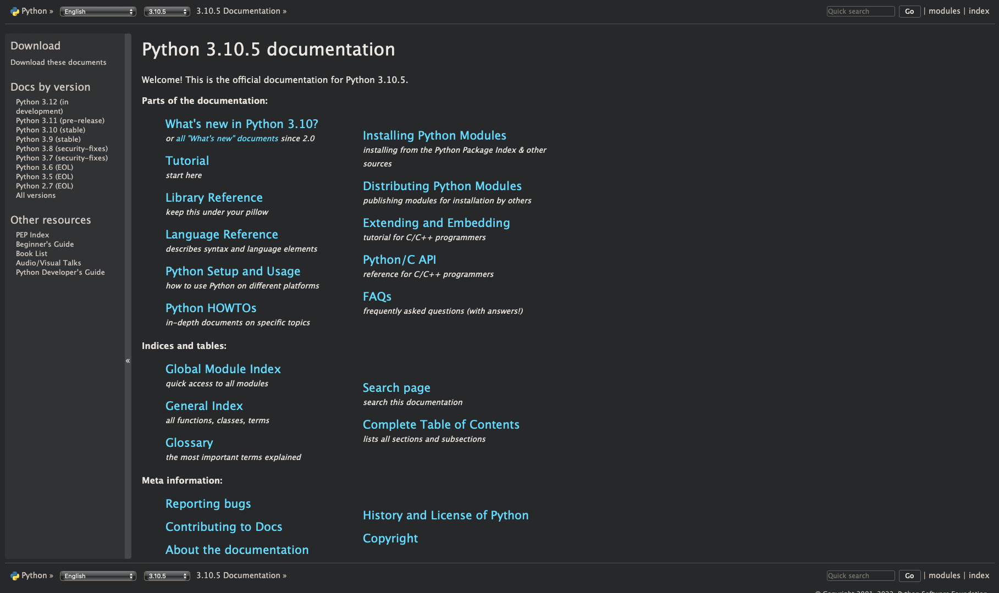

### Included Help in Python

#### Search Help for specific function

`python3`

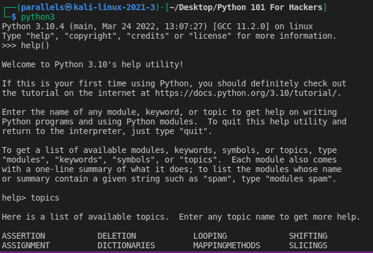

`help(print)`

> *print* ins this case what I want so search in help

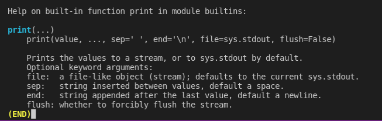

#### See arguments for specific function

`dir(print)`

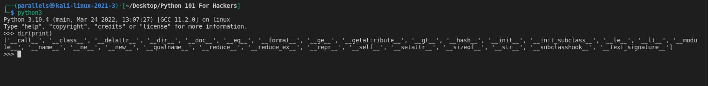

### Python Style Guide

PEP 8 – Style Guide for Python Code
https://peps.python.org/pep-0008/v

