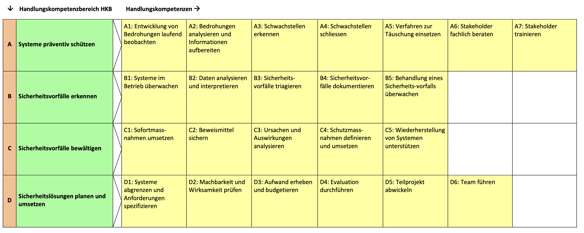

# Federal Exam: Cyber Security Specialist mit eidg. Fachausweis

* [Qualifikationsprofil - Cyber Security Specialist mit eidg. Fachausweis](assets/Qualifikationsprofil_Berufspruefung_Cyber-Security-Specialist-EFA_DE.pdf)
* [Wegleitung Berufsprüfung für Cyber Security Specialist](assets/Wegleitung_Berufspruefung_Cyber-Security-Specialist-EFA_DE1.pdf)

## Table of Contents

- [Federal Exam: Cyber Security Specialist mit eidg. Fachausweis](#federal-exam-cyber-security-specialist-mit-eidg-fachausweis)
  - [Table of Contents](#table-of-contents)
  - [Übersicht der beruflichen Handlungskompetenzen](#Übersicht-der-beruflichen-handlungskompetenzen)
  - [HKB A: Systeme präventiv schützen](#hkb-a-systeme-präventiv-schützen)
    - [Beschreibung des Handlungskompetenzbereichs (HKB)](#beschreibung-des-handlungskompetenzbereichs-hkb)
    - [Kontext](#kontext)
    - [Berufliche Handlungskompetenz](#berufliche-handlungskompetenz)
      - [A1: Entwicklung von Bedrohungen laufend beobachten](#a1-entwicklung-von-bedrohungen-laufend-beobachten)
      - [A2: Bedrohungen analysieren und Informationen aufbereiten](#a2-bedrohungen-analysieren-und-informationen-aufbereiten)
      - [A3: Schwachstellen erkennen](#a3-schwachstellen-erkennen)
      - [A4: Schwachstellen schliessen](#a4-schwachstellen-schliessen)
      - [A5. Verfahren zur Täuschung einsetzen](#a5-verfahren-zur-täuschung-einsetzen)
      - [A6: Stakeholder fachlich beraten](#a6-stakeholder-fachlich-beraten)
      - [A7: Stakeholder trainieren](#a7-stakeholder-trainieren)
    - [Persönliche und soziale Kompetenzen](#persönliche-und-soziale-kompetenzen)
    - [Leistungskriterien (LK)](#leistungskriterien-lk)
  - [HKB B: Sicherheitsvorfälle erkennen](#hkb-b-sicherheitsvorfälle-erkennen)
    - [Beschreibung des Handlungskompetenzbereichs (HKB)](#beschreibung-des-handlungskompetenzbereichs-hkb)
    - [Kontext](#kontext)
    - [Berufliche Handlungskompetenz](#berufliche-handlungskompetenz)
      - [B1: Systeme im Betrieb überwachen](#b1-systeme-im-betriebü-berwachen)
      - [B2: Daten analysieren und interpretieren](#b2-daten-analysieren-und-interpretieren)
      - [B3: Sicherheitsvorfälle triagieren](#b3-sicherheitsvorfälle-triagieren)
      - [B4: Sicherheitsvorfälle dokumentieren](#b4-sicherheitsvorfälle-dokumentieren)
      - [B5: Behandlung eines Sicherheitsvorfalls überwachen](#b5-behandlung-eines-sicherheitsvorfallsü-berwachen)
    - [Persönliche und soziale Kompetenzen](#persönliche-und-soziale-kompetenzen)
    - [Leistungskriterien (LK)](#leistungskriterien-lk)
  - [HKB C: Sicherheitsvorfälle bewältigen](#hkb-c-sicherheitsvorfälle-bewältigen)
    - [Beschreibung des Handlungskompetenzbereichs (HKB)](#beschreibung-des-handlungskompetenzbereichs-hkb)
    - [Kontext](#kontext)
    - [Berufliche Handlungskompetenz](#berufliche-handlungskompetenz)
      - [C1: Sofortmassnahmen umsetzen](#c1-sofortmassnahmen-umsetzen)
      - [C2: Beweismittel sichern](#c2-beweismittel-sichern)
      - [C3: Ursachen und Auswirkungen analysieren](#c3-ursachen-und-auswirkungen-analysieren)
      - [C4: Schutzmassnahmen definieren und umsetzen](#c4-schutzmassnahmen-definieren-und-umsetzen)
      - [C5: Wiederherstellung von Systemen unterstützen](#c5-wiederherstellung-von-systemen-unterstützen)
    - [Persönliche und soziale Kompetenzen](#persönliche-und-soziale-kompetenzen)
    - [Leistungskriterien (LK)](#leistungskriterien-lk)
  - [HKB D: Sicherheitslösungen planen und umsetzen](#hkb-d-sicherheitslösungen-planen-und-umsetzen)
    - [Beschreibung des Handlungskompetenzbereichs (HKB)](#beschreibung-des-handlungskompetenzbereichs-hkb)
    - [Kontext](#kontext)
    - [Berufliche Handlungskompetenz](#berufliche-handlungskompetenz)
      - [D1: Systeme abgrenzen und Anforderungen spezifizieren](#d1-systeme-abgrenzen-und-anforderungen-spezifizieren)
      - [D2: Machbarkeit und Wirksamkeit prüfen](#d2-machbarkeit-und-wirksamkeit-prüfen)
      - [D3: Aufwand erheben und budgetieren](#d3-aufwand-erheben-und-budgetieren)
      - [D4: Evaluation durchführen](#d4-evaluation-durchführen)
      - [D5: Teilprojekt abwickeln](#d5-teilprojekt-abwickeln)
      - [D6: Team führen](#d6-team-führen)
    - [Persönliche und soziale Kompetenzen](#persönliche-und-soziale-kompetenzen)
    - [Leistungskriterien (LK)](#leistungskriterien-lk)
  - [Prüfung](#prüfung)
    - [Prüfungsteil 1 – Cyber Sicherheit](#prüfungsteil-1–-cyber-sicherheit)
    - [Prüfungsteil 2 – Projekte & Betriebswirtschaft](#prüfungsteil-2–-projekte-betriebswirtschaft)
    - [Prüfungsteil 3 – Führung & Kommunikation](#prüfungsteil-3–-führung-kommunikation)
    - [Hilfsmittel](#hilfsmittel)

## Übersicht der beruflichen Handlungskompetenzen

**A) Systeme präventiv schützen**

* A1: Entwicklung von Bedrohungen laufend beobachten
* A2: Bedrohungen analysieren und Informationen aufbereiten
* A3: Schwachstellen erkennen
* A4: Schwachstellen schliessen
* A5: Verfahren zur Täuschung einsetzen
* A6: Stakeholder fachlich beraten
* A7: Stakeholder trainieren

**B) Sicherheitsvorfälle erkennen**
* B1: Systeme im Betrieb überwachen
* B2: Daten analysieren und interpretieren
* B3: Sicherheitsvorfälle triagieren
* B4: Sicherheitsvorfälle dokumentieren
* B5: Behandlung eines Sicherheits-vorfalls überwachen

**C) Sicherheitsvorfälle bewältigen**
* C1: Sofortmassnahmen umsetzen
* C2: Beweismittel sichern
* C3: Ursachen und Auswirkungen analysieren
* C4: Schutzmassnahmen definieren und umsetzen
* C5: Wiederherstellung von Systemen unterstützen

**D) Sicherheitslösungen planen und umsetzen**
* D1: Systeme abgrenzen und Anforderungen spezifizieren
* D2: Machbarkeit und Wirksamkeit prüfen
* D3: Aufwand erheben und budgetieren
* D4: Evaluation durchführen
* D5: Teilprojekt abwickeln
* D6: Team führen

## HKB A: Systeme präventiv schützen

### Beschreibung des Handlungskompetenzbereichs (HKB)

Der HKB A umfasst die beruflichen Handlungskompetenzen, die Cyber Security Specialists (CSS) in den Bereichen Antizipation und Prävention ausüben. Die Tätigkeiten in diesen Bereichen bezwecken die frühzeitige Identifikation möglicher Bedrohungen und die Verringerung der Angriffsfläche durch vorbeugende Schutzmassnahmen.

CSS beobachten und analysieren auf der Basis verschiedener Informationsquellen und durch Erfahrungsaustausch die aktuelle Entwicklung von Bedrohungen laufend und bereiten relevante Erkenntnisse und Informationen auf der taktischen, operativen und technischen Ebene für die Entscheidungsträger auf.

Mit ausgewählten Verfahren und Werkzeugen decken CSS Schwachstellen in Netzwerken, Applikationen, Speicherlösungen und beim Einsatz von End- und Peripherie- geräten auf. Bei der Beurteilung, ob eine Schwachstelle geschlossen werden soll, berücksichtigen CSS das Verhältnis zwischen Aufwand und Nutzen und orientieren sich an den Richtlinien und Prozessen der Organisation. Bei Bedarf setzen CSS technische Verfahren und Werkzeuge zur Täuschung von Angreifern ein.

CSS beraten und trainieren unterschiedliche Anspruchsgruppen in fachlichen Aspekten und unterstützen damit die Sensibilisierung als wesentliches Element einer wirkungsvollen Prävention.

### Kontext

Der Umfang und die Art der Prävention werden massgebend durch den Risikoappetit und die Risikobeurteilung des Managements bestimmt. Vorbeugende Massnahmen sind wirkungsvoll und ökonomisch, wenn diese in Einklang mit der Risikobehandlung aus der übergeordneten Sicherheitsstrategie stehen.
Beim Einsatz von Verfahren und Werkzeugen zur Erkennung von Schwachstellen müssen gesetzliche Vorgaben aus dem Strafrecht (z.B. unbefugte Datenbeschaffung, unbefugtes Eindringen in Datenverarbeitungssysteme) und zum Datenschutz berücksichtigt werden.
Bedrohungen und Angriffsszenarien entwickeln und verändern sich im Cyber-Raum äusserst dynamisch. In Ergänzung zu wichtigen persönlichen Kompetenzen erfordert eine effektive Informations- und Wissensbeschaffung auch ein tragfähiges Beziehungs- und Kommunikationsnetzwerk mit relevanten Anspruchsgruppen.
Bezug zu HKB D: In den Bereichen Antizipation und Prävention können in der Praxis auch Bedürfnisse nach umfassenderen oder komplexerer Sicherheitslösungen entstehen, die typischerweise projektbezogen und ausserhalb des operativen Normalbetriebs abgewickelt werden. Die beruflichen Handlungskompetenzen von CSS in projektbezogenen Vorhaben werden im HKB D beschrieben.

### Berufliche Handlungskompetenz

#### A1: Entwicklung von Bedrohungen laufend beobachten
* Informationsquellen wie Gefährdungskataloge MELANI, BSI, Sicherheitsreports von Herstellern, Foren, Fachgremien etc.

#### A2: Bedrohungen analysieren und Informationen aufbereiten
* Konzept und Ebenen der Cyber Threat Intelligence CTI (strategisch, taktisch, operativ und technisch)

#### A3: Schwachstellen erkennen
* Audits und Audittypen (System-, Prozess-, Performance- und Complianceaudit)
* Verfahren und Werkzeuge für Penetrationstests, Vulnerability-Scans und Compliance-Scans
* Indicators of Compromise (IoC) und Indicators of Attack (IoA)
* Proaktives "Threat Hunting"
* Gesetzliche Rahmenbedingungen beim Hacking

#### A4: Schwachstellen schliessen
* Vorgaben aus der Informationssicherheitsstrategie (Information Security Policy, ISP)
* Systemspezifische technische und organisatorische Schutzmassnahmen (TOMs), Sicherheitslösungen und Best Practices
* Methoden zum Härten von Systemen

#### A5. Verfahren zur Täuschung einsetzen
* Verfahren und Werkzeuge zur Irreführung von Angreifern (z.B. Honeypots, Traps, Decoys oder Werkzeuge zur Verschleierung)

#### A6: Stakeholder fachlich beraten
* Grundsätze der systemisch-lösungsorientierten Beratung
* Kommunikationsmodelle und Kommunikationsregeln
    * [Team Building and Management](../Topics/Team%20Building%20and%20Management/README.md)

#### A7: Stakeholder trainieren
* Methodisch-didaktische Grundlagen
* Planung und Durchführung von Schulungen

### Persönliche und soziale Kompetenzen
* Neugierde und Lernbereitschaft
* Fähigkeit zum Perspektivenwechsel (Denken wie ein Angreifer)
* Verantwortungsbewusstsein im Umgang mit sensiblen Verfahren zur Erkennung von Schwachstellen oder zur Täuschung
* Wahrung der Vertraulichkeit und Integrität im Umgang mit sensiblen Daten und Informationen
* Kommunikationsfähigkeit beim Beraten und Ausbilden

### Leistungskriterien (LK)
CSS sind fähig:
* LK-A-1: verschiedene Informationsquellen zu Bedrohungen zu unterscheiden
* LK-A-2: die Glaubwürdigkeit von Quellen und Informationen zu bewerten
* LK-A-3: das Wissen über Bedrohungen proaktiv, selbstgesteuert und kontinuierlich zu erweitern
* LK-A-4: das Konzept der Cyber Threat Intelligence zu erläutern
* LK-A-5: die Relevanz von Bedrohungen für die eigene Organisation zu identifizieren
* LK-A-6: Audits vorzubereiten, durchzuführen und auszuwerten
* LK-A-7: geeignete Verfahren und Werkzeuge zur Erkennung von Schwachstellen kontext- und systemspezifisch auszuwählen und einzusetzen
* LK-A-8: geeignete technische oder organisatorische Schutzmassnahmen zu definieren und umzusetzen
* LK-A-9: geeignete Verfahren und Werkzeuge zur Täuschung auszuwählen und einzusetzen
* LK-A-10: die gesetzliche, rechtliche und regulatorische Konformität aller Massnahmen in den Bereichen Antizipation und Prävention zu beurteilen
* LK-A-11: Stakeholder in fachlicher Hinsicht bedürfnis- und lösungsorientiert zu beraten
* LK-A-12: Fachinhalte methodisch-didaktisch für Schulungen aufzubereiten
* LK-A-13: Schulungen zu planen, durchzuführen und auszuwerten

## HKB B: Sicherheitsvorfälle erkennen

### Beschreibung des Handlungskompetenzbereichs (HKB)

Der HKB B umfasst die beruflichen Handlungskompetenzen, die Cyber Security Specialists (CSS) im Bereich **Erkennung** (**Detection**) ausüben. Die Tätigkeiten in diesem Bereich bezwecken die Erkennung von Sicherheitsvorfällen (Security Incidents) im operativen Betrieb.

CSS zeichnen relevante Daten in Netzwerken, Applikationen, Speicherlösungen und beim Einsatz von End- und Peripheriegeräten mit ausgewählten Werkzeugen auf. Die aufgezeichneten Daten werden manuell oder automatisiert und in Echtzeit oder zeitlich versetzt hinsichtlich Anomalien und Nichtkonformitäten ausgewertet und analysiert. Mittels systematischer Triage priorisieren CSS die identifizierten Sicherheitsvorfälle und dokumentieren die relevanten Informationen für die Behandlung eines Vorfalls durch die zuständige Stelle.

### Kontext

Die Erkennung von Sicherheitsvorfällen erfolgt innerhalb einer Organisation in der Regel nach definierten Prozessen und mit bestimmten Verfahren. CSS müssen diese Vorgaben bei der Erfüllung ihrer Aufgaben berücksichtigen und befolgen. Beim Einsatz von Verfahren und Werkzeugen zur Überwachung von Systemen müssen gesetzliche Vorgaben zum Daten- und Persönlichkeitsschutz berücksichtigt werden.

Bezug zum HKB C: Die Behandlung von identifizierten Sicherheitsvorfällen wird im HKB C beschrieben.

Bezug zu HKB D: Durch die Erkennung von Sicherheitsvorfällen können in der Praxis auch Bedürfnisse nach umfassenderen oder komplexerer Sicherheitslösungen entstehen, die typischerweise projektbezogen und ausserhalb des operativen Normalbetriebs abgewickelt werden. Die beruflichen Handlungskompetenzen von CSS in projektbezogenen Vorhaben werden im HKB D beschrieben.

### Berufliche Handlungskompetenz

#### B1: Systeme im Betrieb überwachen
* Verfahren und Werkzeuge zur Überwachung (Monitoring) von Netzwerken, Applikationen, Serverdiensten, Speicherlösungen, End- und Peripheriegeräte
* Technische Lösungen (Appliance) zur Erkennung von Angriffen wie Firewalls, Intrusion Detection Systeme (IDS), Intrusion Prevention Systeme (IPS) oder Webapplication-Firewalls (WAF)
* Security Information and Event Management (SIEM)

#### B2: Daten analysieren und interpretieren
* Automatisierte und manuelle Auswertung von Protokollierungen (Logfiles)
* Erkennung von False Positives
* Skriptsprachen zur Datenauswertung
* Methoden zur Datenanalyse
* Darstellungstechniken zur Verdichtung von Informationen

#### B3: Sicherheitsvorfälle triagieren
* Vorgaben aus internen Richtlinien und Prozessen
* Klassierung und Priorisierung von Incidents
* Zuteilung (Dispatching) von Incidents

#### B4: Sicherheitsvorfälle dokumentieren
* Issue-Tracking-Systeme (ITS) für die Verwaltung von Incidents über deren gesamten Lebenszyklus
* Informationselemente eines Incidents resp. Tickets

#### B5: Behandlung eines Sicherheitsvorfalls überwachen
* Operational resp. Service Levels Agreements (OLA, SLA) für die Behandlung von Incidents
* Eskalationsstufen gemäss OLA resp. SLA

### Persönliche und soziale Kompetenzen
* System- und Prozessdenken
* Disziplin, Hartnäckigkeit und Verantwortungsbewusstsein bei der Erkennung von Incidents
* Analytisches und vernetztes Denken bei der Datenanalyse und Triage
* Genauigkeit und schriftliche Ausdrucksfähigkeit bei der Dokumentation von Incidents
* Kommunikationsfähigkeit und emotionale Kompetenz im Team und mit Stakeholdern

### Leistungskriterien (LK)
CSS sind fähig:

* LK-B-1: die für die eigene Tätigkeit relevanten Strukturen, Prozesse und Abhängigkeiten in einer Organisation zu erklären
* LK-B-2: die spezifische Aufbau- und Ablauforganisation des Incident Managements zu erklären
* LK-B-3: geeignete Verfahren und Werkzeuge für die Überwachung von Systemen auszuwählen und einzusetzen
* LK-B-4: technische Lösungen zur Erkennung von Angriffen zu erläutern und deren Funktion zu gewährleisten
* LK-B-5: Protokollierungen von unterschiedlichen Systemen und in unterschiedlichen Formaten auswerten und interpretieren
* LK-B-6: Funktionen mittels Skriptsprachen für die Auswertung von Daten zu programmieren
* LK-B-7: Datenbestände inhaltlich zu analysieren und/oder zu vergleichen und die gewonnenen Informationen zu verdichten und darzustellen
* LK-B-8: identifizierte Sicherheitsvorfälle zu klassieren, zu priorisieren und der zuständigen Stelle zuzuteilen
* LK-B-9: Issue-Tracking-Systeme zu bedienen und Sicherheitsvorfälle über deren ganzen Lebenszyklus zu dokumentieren
* LK-B-10: Die Einhaltung der Vorgaben aus den OLA oder SLA zu beurteilen und bei Bedarf zu eskalieren
* LK-B-11: die gesetzliche, rechtliche und regulatorische Konformität aller Massnahmen im Bereich der Erkennung (Detection) zu beurteilen

## HKB C: Sicherheitsvorfälle bewältigen

### Beschreibung des Handlungskompetenzbereichs (HKB)

Der HKB C umfasst die beruflichen Handlungskompetenzen, die Cyber Security Specialists (CSS) im Bereich Reaktion (Response) ausüben. Die Tätigkeiten in diesem Bereich umfassen die Handhabung von Sicherheitsvorfällen im Normalbetrieb und die fachliche Unterstützung bei der Bewältigung von Notfällen oder Krisen im Rahmen des Business Continuity Managements (BCM) einer Organisation.

Bei gravierenden Sicherheitsvorfällen implementieren CSS technische Sofortmassnahmen, um die unmittelbaren Auswirkungen und damit den Schaden eines Vorfalls zu minimieren. Die Sicherung von relevantem Beweismaterial bildet die Grundlage für die Analyse eines Sicherheitsvorfalls und gegebenenfalls für digital-forensische oder strafrechtliche Untersuchungen.

CSS untersuchen die Ursachen und die Auswirkungen eines Sicherheitsvorfalls. Auf der Grundlage dieser Untersuchung und im Einklang mit dem Vorfallreaktionsplan (Incident Response Plan) der Organisation implementieren CSS reaktive Schutzmassnahmen oder empfehlen den vorgesetzten Entscheidungsträgern Korrektur- oder Verbesserungsmassnahmen. Nach dem Ausfall eines Systems unterstützen CSS die zuständigen Stellen bei der sicheren Wiederherstellung des Betriebs.

### Kontext

Die Bewältigung von Sicherheitsvorfällen erfolgt innerhalb einer Organisation in der Regel nach definierten Prozessen und mit bestimmten Verfahren. CSS müssen diese Vorgaben bei der Erfüllung ihrer Aufgaben berücksichtigen und befolgen. Bei der Umsetzung von Sofort- oder Schutzmassnahmen sind zudem die Abhängigkeiten mit anderen Organisationseinheiten und Prozessen zu berücksichtigen (z.B. ICT-Serviceüberführung und Servicebetrieb, Compliance, Notfall- und Krisenorganisation), weshalb fundierte Kenntnisse über die Aufbau- und Ablauforganisation einer Organisation eine wichtige Voraussetzung sind.

Im Kontext der Beweissicherung sind gesetzliche Vorgaben bezüglich Methoden und Grundsätze zur Sicherstellung der gerichtlichen Verwendbarkeit der Beweismittel zu berücksichtigen.

Bezug zu HKB D: Aus der Analyse der Ursachen eines Sicherheitsvorfalls können in der Praxis auch Bedürfnisse nach umfassenderen oder komplexerer Sicherheitslösungen entstehen, die typischerweise projektbezogen und ausserhalb des operativen Normalbetriebs abgewickelt werden. Die beruflichen Handlungskompetenzen von CSS in projektbezogenen Vorhaben werden im HKB D beschrieben.

### Berufliche Handlungskompetenz

#### C1: Sofortmassnahmen umsetzen
* Vorgaben des Vorfallreaktionsplans (Incident Response Plan)
* Technische Sofortmassnahmen wie Isolation, Deaktivierung oder Abschaltung von Systemen oder Diensten

    
#### C2: Beweismittel sichern
* Forensische Grundsätze und Prinzipien
* Gesetzes- und Rechtskonformität
* Methoden der Beweissicherung (Post Mortem, Live-Response)

#### C3: Ursachen und Auswirkungen analysieren
* Analyse von Angriffen
* Statische und dynamische Malware Analyse
* System-, Netzwerk und Memory-Forensik
* Methoden und Techniken zur strukturierten Ursachenanalyse

#### C4: Schutzmassnahmen definieren und umsetzen
* Technische und organisatorische Schutzmassnahmen (TOMs)
* Schnittstellen zu anderen Anspruchsgruppen und Prozessen

#### C5: Wiederherstellung von Systemen unterstützen
* Business Continuity Management (BCM)
* Massnahmen zur Notfallwiederherstellung (Desaster Recovery)

### Persönliche und soziale Kompetenzen

* System- und Prozessdenken
* Analytisches und vernetztes Denken bei der Untersuchung von Ursachen und Auswirkungen
* Höchste Genauigkeit und Sorgfalt beim Sicherstellen von Beweismitteln und in der Analyse
* Vertraulichkeit und Integrität beim Umgang mit Beweismitteln
* Kreativität und Innovationsfähigkeit bei der Entwicklung von Lösungen
* Kommunikationsfähigkeit und emotionale Kompetenz im Team und mit Stakeholdern

### Leistungskriterien (LK)
* LK-C-1: die für die eigene Tätigkeit relevanten Strukturen, Prozesse und Abhängigkeiten in einer Organisation zu erklären
* LK-C-2: die spezifische Aufbau- und Ablauforganisation des Incident Managements zu erklären
* LK-C-3: die Vorgaben des Vorfallreaktionsplans einer Organisation zu interpretieren und anzuwenden
* LK-C-4: technische Sofortmassnahmen situations- und kontextspezifisch auszuwählen, zu implementieren und in Bezug auf die Wirksamkeit zu überprüfen
* LK-C-5: Beweismittel unter Berücksichtigung der Grundsätze für die gerichtliche Verwertbarkeit zu sichern
* LK-C-6: die Ursachen und Auswirkungen von Angriffen mit geeigneten Methoden und Verfahren zu analysieren
* LK-C-7: Methoden und Verfahren zur Analyse von Malware zu erläutern
* LK-C-8: Werkzeuge für digital-forensische Analysen von Systemen, Netzwerken und Memory einzusetzen
* LK-C-9: geeignete reaktive Schutzmassnahmen zu definieren
* LK-C-10: Empfehlungen für Entscheidungsträger adressatengerecht zu formulieren und zu präsentieren
* LK-C-11: reaktive Schutzmassnahmen unter Einbezug der zuständigen Stakeholder zu implementieren und in Bezug auf die Wirksamkeit zu überprüfen
* LK-C-12: die Notfall- und Krisenorganisation einer Organisation hinsichtlich Cyber-Sicherheit bedürfnis- und lösungsorientiert zu beraten
* LK-C-13: die gesetzliche, rechtliche und regulatorische Konformität aller Massnahmen im Bereich der Reaktion (Response) zu beurteilen

## HKB D: Sicherheitslösungen planen und umsetzen

### Beschreibung des Handlungskompetenzbereichs (HKB)

Der HKB D umfasst die beruflichen Handlungskompetenzen, die Cyber Security Specialists (CSS) in den Bereichen Business Engineering, Projektmanagement und Führung ausüben. Diese Kompetenzen sind dann relevant, wenn neue oder veränderte Bedürfnisse nach Sicherheitslösungen durch Vorhaben mit Projektcharakter abgewickelt werden.

CSS spezifizieren unter Einbezug der relevanten Stakeholder messbare funktionale und nichtfunktionale Anforderungen an Sicherheitslösungen und analysieren deren Einbettung und Schnittstellen im übergeordneten System. Bei Bedarf prüfen sie die Machbarkeit und Wirksamkeit einer Sicherheitslösung in einem spezifischen Kontext.

CSS ermitteln und budgetieren die notwendigen Personal- und Betriebsmittel einer Sicherheitslösung für die Entscheidungsträger. Abgestimmt auf die Anforderungen führen sie Evaluationen von Angeboten und Varianten durch und unterstützen die zuständigen Stellen bei der Beschaffung von Sicherheitslösungen.

Innerhalb von Projekten übernehmen CSS die Verantwortung für einzelne Arbeitspakete oder Teilprojekte. Sie planen das Vorhaben, stellen während der Umsetzung die Kommunikation mit allen Stakeholdern sicher, überwachen die Zielerreichung und ergreifen bei Bedarf Steuerungs- oder Korrekturmassnahmen. CSS können als Teamleaderinnen respektive Teamleader einer Organisationseinheit oder als Leiterinnen respektive Leiter von projektbezogenen Vorhaben kleinere Expertengruppen führen.

### Kontext

Projektbezogene Vorhaben im Bereich der Cyber-Sicherheit finden in einem Arbeitskontext statt, der durch komplexe Problemstellungen, interdisziplinäre Anforderungen und häufige Veränderung geprägt ist. In Ergänzung zu umfassenden Fachkenntnissen verschiedener Arbeitsbereiche und Methoden zur Bewältigung von Komplexität, erfordern diese Tätigkeiten insbesondere auch erweiterte Sozial- und Selbstkompetenzen.

### Berufliche Handlungskompetenz

#### D1: Systeme abgrenzen und Anforderungen spezifizieren
* Modellierung von Systemen, Teilsystemen und Systemgrenzen
* Beschreibung von Schnittstellen
* Spezifikation von messbaren Anforderungen

#### D2: Machbarkeit und Wirksamkeit prüfen
* Methoden zur Überprüfung der Machbarkeit (z.B. Proof of Concept, Feasability Study, Prototyping, Pilotprojekte)

#### D3: Aufwand erheben und budgetieren
* Methoden zur Aufwandschätzung
* Kostenplan und Kostenkalkulation
* Finanzcontrolling und Reporting

#### D4: Evaluation durchführen
* Entwicklung von Bewertungskriterien
* Pflichten- und Lastenheft
* Vergleich von Varianten
* Unterstützung im Verhandlungs- und Beschaffungsprozess

#### D5: Teilprojekt abwickeln
* Projektplanung resp. Teilprojektplanung
* Risikomanagement und Kommunikation
* Qualitätssicherung
* Projektcontrolling und Reporting

#### D6: Team führen
* Kontext- und situationsgerechtes Führungsverhalten
* Kommunikationsmodelle und Kommunikationsregeln
* Teambildung und Motivation
* Konfliktmanagement

### Persönliche und soziale Kompetenzen

* Kommunikationsfähigkeit und Kundenorientierung beim Erheben von Anforderungen
* Systemdenken und schriftliche Ausdrucksfähigkeit bei der Spezifikation von Anforderungen
* Kreativität und Innovationsfähigkeit bei der Entwicklung von Lösungen
* Analysefähigkeit für komplexe Zusammenhänge in interdisziplinären Vorhaben
* Verantwortungs-, Kosten- und Qualitätsbewusstsein in Projekten
* Entscheidungsstärke in Projekten
* Team-, Kommunikations- und Motivationsfähigkeit beim Führen einer Gruppe
* Konfliktfähigkeit und Durchsetzungsvermögen beim Führen einer Gruppe

### Leistungskriterien (LK)

CSS sind fähig:
* LK-D-1: Systeme und Prozesse zu analysieren und zu beurteilen
* LK-D-2: Schnittstellen zu definieren und zu beschreiben
* LK-D-3: Anforderungen für Systeme in komplexen Umgebungen zu spezifizieren
* LK-D-4: die Machbarkeit von Sicherheitslösungen zu prüfen und zu bewerten
* LK-D-5: den Aufwand für Sicherheitslösungen zu kalkulieren
* LK-D-6: Bewertungskriterien für Sicherheitslösungen zu entwickeln
* LK-D-7: Varianten zu vergleichen und zu bewerten
* LK-D-8: relevante Stellen bezüglich Sicherheitslösungen zu beraten und die Beschaffung zu unterstützen
* LK-D-9: Teilprojekte inhaltlich und bezüglich Ressourcen zu planen
* LK-D-10: Teilprojekte zu überwachen und deren Fortschritt zu beurteilen
* LK-D-11: Kontext- und situationsgerechte Steuerungs- und Korrekturmassnahmen in Teilprojekten zu definieren und umzusetzen
* LK-D-12: ein Team in fachlicher und sozialer Hinsicht zu führen und zu entwickeln
* LK-D-13: Konflikte in Gruppen proaktiv zu bearbeiten und konstruktive Lösungen zu entwickeln

## Prüfung

Die eidgenössische Berufsprüfung dient dazu, abschliessend zu prüfen, ob die Kandidatinnen und Kandidaten über die Handlungskompetenzen verfügen, die zur Ausübung der Berufstätigkeit als Cyber Security Specialist erforderlich sind. Die Art der Prüfung orientiert sich am Nachweisen von Handlungskompetenzen, am Erbringen von Transferleistungen und am Bezug zur Praxis.

### Prüfungsteil 1 – Cyber Sicherheit 

> Gewichtung 100%

**Antizipation & Prävention**
* HKB A: LK-A-1 bis LK-A-13
* HKB D: LK-D-1 bis LK-D-4

**Erkennung (Detection)**
* HKB B: LK-B-1 bis LK-B-11
* HKB D: LK-D-1 bis LK-D-4

**Reaktion (Response)**
* HKB C: LK-C-1 bis LK-C-13
* HKB D: LK-D-1 bis LK-D-4, LK-D-6

### Prüfungsteil 2 – Projekte & Betriebswirtschaft

> Gewichtung 100%

**Projekte & Betriebswirtschaft**
* HKB D: LK-D-4 bis LK-D-11

### Prüfungsteil 3 – Führung & Kommunikation

> a) Führung -> 50%
> b) Kommunikation -> 50%

**a) Führung**
* HKB A: LK-A-6
* HKB D: LK-D-11 bis LK-D-13

**b) Kommunikation**
* HKB A: LK-A-11 bis LK-A-13
* HKB B: LK-B-9
* HKB C: LK-C-10, LK-C-12
* HKB D: LK-D-8, LK-D-12, LK-D-13

### Hilfsmittel

Folgende Hilfsmittel sind zur Prüfung zugelassen:

* Praktische und schriftliche Fallbearbeitung 
    * Es ist alles zugelassen, was den möglichst realitätsgetreuen Arbeitsalltag von Cyber Security Specialists widerspiegelt, ausgenommen jegliche Mitarbeit und Hilfe von Drittpersonen.
* Mündliche Fallbearbeitung und Fachgespräch
    * Es ist alles zugelassen, was den möglichst realitätsgetreuen Arbeitsalltag von Cyber Security Specialists zur Vorbereitung eines Gesprächs, einer Präsentation u. dgl. widerspiegelt, ausgenommen jegliche Mitarbeit und Hilfe von Drittpersonen
