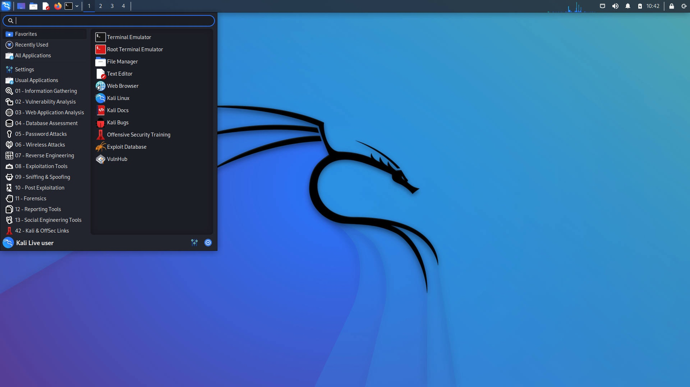

# Kali Linux

## What is Kali Linux

Kali Linux is a Debian-derived Linux distribution designed for digital forensics and penetration testing. It is maintained and funded by Offensive Security. Kali Linux has around 600 penetration-testing programs, including Armitage, Nmap, Wireshark, metasploit, John the Ripper, sqlmap, Aircrack-ng, Burp suite and OWASP ZAP web application security scanners, etc

## Installation

* [Get Kali Linux](https://www.kali.org/get-kali/)
* [Use a Raspberry Pi 4B as an iPad Pro Hacking Accessory](https://cardboard-iguana.com/notes/use-a-raspberry-pi-4b-as-an-ipad-pro-hacking-accessory.html)

## Python Setup Script for Kali

* [Kali-Setup.py](../../Topics/Python/assets/Kali-Setup.py)

## Cheat Sheets
* [Kali Linux Cheat Sheet](assets/Kali-Linux-Cheat-Sheet.pdf)

# Topcis

## Package configuration

`sudo tasksel`

## How to install GNOME desktop on Kali Linux 

`sudo apt update && sudo apt upgrade && sudo apt dist-upgrade `
`sudo apt install kali-desktop-gnome`

> If you receive a notification that asks you what display manager to use, select gdm3, as that is the display manager for GNOME.

`reboot`

If you did't ask get ask to switch GNOME, run 
`sudo tasksel`
and select "GNOME". You can deselect "Xfce"

