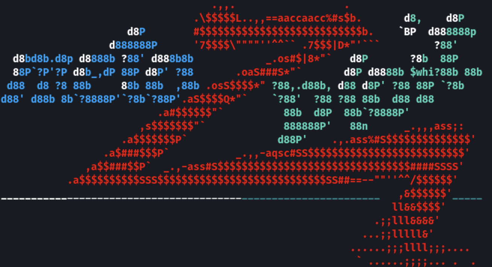

# Metasploit

The Metasploit Project is a computer security project that provides information about security vulnerabilities and aids in penetration testing and IDS signature development. It is owned by Boston, Massachusetts-based security company Rapid7.

Its best-known sub-project is the open-source Metasploit Framework, a tool for developing and executing exploit code against a remote target machine. Other important sub-projects include the Opcode Database, shellcode archive and related research.

The Metasploit Project includes anti-forensic and evasion tools, some of which are built into the Metasploit Framework. Metasploit is pre-installed in the Kali Linux operating system.

## Table of Contents

- [Metasploit](#metasploit)
  - [Table of Contents](#table-of-contents)
  - [Installation](#installation)
    - [First Time Setup DB](#first-time-setup-db)
  - [Links](#links)
  - [Use](#use)
      - 
  - [Information Gathering](#information-gathering)
    - [Portscan](#portscan)

## Installation

`sudo apt install metasploit-framework`

### First Time Setup DB

1. `sudo service postgresql start`
2. `sudo msfdb init`
3. `sudo msfconsole`
4. msf > `db_status`
5. msf > `db_rebuild_cache`

## Links

* [kali.org > metasploit-framework](https://www.kali.org/tools/metasploit-framework/)
* [Metasploit Unleashed by Offensive-Security](https://www.offensive-security.com/metasploit-unleashed/)
* [Using Metasploit and Nmap to scan for vulnerabilities](https://www.cm-alliance.com/cybersecurity-blog/using-metasploit-and-nmap-to-scan-for-vulnerabilities)

## Use
`> msfconsole`
#### 

## Information Gathering

### Portscan

1. 

