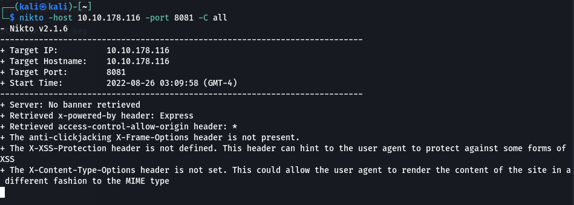

# nikto - web vulns scanner

```
nikto -host 10.211.55.7
```

```
 nikto -url http://10.10.178.116:31331  
```

**Scan Port 8081 (Default is port 80) with all <u>dictionary </u>scan**

```
nikto -host 10.10.178.116 -port 8081 -C all
```


