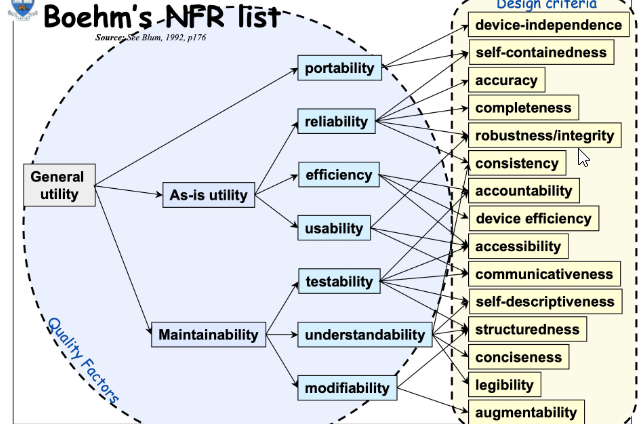
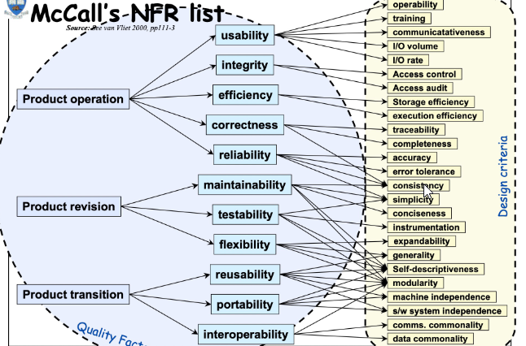

# Delimit systems and define requirements

## Competence

Elicits the deliverables to a system, describes the system context and interfaces, and specifies the requirements in a structured requirements catalog

### Goals for action

1. Elicits the required performance and characteristics of a system with the relevant stakeholders.

2. Identifies relevant surrounding systems and their relationships in the context of the system and defines the system boundary.

3. Decomposesa system into subsystemsor sub-systems and describes the mutual interaction.

4. Defines and describes interfaces between surrounding systems or subsystems.

5. Specifies precise and verifiable requirements for the required services of a system in dialog with the relevant stakeholders.

6. Organizesand describesthe requirementsin a structured requirements catalog.

1. Performance Requirements

2. Building Blocks

3. Decomposition

4. Interfaces

5. Defining Requirements

6. Requirements Management

---

## 1. Performance Requirements

### Knowledge needed for action

Elicits the required performance and characteristicsof a system with the relevant stakeholders.

1. Knows the phasesin the life cycle of an information technology solution (introduction, growth, maturity, saturation, declineand end-of-life) and can explain the typical performance of each phase.

2. Knows different data collection techniques (e.g., interview, questionnaire, observation, document study, report method, workshop) and can explain their advantagesand disadvantages

### 1.1 Cycle of an information technology solution

- What is the IT life cycle?

- Stages (Introduction, Growh, Maturity / Saturation, Decline, Abandonment / End of life)

### 1.2 Data collection techniques

- Interview, Questionnaire, Observation, Document study, Report method, Workshop

---

## 2. Building Blocks

### Knowledge needed for action

Identifies relevant surrounding systems and their relationships in the context of the system and defines the system boundary.

1. Knows different characteristics of surrounding systems, which can influence a system (e.g.actors, external systems, processes, events, laws, rules, norms).

2. Knows the goalof a system context analysis and its usefulness for the development of the system.

3. Knows appropriate techniques for describingand representing systems and their relationships(e.g., context diagram, concept map, UML use case diagram, UML component diagram, arrow diagram).

### 2.1 Characteristics of surrounding systems

- System: A Definition

- Characteristics of a System (Components, Interrelated components, A boundary, A purpose, An environment, Input, Interfaces, Output, Constraints)
  
  - Interfaces: Security, Filtering, Coding, Detecting, Buffering

- Why an industry framework?

### 2.2 System Context Analysis

- Definition: System context (system environment, requirements | Influence by People, Cooperation systems, Processes, Events, Documents)

- Definition: The system context boundary (Seperate important and non-essential parts & not affected by systems. Documenting: Use case, Data flow, Class)

- System Context Analysis
  
  - Definition interaction of a system with environment, 
  
  - Aspects, Laws, standarts, guidelines 
  
  - System influence
  
  - Scope of the development

- The Goal of System Context Analysis
  
  - Context analysis of Persons, Processes, systems. events, documents (laws, norms)
  
  - Enviroments & Influences, Requirements

### 2.3 Techniques for describing representing systems & relationships

- Context Diagram

- Concept Map

- UML Use Case Diagram

- UML Component Diagram

---

## 3. Decomposition

### Knowledge needed for action

Decomposesa system into subsystems and describes the mutual interaction.

1. Knows the method of structured analysis (SA) and its elements for the formal system description (e.g.hierarchical representation, data flow diagram, program flow diagram, structure diagram, decision tables and trees).

2. Knows object-oriented analysis (OOA) method and its elements for formal description of structure (e.g., UML structure diagrams, Entity Relationship Model ERM) and the behavior of a system (e.g.UML behavior diagrams).

3. Knows the concept of Domain Driven Design (DDD) and its basic elements(e.g., ubiquitous language, domain model with entities, Value Objects and Domain Events, Context Map, Bounded Context

### 3.1 Structured analysis (SA)

- What is Structured Analysis?

- Structured Analysis Tools (Tools and techniques for system development)
  
  - Data Flow Diagrams, Data Dictionary, Decision Trees, Decision Tables, Structured English, Pseudo Code

### 3.2 Object-oriented analysis (OOA)

- Structure diagrams

- Behaviour diagrams

- Interaction diagrams

### Domain Driven Design (DDD)

---

## 4. Interfaces

### Knowledge needed for action

Defines and describes interfaces between surrounding systems or subsystems.

1. Knows different types of interfaces (e.g. hardware or software interfaces, user interfaces UI, programming interfaces API) and can name common standards.

2. Knows suitable forms for syntacticand semanticdescription of data interfaces (data dictionary, extended Backus-Naur form EBNF, XML with DTD or XMD, JSON, OpenAPI).

### 4.1 Types of Interfaces

- Hard- & Software Interfaces
  
  - Hardware interfaces (plugs, sockets, cables, electrical signals, CPU, peripheral device, communication network)
  
  - Software interfaces (languages, codes, messages to communicate with each other)

- User Interface (GUI, CLI, menu-driven, touch, voice (VUI), form-based, natual language)

- API (communicate with each other, software interface, api specification, expose API)

- Web APIs: Via HTTP (JSON, XML)

### 4.2 Forms of Data Interfaces

- Extended Markup Language (XML)

- Extended Backus-Naur form EBNF

- JavaScript Object Notation (JSON)

---

## 5. Defining Requirements

### Knowledge needed for action

Specifies precise and verifiable requirements for the required services of a system in dialog with the relevant stakeholders.

1. Knows the purpose and the essential elements of the content of a specification.

2. Knows the quality criteria for describing requirements (e.g., conciseness, comprehensibility, consistency, measurability and testability, unambiguity, legal compliance).

3. Knows the elements in agile requirements elicitation (e.g., epic, feature, user story, task) and can explain their purpose and level of detail.

### 5.1 Elements of the content of a specification

- What Is a Software Requirements Specification?
  
  - Software requirements specification (SRS)
  
  - Business requirements specification.
  
  - Functionaland non-functional requirements
  
  - Use Cases

- Imperatives when designing a requirements document
  
  - Organized
  
  - Users’ viewpoint and in the user’s language
  
  - Implementation-neutral
  
  - Analyse, refine, decompose
  
  - Testable
  
  - Evaluate documentation
  
  - Manage requirements change

### 5.2 Describing requirements

???

### 5.3 Agile requirements

- Agile Projects
  
  - Backlogs
  
  - Definition of Done (DoD)
  
  - Epics
  
  - Features
  
  - User Stories
  
  - Tasks

---

## 6. Requirements Management

### Knowledge required for action

Organizesand describes the requirements in a structured requirements catalog.

1. Knows the typical components of a requirements description (e.g. identification, description, priority, acceptance criterion, status).

2. Knows the difference between functional and non-functional requirements.

3. Knows typical non-functional requirements (e.g., reliability, safety, usability, performance, maintainability, portability, scalability) and can explain their impacton the quality of a system.

4. Knows the importance and purpose of the product backlog, sprint backlogs and a product increment in agile requirements management.

### 6.1 Requirements description

- What Is a Software Requirements Specification (SRS) Document

- Possible Outline (Purpose, Overall Description, System Features and Requirements)

- Define your product's purpose (Intended Audience, Intended Use, Product Scope, Definitions and Acronyms)

- Describe What You Will Build (User Needs, Assumptions, Dependencies)

### 6.2 Functional and non-functional requirements.

- Functional requirements: what the system should do (use cases, diagrams)

- Non-functional requirements: global constraints (costs, performance, reliability, maintainability, portability, robustness etc.)

- The challenge of NFRs (Hard to model, usally informally, hard to measure requirements)

### 6.3 Non-functional requirements

**Typical NFRs**

### 6.4 Agile requirements management

???

