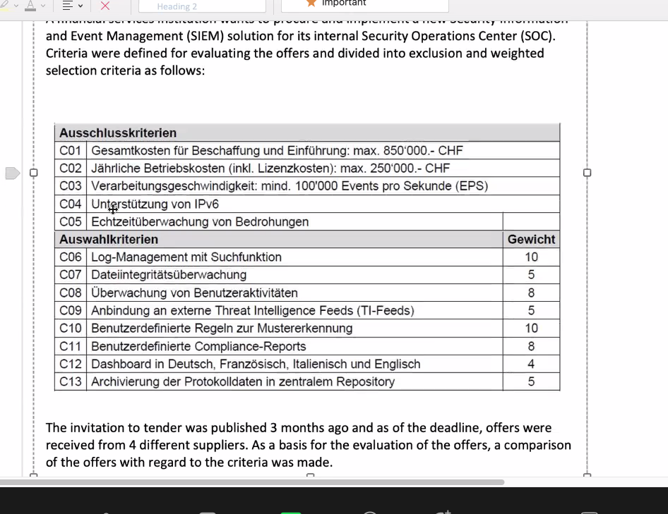
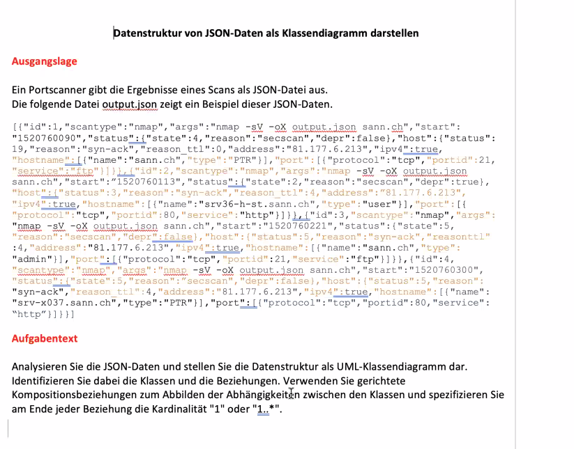

# Evaluate IT solutions

## Competence

Carries out the evaluation of an IT solution based on a given assignment and defined requirements and formulates a recommendation for procurement.

## Goals for action

1. Assessesthe given requirements for an IT solution in the specific context and, if required, checks the technical feasibility and effectiveness.

2. Determines the procedure for evaluatingan IT solution, considering the project or procurement order the procedure for the evaluation of an IT solution and prepares a a time schedule

3. Defines, based on the orderand the given requirements,the criteria for the evaluation of the offers in a criteria catalog

4. Draws up a specification sheet as the basis for the invitation to tender to suppliers.

5. Preparesthe evaluation documents for an objective and comprehensible evaluationof the offers

6. Checks the completeness and quality of the offers received, requests their correction if necessary and, considering the defined the pre-selection of the offers and exclusion criteria.

7. Evaluatesand comparesthe remaining bids based on the evaluation documents and makes a recommendation for the decision makers

---

## 1. IT SOLUTION REQUIREMENTS

### Knowledge needed for action

Assessesthe given requirementsfor an IT solution in the specific context and, if required, checks the technical feasibility and effectiveness.

1. Knows the importance and purpose of technical feasibility reviews and their differences from broader feasibility or project studies (e.g., no review or assessment of economic viability, legal compliance, timing, risks).

2. Knows methods for testing technical feasibility and effectiveness in ICT projects (e.g., pilot testing, prototyping, simulation, expert interviews, reference objects).
   
   1. Johari Windows

---

## 2. EVALUATION PROCEDURE

### Knowledge needed for action

Exam Question 2020

**Subquestion 2**

I recommendate Offer D because it fulfill all Ausschlusskriterien and most % by "Auswahlkriterien". Offer C does not fulfill all Ausschlusskriterien.

**Subquestion 3**

I would recommend Solution B has 84% Fullfill Rate by Auswahlkriterien and fulfill all Ausschlusskriterien. Cost less and has better performance than D.

