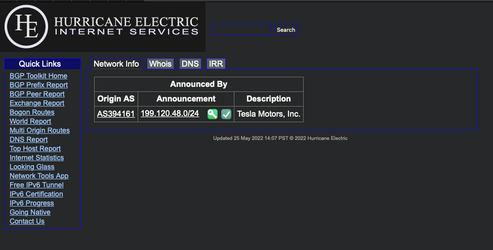
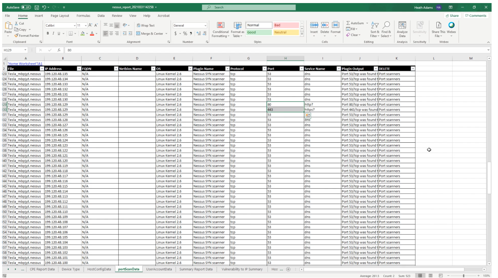
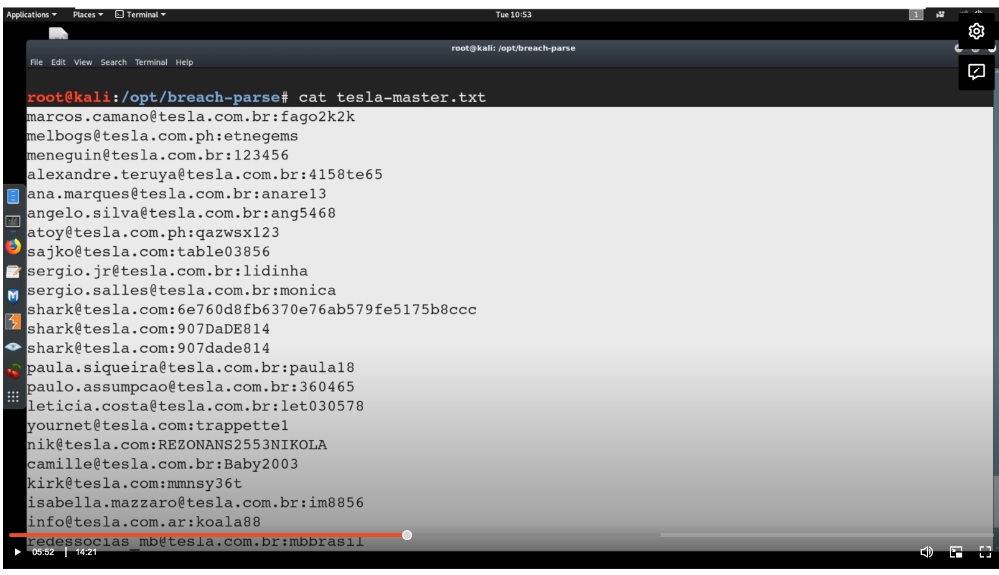
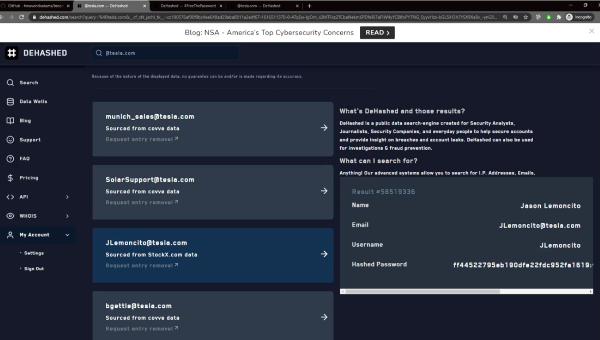

# External Pentest Playbook

- [External Pentest Playbook](#external-pentest-playbook)
- [Objectives of an External Pentest](#objectives-of-an-external-pentest)
- [Checklists, FTW](#checklists-ftw)
  - [Ethical Hacking Checklist for Externals](#ethical-hacking-checklist-for-externals)
    - [ToDo's](#todo-s)
    - [Scope](#scope)
    - [Targets](#targets)
    - [Password Spraying](#password-spraying)
    - [Breached Accounts](#breached-accounts)
    - [Login Portals](#login-portals)
    - [Findings & Strengths](#findings-strengths)
- [Rules of Engagement](#rules-of-engagement)
- [Verifying Scope](#verifying-scope)
- [Client Communication](#client-communication)

# Objectives of an External Pentest

* Break in
* Worstcase 
* Password Policy
* Vulernability Scanning

# Checklists, FTW

* [OWASP-Testing-Checklist](https://github.com/tanprathan/OWASP-Testing-Checklist) - OWASP based Web Application Security Testing Checklist is an Excel based checklist which helps you to track the status of completed and pending test cases.
* [WASP Guide](https://owasp.org/www-project-web-security-testing-guide/v41/)

## Ethical Hacking Checklist for Externals

### ToDo's

| To Do's                                                                                                                             | Status      | Comments |
|-------------------------------------------------------------------------------------------------------------------------------------|-------------|----------|
| Ensure ROE is signed by client                                                                                                      | Outstanding |          |
| Add IPs in scope to Scope list                                                                                                      | Outstanding |          |
| Verify customer scope                                                                                                               | Outstanding |          |
| Send kickoff email                                                                                                                  | Outstanding |          |
| Conduct vulerability scanning with Nessus                                                                                           | Outstanding |          |
| Identify e-mails/users/pass in breach databases (Dehashed, breach-parse, etc.)                                                      | Outstanding |          |
| Identify employees & email address format (LinkedIn, phonebook.cz, clearbit, hunter.io, etc.)                                       | Outstanding |          |
| Identify client's website(s) and search for any data useful to help attack (job posting, system information, password policy, etc.) | Outstanding |          |
| Attempt to enumerate any accounts on portals, password reset functions, etc                                                         | Outstanding |          |
| Run web app scans, if necessary                                                                                                     | Outstanding |          |
| Conduct manual testing and exploitation on target                                                                                   | Outstanding |          |
| Validate scanning tool vulerabilities                                                                                               | Outstanding |          |
| Conduct password spraying guessing and brute force on login portals                                                                 | Outstanding |          |
| Escalate access from external to internal                                                                                           | Outstanding |          |
| Validate previous year findings have been resolved                                                                                  | Outstanding |          |
| Cleanup                                                                                                                             | Outstanding |          |

### Scope

| IP Range                     | Comments |
|------------------------------|----------|
| xxx.xxx.xx.0/24 |          |

### Targets

| Host IP | URL | Open Port | Status      | Comments / Findings |
|---------|-----|-----------|:------------|:--------------------|
|         |     |           | Outstanding |                     |

### Password Spraying

| Site | Account list using | Passwors Tried |
|------|--------------------|----------------|
|      |                    |                |

### Breached Accounts

| Users | Password from Breach |
|-------|----------------------|
|       |                      |

### Login Portals

| Login Pages | Comments |
|-------------|----------|
|             |          |

### Findings & Strengths

| Finding / Issue | System/IP Name | Screenshot? | Comment |
|-----------------|:---------------|-------------|---------|
|                 |                |             |         |

| Strengths Identified | System/IP Name | Screenshot? | Comment |
|:---------------------|:---------------|:------------|---------|
|                      |                |             |         |

# Rules of Engagement

* [Rules of Engagement Template.docx](assets/Rules%20of%20Engagement%20Template-a.docx)

# Verifying Scope

Ensure Information provieded by client (e.g. IP Range Scope), is related to customer. If he provide wrong information, you will attack someone else.

* [https://bgp.he.net](https://bgp.he.net)

# Client Communication

* Inform customer when you start with Penetration Testing
* Critical finding -> inform customer immediately 
* Inform customer when you finished with Penetration Testing

## Email Example - Penetration Test Beginning

Hi XXX,
The external penetration test is about to begin. Per our agreement, we will testing the following IPs/ranges:

- xxx.xxx.xx.x/24

All pentesting activity will be performed from the following IP address:

xxx.xxx.xx.x

If our teting triggers any alerting for you, please notify us at your earliest convenience so we can notate this in the report.

Finally, if you need anything at all during the testing, you can reach me at this email or by the phone number listed in my signature.

Thank you,

YX

# Attack Strategy

* Think of external pentests like home security
* Low change of RCE (Remote Code Execution), high change of weak passwords
* OSINT is your best friend (and logical guessing)
* On Website / Portals: Don't start Web-App Assessment when focus is on external infrastructure attacks. But straight forward attacks like SQL Injections or Access Admin Portal can be useful.

# Vulnerability Scanning

# Reviewing & Extracting Information

1. Download "Nessus" File
2. Download [Nessus Parser](http://www.melcara.com)
3. Covert Nessus File to xls:
 
`perl parse_nessus_xml.v23.pl -F report.nessus`

# Information Gathering / OSINT

## Overview

* Previously breached information
* Job Postings
* Current User / Password

## Hunting Breached Credentials

* [breach-parse](https://github.com/hmaverickadams/breach-parse) - A tool for parsing breached passwords

`./breach-parse.sh @client-company.com results.txt`

* [www.dehashed.com](https://www.dehashed.com) - DEHASHED 14,453,524,222 COMPROMISED ASSETS

#  Identifying Employees & Emails

* [phonebook.cz](https://phonebook.cz)
* Find Employees via [LinkedIn](https://www.linkedin.com/feed/)

#  Enumerating Valid Accounts (Pre-Attack)

# Other Useful Information

* Find Information about Systems
* Find Password Policy 
* 