# External Pentest Playbook

> [The External Pentest Playbook from TCM Security](https://academy.tcm-sec.com/p/external-pentest-playbook)


# Table of Contents

- [External Pentest Playbook](#external-pentest-playbook)
- [Table of Contents](#table-of-contents)
- [Before We Start](#before-we-start)
  - [Objectives of an External Pentest](#objectives-of-an-external-pentest)
  - [Checklists, FTW](#checklists-ftw)
    - [Ethical Hacking Checklist for Externals](#ethical-hacking-checklist-for-externals)
      - [ToDo's](#todo-s)
      - [Scope](#scope)
      - [Targets](#targets)
      - [Password Spraying](#password-spraying)
      - [Breached Accounts](#breached-accounts)
      - [Login Portals](#login-portals)
    - [Findings & Strengths](#findings-strengths)
  - [Rules of Engagement](#rules-of-engagement)
  - [Verifying Scope](#verifying-scope)
  - [Client Communication](#client-communication)
  - [Email Example - Penetration Test Beginning](#email-example-penetration-test-beginning)
- [Kicking Off](#kicking-off)
  - [Attack Strategy](#attack-strategy)
  - [Vulnerability Scanning](#vulnerability-scanning)
  - [Reviewing & Extracting Information](#reviewing-extracting-information)
- [Information Gathering / OSINT](#information-gathering-osint)
  - [Overview](#overview)
  - [Hunting Breached Credentials](#hunting-breached-credentials)
- [Identifying Employees & Emails](#identifying-employees-emails)
- [Enumerating Valid Accounts (Pre-Attack)](#enumerating-valid-accounts-pre-attack)
- [Other Useful Information](#other-useful-information)
- [Attacking Login Portals](#attacking-login-portals)
  - [Overview & Strategy](#overview-strategy)
  - [Attacking O365](#attacking-o365)
  - [Attacking OWA](#attacking-owa)
  - [Attacking Other Portals](#attacking-other-portals)
  - [Bypassing MFA](#bypassing-mfa)
- [Report Writing](#report-writing)
- [Common Pentest Findings](#common-pentest-findings)
  - [Overview](#overview)
  - [Insufficient Authentication Controls](#insufficient-authentication-controls)
  - [Insufficient Patching](#insufficient-patching)
  - [Default Credentials](#default-credentials)
  - [Insufficient Encryption](#insufficient-encryption)
  - [Information Disclosure](#information-disclosure)
  - [Username Enumeration](#username-enumeration)
  - [Default Web Pages](#default-web-pages)
  - [Open Mail Relays](#open-mail-relays)
  - [IKE Aggressive Mode](#ike-aggressive-mode)
  - [Unexpected Perimeter Services](#unexpected-perimeter-services)
  - [Insufficient Traffic Blocking](#insufficient-traffic-blocking)
  - [Undetected Malicious Activity](#undetected-malicious-activity)
  - [Historical Account Compromises](#historical-account-compromises)
- [Wrapping Up](#wrapping-up)
  - [Client Debriefs](#client-debriefs)
  - [Attestation Letters](#attestation-letters)
  - [Client Retests](#client-retests)
- [Conclusion](#conclusion)
  - [Course Conclusion](#course-conclusion)


# Before We Start

## Objectives of an External Pentest


* Break in
* Worstcase 
* Password Policy
* Vulernability Scanning


## Checklists, FTW

* [OWASP-Testing-Checklist](https://github.com/tanprathan/OWASP-Testing-Checklist) - OWASP based Web Application Security Testing Checklist is an Excel based checklist which helps you to track the status of completed and pending test cases.
* [WASP Guide](https://owasp.org/www-project-web-security-testing-guide/v41/)


### Ethical Hacking Checklist for Externals

#### ToDo's


| To Do's                                                                                                                             | Status      | Comments |
|-------------------------------------------------------------------------------------------------------------------------------------|-------------|----------|
| Ensure ROE is signed by client                                                                                                      | Outstanding |          |
| Add IPs in scope to Scope list                                                                                                      | Outstanding |          |
| Verify customer scope                                                                                                               | Outstanding |          |
| Send kickoff email                                                                                                                  | Outstanding |          |
| Conduct vulerability scanning with Nessus                                                                                           | Outstanding |          |
| Identify e-mails/users/pass in breach databases (Dehashed, breach-parse, etc.)                                                      | Outstanding |          |
| Identify employees & email address format (LinkedIn, phonebook.cz, clearbit, hunter.io, etc.)                                       | Outstanding |          |
| Identify client's website(s) and search for any data useful to help attack (job posting, system information, password policy, etc.) | Outstanding |          |
| Attempt to enumerate any accounts on portals, password reset functions, etc                                                         | Outstanding |          |
| Run web app scans, if necessary                                                                                                     | Outstanding |          |
| Conduct manual testing and exploitation on target                                                                                   | Outstanding |          |
| Validate scanning tool vulerabilities                                                                                               | Outstanding |          |
| Conduct password spraying guessing and brute force on login portals                                                                 | Outstanding |          |
| Escalate access from external to internal                                                                                           | Outstanding |          |
| Validate previous year findings have been resolved                                                                                  | Outstanding |          |
| Cleanup                                                                                                                             | Outstanding |          |


#### Scope


| IP Range                     | Comments |
|------------------------------|----------|
| xxx.xxx.xx.0/24 |          |


#### Targets


| Host IP | URL | Open Port | Status      | Comments / Findings |
|---------|-----|-----------|:------------|:--------------------|
|         |     |           | Outstanding |                     |


#### Password Spraying


| Site | Account list using | Passwors Tried |
|------|--------------------|----------------|
|      |                    |                |


#### Breached Accounts


| Users | Password from Breach |
|-------|----------------------|
|       |                      |

#### Login Portals


| Login Pages | Comments |
|-------------|----------|
|             |          |


### Findings & Strengths


| Finding / Issue | System/IP Name | Screenshot? | Comment |
|-----------------|:---------------|-------------|---------|
|                 |                |             |         |


| Strengths Identified | System/IP Name | Screenshot? | Comment |
|:---------------------|:---------------|:------------|---------|
|                      |                |             |         |


## Rules of Engagement

* [Rules of Engagement Template.docx](assets/Rules%20of%20Engagement%20Template-a.docx)


## Verifying Scope

Ensure Information provieded by client (e.g. IP Range Scope), is related to customer. If he provide wrong information, you will attack someone else.


* [https://bgp.he.net](https://bgp.he.net)


## Client Communication

* Inform customer when you start with Penetration Testing
* Critical finding -> inform customer immediately 
* Inform customer when you finished with Penetration Testing

## Email Example - Penetration Test Beginning

Hi XXX,
The external penetration test is about to begin. Per our agreement, we will testing the following IPs/ranges:

- xxx.xxx.xx.x/24

All pentesting activity will be performed from the following IP address:

xxx.xxx.xx.x

If our teting triggers any alerting for you, please notify us at your earliest convenience so we can notate this in the report.

Finally, if you need anything at all during the testing, you can reach me at this email or by the phone number listed in my signature.


Thank you,

YX


# Kicking Off

## Attack Strategy

* Think of external pentests like home security
* Low change of RCE (Remote Code Execution), high change of weak passwords
* OSINT is your best friend (and logical guessing)
* On Website / Portals: Don't start Web-App Assessment when focus is on external infrastructure attacks. But straight forward attacks like SQL Injections or Access Admin Portal can be useful.


## Vulnerability Scanning


## Reviewing & Extracting Information


1. Download "Nessus" File
2. Download [Nessus Parser](http://www.melcara.com)
3. Covert Nessus File to xls:
 
`perl parse_nessus_xml.v23.pl -F report.nessus`


# Information Gathering / OSINT

## Overview

* Previously breached information
* Job Postings
* Current User / Password

## Hunting Breached Credentials

* [breach-parse](https://github.com/hmaverickadams/breach-parse) - A tool for parsing breached passwords

`./breach-parse.sh @client-company.com results.txt`


* [www.dehashed.com](https://www.dehashed.com) - DEHASHED 14,453,524,222 COMPROMISED ASSETS

## Identifying Employees & Emails

* [phonebook.cz](https://phonebook.cz)
* Find Employees via [LinkedIn](https://www.linkedin.com/feed/)


##  Enumerating Valid Accounts (Pre-Attack)


## Other Useful Information

* Find Information about Systems
* Find Password Policy 


# Attacking Login Portals

##  Overview & Strategy

## Attacking O365

[TREVORspray 2.0](https://github.com/blacklanternsecurity/TREVORspray) - TREVORspray is a modular password sprayer with threading, SSH proxying, loot modules, and more!


Use different machines to avoid to get blocked


`trevorspray -u emails.txt -p 'Welcome123' --ssh root@1.2.3.4 root@4.3.2.1`


## Attacking OWA


## Attacking Other Portals


## Bypassing MFA

[MFASweep](https://github.com/dafthack/MFASweep) - MFASweep is a PowerShell script that attempts to log in to various Microsoft services using a provided set of credentials and will attempt to identify if MFA is enabled. 
 
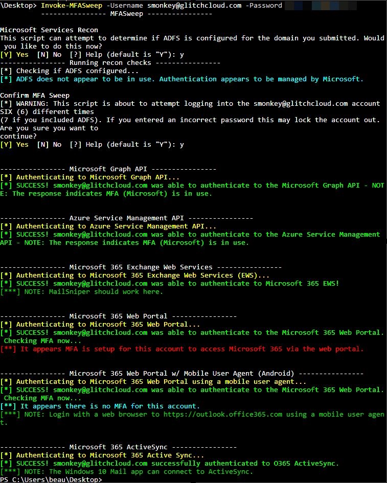

[MailSniper](https://github.com/dafthack/MailSniper) is a penetration testing tool for searching through email in a Microsoft Exchange environment for specific terms (passwords, insider intel, network architecture information, etc.)


# Report Writing

* [TCMS-Demo-Corp-Security-Assessment-Findings-Report](assets/TCMS-Demo-Corp-Security-Assessment-Findings-Report.pdf)

* [WriteHat](https://github.com/blacklanternsecurity/writehat) - is a reporting tool which removes Microsoft Word (and many hours of suffering) from the reporting process. Markdown --> HTML --> PDF. Created by penetration testers, for penetration testers - but can be used to generate any kind of report. Written in Django (Python 3).

  


# Common Pentest Findings

## Overview

## Insufficient Authentication Controls

* Do you have Password Policy

## Insufficient Patching


## Default Credentials


## Insufficient Encryption

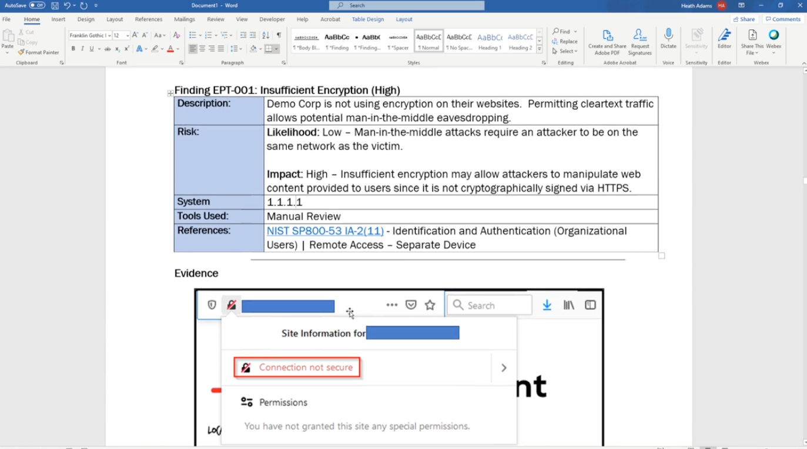

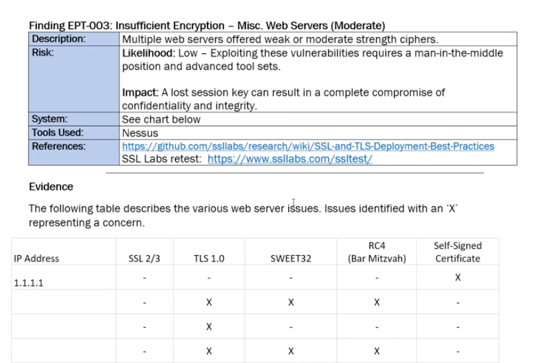


## Information Disclosure

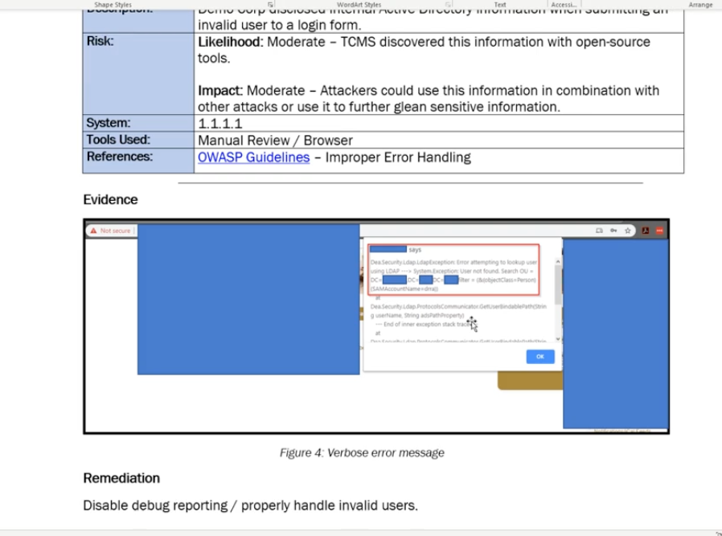


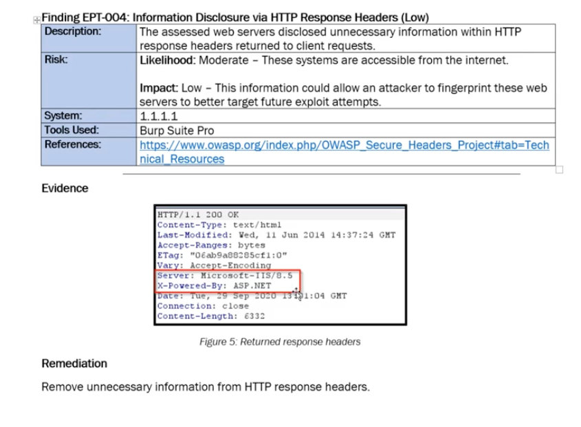


## Username Enumeration


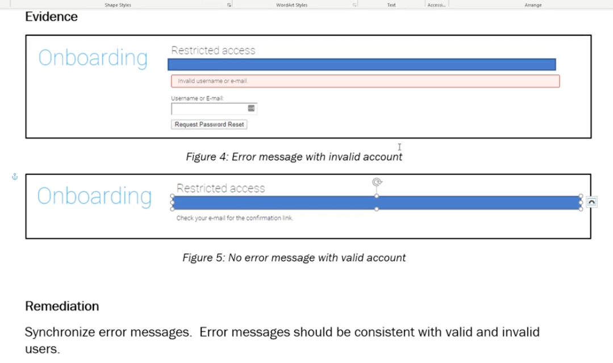


## Default Web Pages


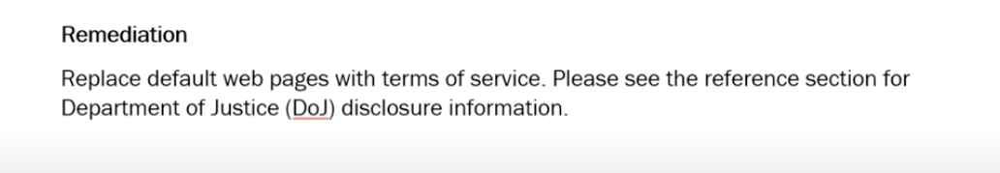


## Open Mail Relays

* [How to Test for Open Mail Relays](https://www.blackhillsinfosec.com/how-to-test-for-open-mail-relays/)

But what is common is to find is what I call a “Partially Open Mail Relay”. This occurs when the mail relay can be used to do one of the following:

* Send email from an external source address to an internal destination address.
* Send email from an internal source address to an internal destination address.


Check this on all your mail servers, as each may be configured differently. This is how you can use the Linux dig command to list the mail servers for your domain. Or for **Windows**, try nslookup.

`dig @8.8.8.8 blackhillsinfosec.com -t MX `

There is also a **Metasploit** module that can test for mail relaying [here](https://www.rapid7.com/db/modules/auxiliary/scanner/smtp/smtp_relay).


```
msf > use auxiliary/scanner/smtp/smtp_relay
msf auxiliary(smtp_relay) > show actions
    ...actions...
msf auxiliary(smtp_relay) > set ACTION < action-name >
msf auxiliary(smtp_relay) > show options
    ...show and set options...
msf auxiliary(smtp_relay) > run
```

##  IKE Aggressive Mode

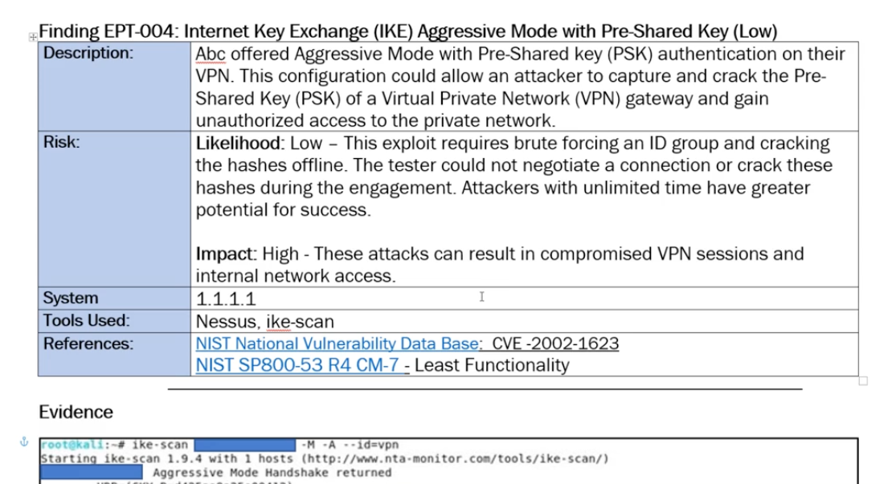

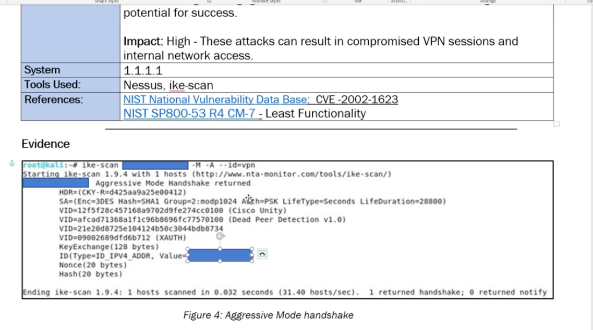

##  Unexpected Perimeter Services

* Finding Remote Desktop Protocol (RDP)
* VNC
* Telnet
* ....


## Insufficient Traffic Blocking

[shotsherpa.com](https://shotsherpa.com) - View your website around the world without a single customs agent


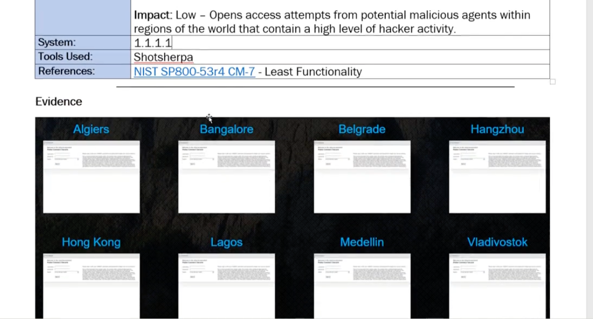

> Maybe Block Content from unnessesary countries.

```
Simple port scanner detector/blocker 
#!/bin/bash

echo "started"

while true ;do
#IP=$(nc -nvl 1025 2>&1 1>/dev/null | egrep "accepted|recieved" | awk -F '[] []' '{print $3;}')
IP=$(nc -nvl 1025 2>&1 1>/dev/null | egrep "accepted|recieved" | grep -E -o "(25[0-5]|2[0-4][0-9]|[01]?[0-9][0-9]?).(25[0-5]|2[0-4][0-9]|[01]?[0-9][0-9]?).(25[0-5]|2[0-4][0-9]|[01]?[0-9][0-9]?).(25[0-5]|2[0-4][0-9]|[01]?[0-9][0-9]?)")
echo ${IP}
#iptables -A INPUT -p tcp -s ${IP} -j DROP #remove the comment to block the ip
echo "-- ${IP} has been blocked"
```

##  Undetected Malicious Activity


##  Historical Account Compromises


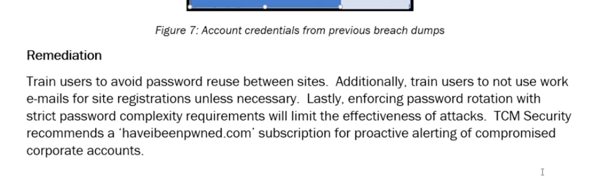

* [haveibeenpwned.com](https://haveibeenpwned.com) - Check if your email or phone is in a data breach

# Wrapping Up

## Client Debriefs

## Attestation Letters


## Client Retests

* 90 Days Retesting Period


# Conclusion

## Course Conclusion

