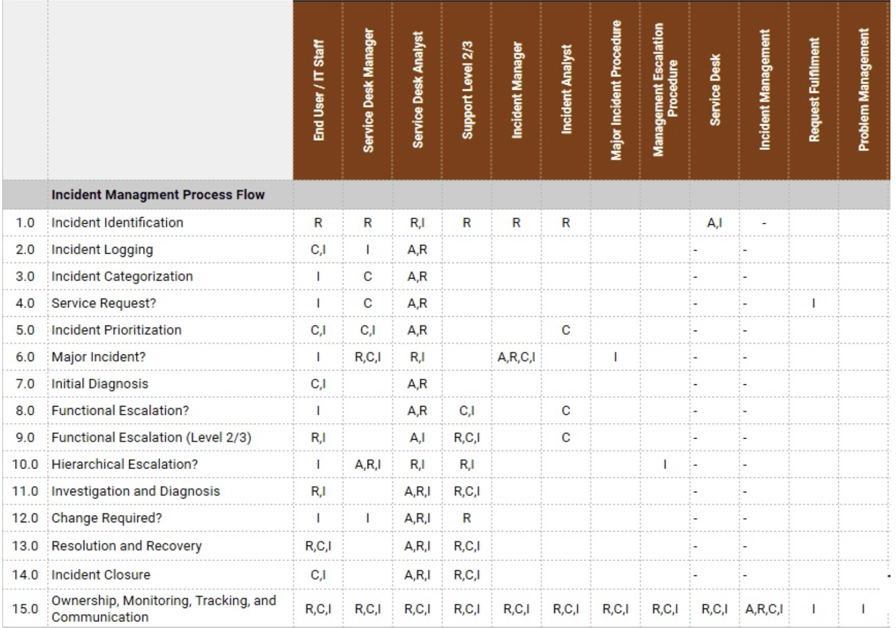
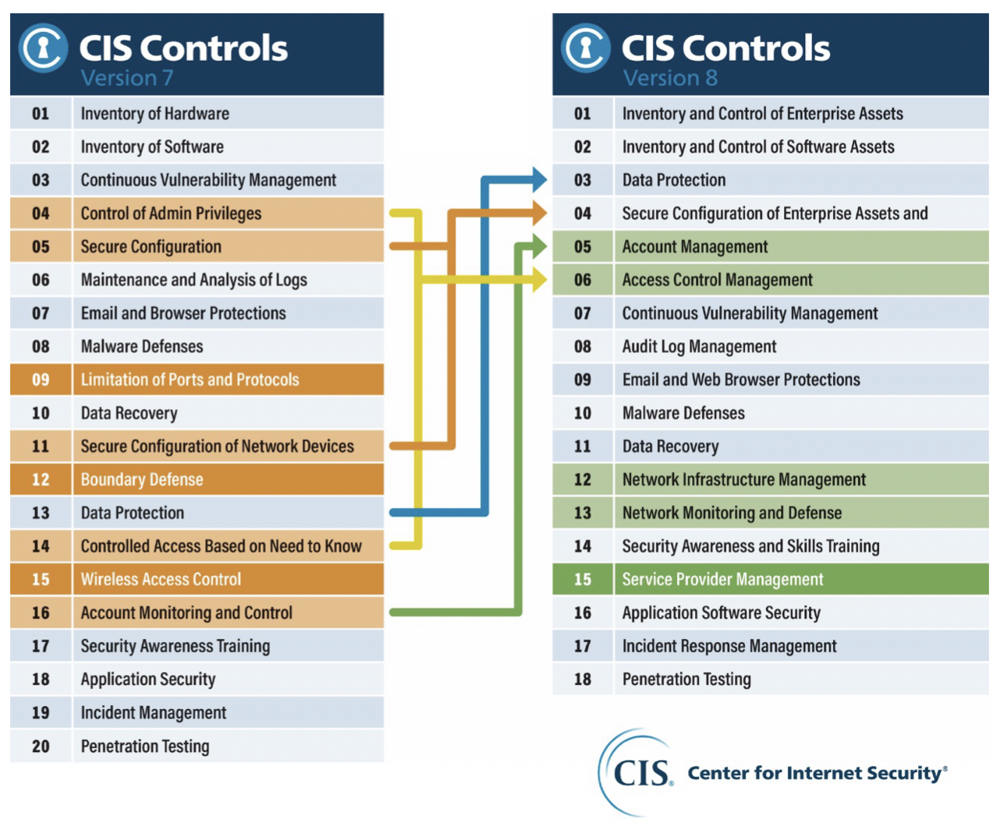
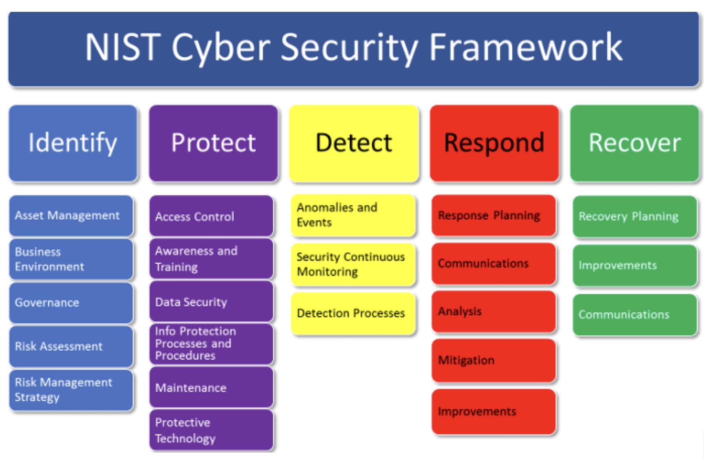
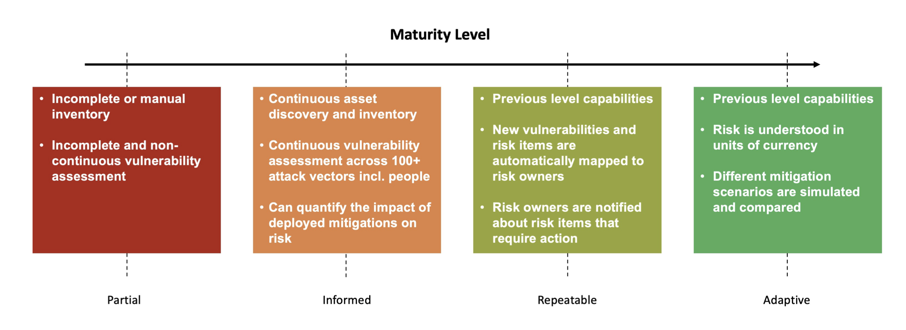
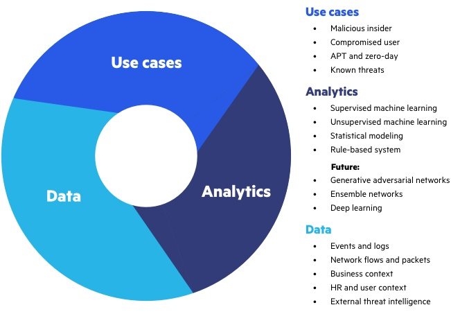
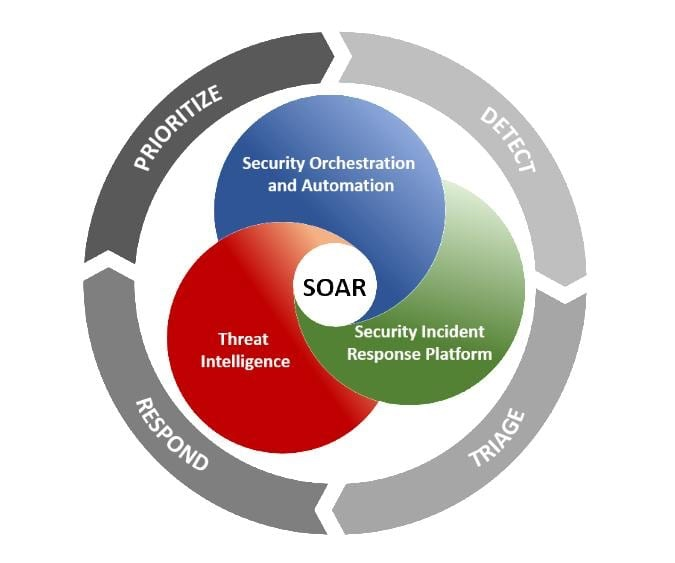
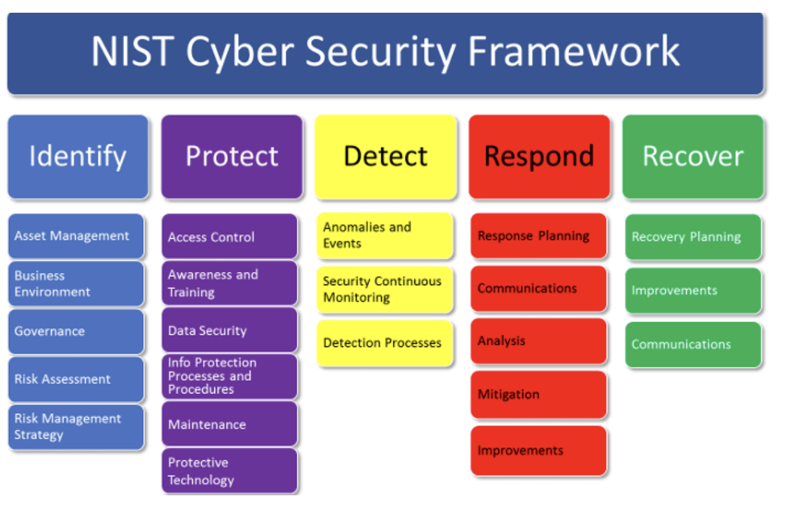
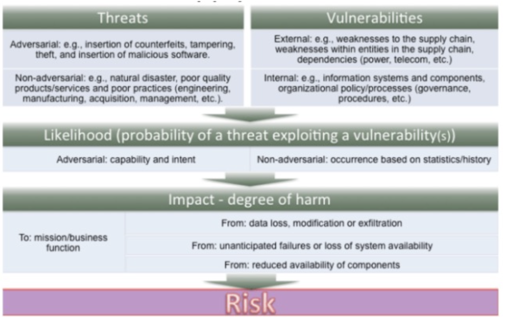

# Manage security incidents & Incident Response

[Flashcards](https://app.studysmarter.de/studysets/8976516?ref=VfFctwQooo0boGPvpYEQ1vMTRDhZpXL5)

[Source Presentation](https://import.cdn.thinkific.com/380432/courses/1359027/ForensicprinciplesandpoliciesLegalandregulatorycompliance-220429-102205.pdf)

## Table of Contents
- [Manage security incidents & Incident Response](#manage-security-incidents-incident-response)
  - [Table of Contents](#table-of-contents)
  - [Agenda](#agenda)
  - [Preparing and Organizations for Incident Response](#preparing-and-organizations-for-incident-response)
    - [Why do we need an Incident Response Plan](#why-do-we-need-an-incident-response-plan)
    - [Some regulations](#some-regulations)
    - [Legal considerations](#legal-considerations)
    - [Q&A from and for the CEO](#q-a-from-and-for-the-ceo)
    - [Questions you should focus on](#questions-you-should-focus-on)
    - [How to define an incident](#how-to-define-an-incident)
    - [Organization’s IR capabilities](#organization’s-ir-capabilities)
    - [Key components for IR plan](#key-components-for-ir-plan)
    - [Other key components for IR plan](#other-key-components-for-ir-plan)
    - [Writing the plan](#writing-the-plan)
      - [NIST framework](#nist-framework)
      - [IR Team access](#ir-team-access)
      - [IR Stakeholders](#ir-stakeholders)
      - [CEO’s support](#ceo’s-support)
      - [CSIRT team](#csirt-team)
      - [RACI for IR](#raci-for-ir)
  - [Identifying Organizational Assets and Risk (Before the Incident)](#identifying-organizational-assets-and-risk-before-the-incident)
    - [Basic requirements](#basic-requirements)
    - [Documentation and configurationsecurity & baseline](#documentation-and-configurationsecurity-baseline)
    - [Risk based approach](#risk-based-approach)
    - [Vulnerability scan and pentesting](#vulnerability-scan-and-pentesting)
    - [Frameworks](#frameworks)
      - [CIS TOP 18 Controls](#cis-top-18-controls)
      - [NIST CSF](#nist-csf)
    - [IT and Cyber Security](#it-and-cyber-security)
    - [SLA and OLA](#sla-and-ola)
    - [SLA and OLA – KPIs](#sla-and-ola–-kpis)
    - [Detection sources](#detection-sources)
      - [SIEM](#siem)
        - [SIEM – Problems](#siem–-problems)
      - [XDR](#xdr)
        - [XDR – Augmenting SIEM](#xdr–-augmenting-siem)
        - [XDR – Sources and analytics](#xdr–-sources-and-analytics)
        - [XDR – Detection approaches](#xdr–-detection-approaches)
      - [UEBA](#ueba)
      - [SOAR](#soar)
        - [SOAR – Benefits](#soar–-benefits)
  - [Protecting an Organization from an Incident](#protecting-an-organization-from-an-incident)
    - [SOC team](#soc-team)
      - [Outsourcing team](#outsourcing-team)
      - [Debate time](#debate-time)
    - [Risk role on IR](#risk-role-on-ir)
    - [Enterprise Risk Management](#enterprise-risk-management)
    - [Asset management](#asset-management)
    - [Information accuracy](#information-accuracy)
    - [Risk assessment](#risk-assessment)
      - [Threat intelligence](#threat-intelligence)
      - [Supply chain risk management](#supply-chain-risk-management)
      - [Insider threats](#insider-threats)
        - [Insider threats – KRI](#insider-threats–-kri)

## Agenda

* Preparing and Organizations for Incident Response
* Identifying Organizational Assets and Risk
* Protecting an Organization from an Incident
* Detecting the Incident
* Responding to an Incident
* Recovering from an Incident

## Preparing and Organizations for Incident Response

### Why do we need an Incident Response Plan
* Your job... And basically everyone's job, depends on it.
* All companies have cybersec risk
* Regulations and laws require it
* It’s good for business
* To reduce impact and costs
* To set aside budget
* To understand and see your capabilities
* ... Can you think of more reasons?

### Some regulations
* PCI DSS
* HIPAA
* GDPR
* SOX

### Legal considerations
* Disconnect vs stay online
* Law enforcement
* Chain of custody
* Retention of records
* Privacy considerations

### Q&A from and for the CEO
* Ok... I know that I need an IR plan... What’s next?
* If an incident happens, what do we have to disclose? How do we handle that?
* How much will it cost?
* What did the attackers take? How did they got in?
* How long until we have full operations again?
* How can we prevent future incidents?
* How can we better prepared for future incidents?
* Who’s was/is the attacker? What’s the MOM?
    * Medium
    * Opportunity
    * Motive

### Questions you should focus on
* How do we manage the IR?
* What people and skills are needed?
* What technology is needed?
* How and what are we learning from previous incidents?

### How to define an incident
There is not easy/right answer for that. Each company can define an incident depending on their needs.

* Event
* Alert
* Small issue
* Big problem
* Confirmed breach

### Organization’s IR capabilities
1. Low maturity... No real capability
2. Moderate maturity... Some tools and skills
3. Mature

### Key components for IR plan
* Mission
* Goals
* Metrics
* Roadmap
* Organizational structure and responsibilities

### Other key components for IR plan
* Terminology
* Declaring an incident
* Roles
* Triage
* Communications
* Decisions to disconnect
* Recovery
* Lessons learned
* When to go back to main building

### Writing the plan
* W.O.R.N.
* Update
* Simple
* Store

#### NIST framework
* Preparation
* Detection and analysis
* Containment eradication and recovery
* Post incident activity

#### IR Team access
* Privileged accounts
* Policy
* Need to know and least privilege
* Monitoring

... quis custodiet ipsos custodes

#### IR Stakeholders
* Auditors
* HR
* IT
* Chief executives
* Public affairs
* Legal
* Customers

#### CEO’s support
Written policy is needed to give the security team the authority to implement controls and the visibility to get information needed.

#### CSIRT team
* From 1 to multiple
* Remote work or on-site
* 24x7 or 8x5
* Outsourcing
* Reverse engineering
* Threat intelligence
* Forensics
* Threat hunting
* Programmers

#### RACI for IR

## Identifying Organizational Assets and Risk (Before the Incident)

### Basic requirements

* Updated network diagrams
* Ports, protocols and configuration documentation
* Baselines and gold images
* Policies and procedures

### Documentation and configurationsecurity & baseline
* Network devices configuration and policies
* Backups
* Baseline images
* Hashes and digital signatures
* Asset inventory

### Risk based approach
* Threat – Available exploits?
* Probability – known and zero day
* Impact
* Exposure
* Current countermeasures

### Vulnerability scan and pentesting
* What’s the difference?
* How do they complement
* How can they help to create, implement and maintain an IR plan?
* How can they help reduce risk?

### Frameworks

#### CIS TOP 18 Controls
* Not 20 controls
* Combined by activities and not by devices
* Migrated from 171 sub-controls to 153 safeguards
* Safeguard are still prioritized by IG (Implementation Groups)

#### NIST CSF

* Identify – What processes and assets must be protected
* Protect – What countermeasures are available
* Detect – What technologies and techniques can identify incidents
* Respond – What controls can mitigate the impact

### IT and Cyber Security

* Without the IT department, there’s no need for security
* Reporting structure can cause problems
* Use RACI if necessary
* IT lack of knowledge or is under-resourced
* IT should maintain accurate documentation
* IT and cyber security must understand risk

### SLA and OLA
* Clearly defined responsibilities, penalties and rewards between internal and external providers
* Clearly defined KPI to measure SLA and OLA
* Create balanced scorecards for compliance
* Take into consideration all the impacts (e.g. business image)
* Take into consideration laws and regulations

### SLA and OLA – KPIs
* Pentesting and vulnerability scanning results
* RTO, RPO and MTBF
* Patching %
* Incidents per month
* ... Can you think of other important KPIs?

### Detection sources
* Cloud
* User activity and complaints
* Endpoint / Servers and entity activity
* Applications and sensors
* Mobile devices
* Network Traffic

#### SIEM
* Correlation and aggregation from several sources
* Be careful about about is time zones
* Configure the dashboard to match your KPI and KRI
* Define RACI for SIEM and alerts

##### SIEM – Problems
* Receiving the correct information?
* Getting information from the correct sources?
* Configuring the correct use cases?
* Running the correct playbooks?
* Does it have the user and entity context?

#### XDR
* Extended detection and response (XDR) is cross-layered detection and response.
* XDR collects and automatically correlates data across multiple security layers – email, endpoint, server, cloud workloads, and network – so threats are detected faster and security analysts improve investigation and response times.
* XDR represents the evolution of detection and response(EDR) beyond the current point-solution, single-vector approach.

##### XDR – Augmenting SIEM
* Organizations use SIEMs to collect logs and alerts from multiple solutions. While SIEMs allow companies to bring together a lot of information from multiple places for centralized visibility, they result in an overwhelming number of individual alerts.
* XDR collects deep activity data and feeds that information into a data lake for cross-layer sweeping, hunting, and investigation. Applying AI and expert analytics to the rich data set enables fewer, context-rich alerts, which can be sent to a company’s SIEM solution.

##### XDR – Sources and analytics
* Descriptive
* Diagnostic
* Predictive
* Prescriptive

##### XDR – Detection approaches
* Rules-based anomaly detection
* Historical analysis
* Machine learning and AI
* Mixed

#### UEBA
* UEBA stands for User and Entity Behavior Analytics and was previously known as user behavior analytics (UBA).
* UEBA uses large datasets to model typical and atypical behaviors of humans and machines within a network.
* By defining such baselines it can identify suspicious behavior, potential threats and attacks that traditional antivirus may not detect.

[Source Image](https://www.imperva.com/learn/wp-content/uploads/sites/13/2019/08/ueba.jpg)

#### SOAR

* SOAR (security orchestration, automation and response) is a stack of compatible software programs that enables an organization to collect data about security threats and respond to security events without human assistance.
* What SOC teams are looking for:
    * Automate Repeated Response Workflow
    * Save Time for Higher Priority Triage Tasks
    * Easy Standardized Response to follow

[Image Source](https://www.bravotecnologia.com.br/wp-content/uploads/2020/03/Soar.jpg)

##### SOAR – Benefits
* Consolidate process management, technology and expertise
* Centralize asset monitoring
* Enrich alerts with contextual intelligence
* Automate response and perform inline blocking

## Protecting an Organization from an Incident

### SOC team

* Separate team from CSIRT
* Train in IR topics
* Playbooks
* SOAR, XDR, UEBA

#### Outsourcing team

* Not enough staff
* Better working hours (follow the sun)
* Cyber insurance
* IR Retainers
* SLA and Roles

#### Debate time

Which one is better to conform the IR team?

* Only company staff
* Only outsourcing staff
* Mixed

### Risk role on IR

* Risk appetite
* Impact
* Probability
* Complexity

### Enterprise Risk Management

* IT on the board of directors
* Cyber risk included in the overall risk management
* C-level inclusion
* BCP / DRP
* RTO and RPO

### Asset management

* High value asset
* Hardware and software assets
* Criticality and objectives
    * DRP–BCP–RTO–RPO
* Change management

### Information accuracy

* Change management database
* Up-to-date plans
* Vulnerability and pentest results
* Network diagrams
* Public reports
* KPI and KRI

### Risk assessment

* Vulnerabilities change
* Threats change
* Business processes change
* Frameworks evolve

#### Threat intelligence

* Vulnerabilities
* Threats
* Exploits
* Actors
* Based on evidence
* Actionable advice
* Influence response plans
* Obtained from several sources

#### Supply chain risk management

* Commercially acquired information
* Communication technologies
* Providers
* Partners

NIST SP 800-161 // Supply chain risk management practices for federal information systems and organizations

#### Insider threats

* On purpose – Criminal insiders
* Not on purpose – Negligent or ignorant insiders

* Must be considered when calculating risk
* Identify high risk roles
* Implement dual check controls
* Increase monitoring on high risk accounts
* Define insider threats MOM and PlayBooks
* Define an acceptable use policy
* Consider creating a working group
* Consider collaborating with HR and Legal
* Consider creating KPI and KRI for insider threats
* Consider centralizing notifications to IT, HR and Legal
* Consider defining reporting structure that allows bypassing the chain of command when necessary

##### Insider threats – KRI

* Work performance
* Missing work
* Social media posts
* Increase in wealth
* Ties to sketchy people
* Increase in DLP alerts

* Installing unauthorized software
* USB insertion
* Login to privileged accounts
* High printing volume
* Access during non-standar times
* Unusual network traffic (uploads and downloads)
* SSH logins
* Using non-standar protocols

