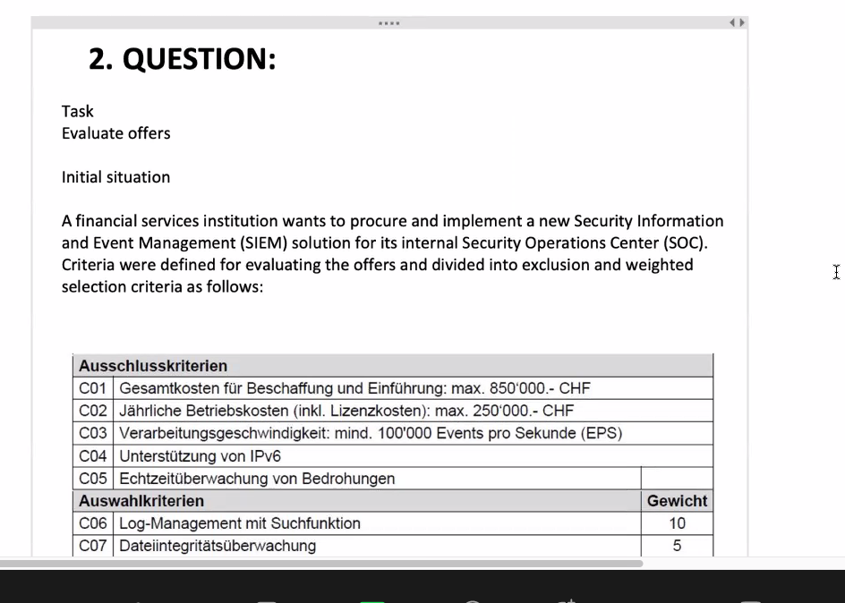
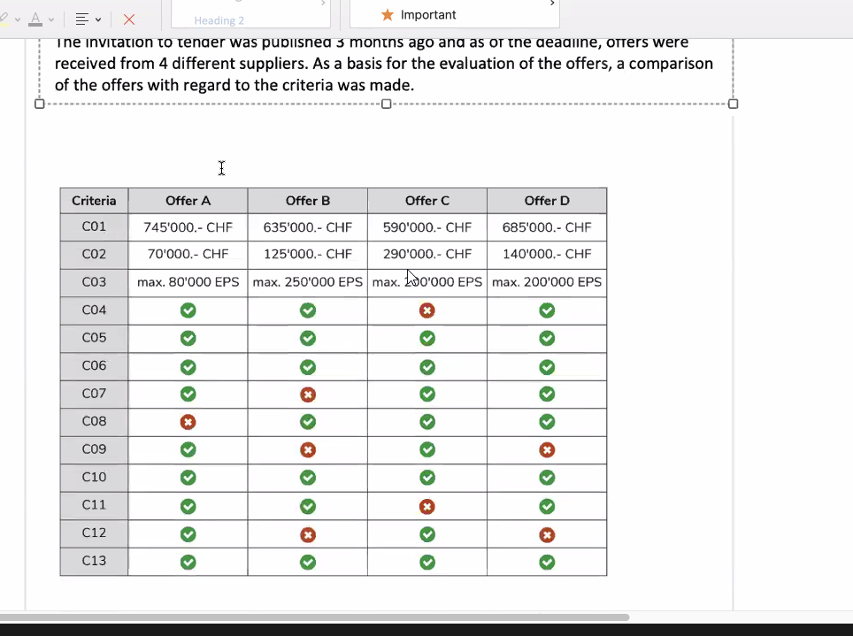
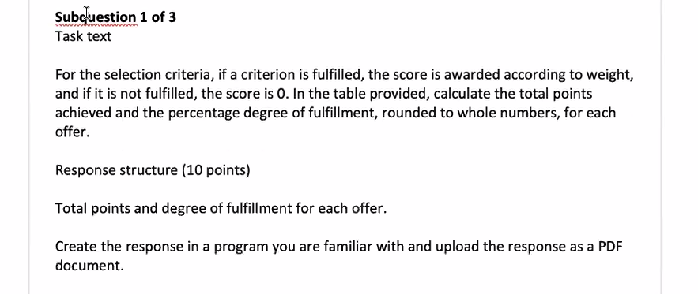
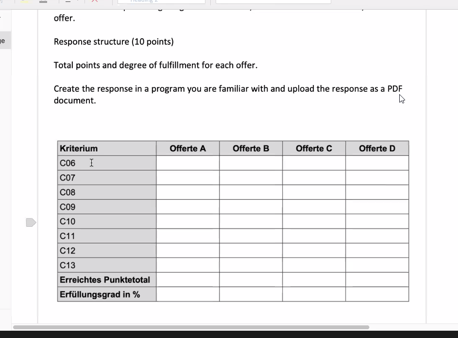
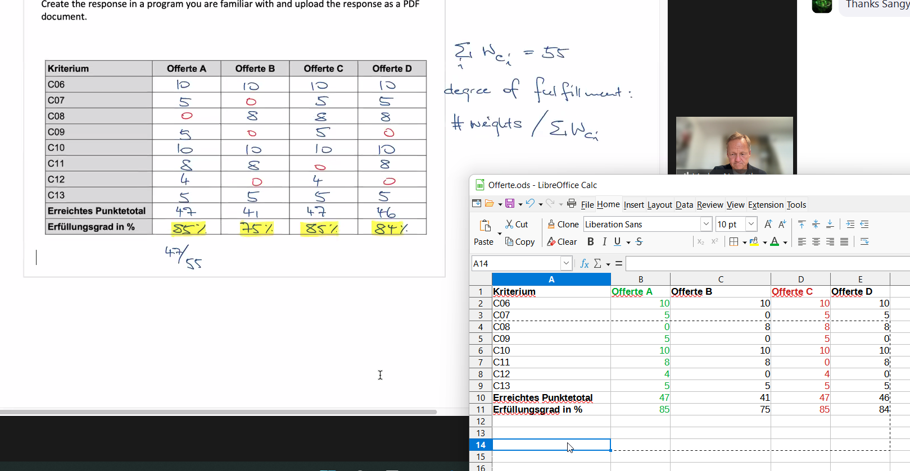
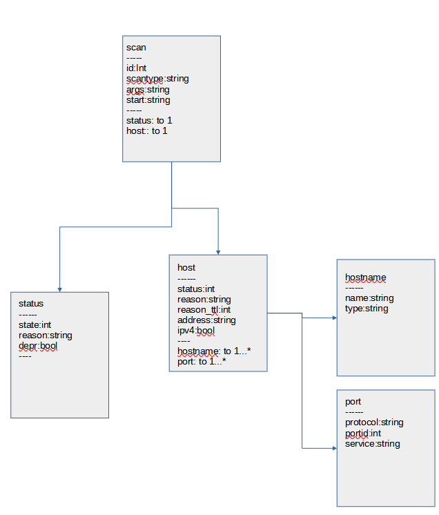

# Exam Question 2020

**Subquestion 2**

I recommendate Offer D because it fulfill all Ausschlusskriterien and most % by "Auswahlkriterien". Offer C does not fulfill all Ausschlusskriterien.

**Subquestion 3**

I would recommend Solution B has 84% Fullfill Rate by Auswahlkriterien and fulfill all Ausschlusskriterien. Cost less and has better performance than D.

[UML Document](assets/UML.odg)
