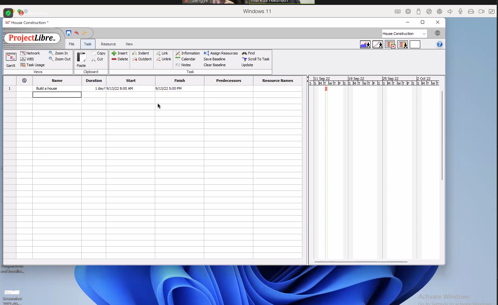
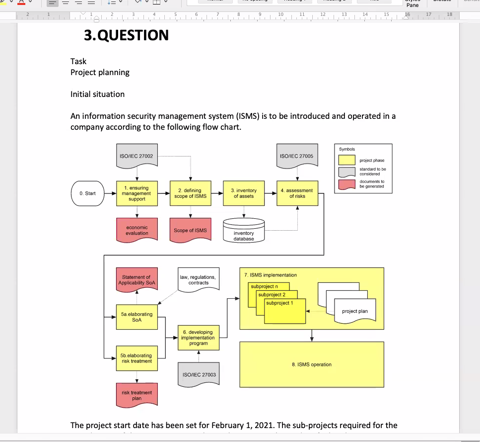
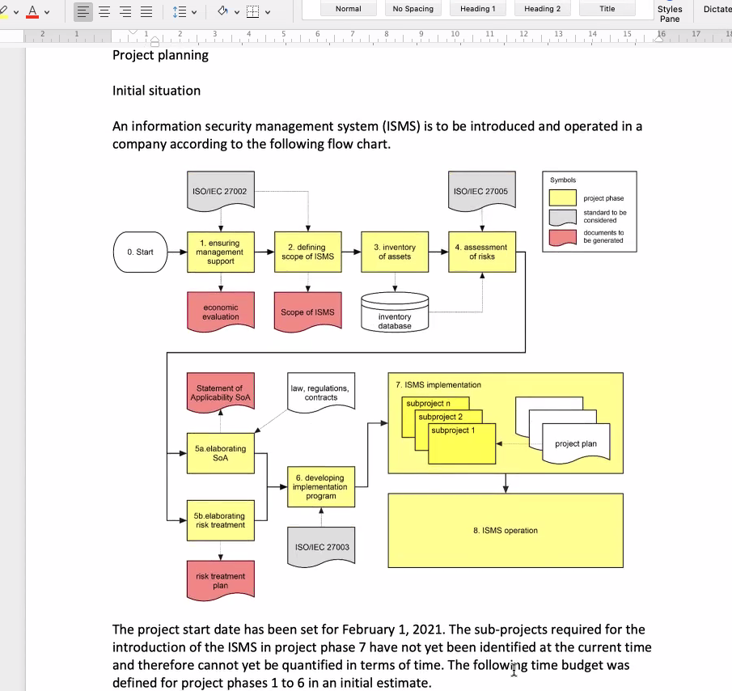
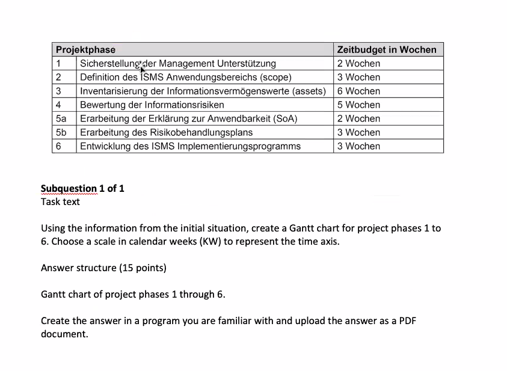
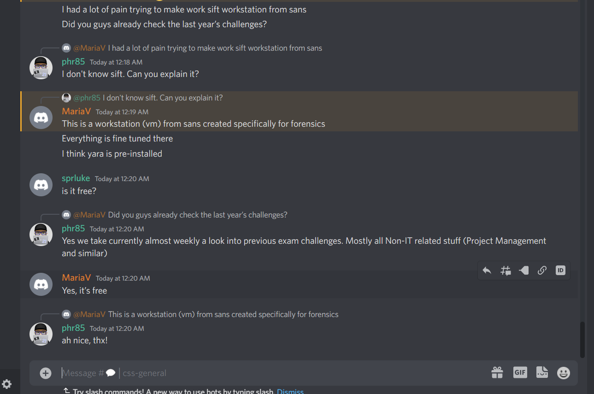

# Projects IT Project Management

## Module 690

## Plan lead and oversee projects

## Competence

Structures and plans a project based on the specified project mission, manages and monitors the project during implementation, and periodically informs decision makers of project progress.

### What makes ICT projects unique?

- While ICT projects are often compared to building or construction projects, there are some marked departures between these and ICT projects.

-  I will outline a few of those differences on the following pages as introduction

- Cost out projects: CHF per unit of building size m/2

- Construction -> not involve unproved materials | ICT project new soft- and hardware (project risk)

- Abscence of enforceable controls on ICT projects. 

- Maturity Models: CMMI (Capability Maturity Model Integration)

- Process models: Identify, improve, processes, products, continuous process improvement

- Frequency of Updates (Cost of software development only fraction of life cycle costs)

- Construction -> Most expensive part is to build up

## Goals for Actions

- Analysis and Approach

- Divide et Impera

- Planning

- Communication

- Subprojects

- Chnage Management

- Risks and Countermeasures

- Controlling

- Reporting

## Examples of Projects

- Technical projects

- Artistic projects

- Organizational projects (Implementation of an enterprise software)

- Scientific projects (Genome Project, ISS)

## Definition

- Project (related to DIN 69901) 
  
  - Start and End, is temporary, one-time
  
  - Project delivered in a scope (time, cost, resources, organization, quality, ..)

- Project Management
  
  - Organizing and managing ressources
  
  - Art of solving a given problem in a certain time / ressources

- Example of Project Definition
  
  - What can be defined as a project?
    
    - Exam, academic studies
    
    - Preparation and execution of a voter mandate to govern a country
    
    - Software implementation project
    
    - Football World Championship
  
  - What is usally not a project?
    
    - Reading book for the academic studies (no start / finish date)
    
    - initiating a political debate (not target, no process model)
    
    - Answering eMail
  
  - What is a successful project
    
    - Possible criteria
      
      - In the mood good?
      
      - Is
  
  - Study Project Success
    
    - Can you draw any conclutions?
    
    - Would you have any example of failed projects?

Example of Failures

- Ariane 5

- Mars Climate Orbiter

- Toll Collect

Why Project Management?

- Better control of financial, pysical, and human resources

- Improved customer relations

- Shorter development imes

- Lower cots

- Higher quality and incread reliability

- Higher profit margins

- Improved productivity

Law of Project Managment

- Progess quickly until 90%. 10% take forever

- Things to well, something go wrong

Why are there projects?

- extraordinary problems (no day-to-day routine)

Ranking of most important Difficulties

- According to Pazak / Rattay

### Operations vs Projects

Origins of Projects

- Projects Objectives

- Requirements

- Project cost-effectiv

- process model

Example

Supplements to Project Approval

Life Cycle Models

Overview about Roles in Projects

- Project executing organization

- Project team (Project leader, statt)

https://www.projectlibre.com/

----

## 3. Planing

### Knowlage needs for action

1. methodse, techniques, planing sequential, iterative projects (Gantt chart, network diagram)

2. Ceremonies (Steps) in Planning agile projects (e.g. release planning, product backlog, sprint planning sprint review, sprint retrosprective, daily scrum)

-----

## 4. Communication

