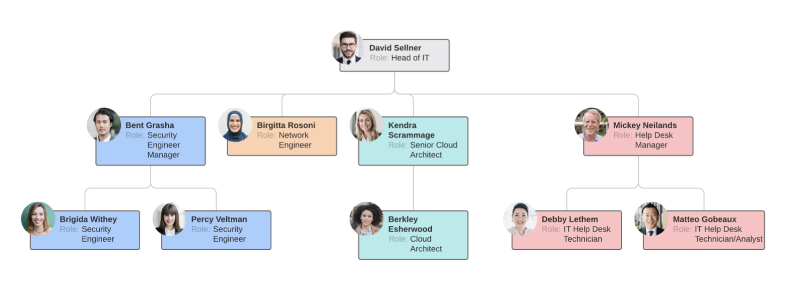

# 674 Team Building and Management

* ⭐️ [Flashcards](https://app.studysmarter.de/studysets/9004280?ref=VfFctwQooo0boGPvpYEQ1vMTRDhZpXL5)

---

- [674 Team Building and Management](#674-team-building-and-management)
  - [Objectives](#objectives)
  - [Modulnummer 674 - Team führen und fördern](#modulnummer-674-team-führen-und-fördern)
    - [Competence](#competence)
    - [Goals for action](#goals-for-action)
    - [1. Efficient and Effective Leadership](#1-efficient-and-effective-leadership)
      - [Johari Window](#johari-window)
        - [The Model](#the-model)
        - [Typical Attributes](#typical-attributes)
        - [The four Johari Windows perspectives](#the-four-johari-windows-perspectives)
        - [Johari window four regions](#johari-window-four-regions)
        - [Johari quadrat 1](#johari-quadrat-1)
          - [New team mebers](#new-team-mebers)
          - [Increasing open area through feedback](#increasing-open-area-through-feedback)
          - [Managers and Leaders](#managers-and-leaders)
        - [Johari quadrat 2](#johari-quadrat-2)
          - [Team](#team)
        - [Johari quadrant 3](#johari-quadrant-3)
        - [Johari quadrant 4](#johari-quadrant-4)
        - [The four Johari Window perspectives](#the-four-johari-window-perspectives)
        - [Sample Johari Session](#sample-johari-session)
      - [Iceberg model of Competencies](#iceberg-model-of-competencies)
        - [1. Social Role](#1-social-role)
        - [2. Self image](#2-self-image)
          - [Positive self](#positive-self)
          - [Negative self](#negative-self)
          - [Unconditional self](#unconditional-self)
        - [3. Traits](#3-traits)
          - [List of personality traits](#list-of-personality-traits)
        - [4. Social motives](#4-social-motives)
        - [Summary](#summary)
      - [Time Management](#time-management)
        - [Definition](#definition)
        - [Techniques](#techniques)
        - [Eisenhower Matrix](#eisenhower-matrix)
        - [Pareto Principle](#pareto-principle)
          - [Pareto Application](#pareto-application)
      - [Leading by example](#leading-by-example)
        - [CRAP ROLLS DOWNHILL](#crap-rolls-downhill)
        - [Hack Welch (former GE CEO)](#hack-welch-former-ge-ceo)
    - [2. Situative Leadership](#2-situative-leadership)
      - [Knowledge needed for action](#knowledge-needed-for-action)
      - [Leadership](#leadership)
        - [Importance of Leadership](#importance-of-leadership)
        - [Some Primary Leadership Styles](#some-primary-leadership-styles)
          - [1. Autocratic Style](#1-autocratic-style)
          - [2. Authoritative Style](#2-authoritative-style)
          - [3. Pacesetting Style](#3-pacesetting-style)
          - [4. Democratic Style](#4-democratic-style)
          - [5. Coaching Style](#5-coaching-style)
          - [6. Affiliative Style](#6-affiliative-style)
          - [7. Laissez-Faire Style](#7-laissez-faire-style)
        - [Choosing Leadership Styles](#choosing-leadership-styles)
      - [Organizational Structures](#organizational-structures)

## Objectives

**Module**
Leading and promoting the team.

**Competence**
Leads and promotes a team in professional and social respects and through an adapted and situationally appropriate leadership and communication behavior.

**Objectives of action**
1. Reflects on one's own behavior in terms of effective and efficient leadership.

2. Consciously shapes his/her own leadership behavior and adapts it to the situation depending on the context.

3. Shapes one's own communication behavior consciously and situationally and establishes an appreciative communication culture in the team.

4. Actively promotes the team-building process and moderates role clarification in the team.

5. Creates the basic conditions for a team to work with motivation.

6. Recognizes conflict potential and conflicts in the team and initiates appropriate measures to prevent, defuse or clarify them.

7. Plans change processes and supports affected persons in reducing resistance and in coping with change.

8. Identifies the need for further training in the team, develops individual development goals together with the employees, and plans the corresponding further training or support measures.

## Modulnummer 674 - Team führen und fördern
*(Tuesday, 01. June 2021 - Live Session)*

Source:
[Modulnummer 674 - Team führen und fördern.pdf](https://import.cdn.thinkific.com/380432/courses/1359027/674TeamBuildingandManagementV8-210527-130533.pdf)

### Competence

* Leads and promotes a team (professional & social)
* Adapt leadership & communication based on situiation

### Goals for action
1. Efficient and Effective Leadership
2. Situative Leadership
3. Communication
4. Teambuilding and Roles
5. Motivation
6. Conflict Management
7. Change Management
8. Training

### 1. Efficient and Effective Leadership

**Reflects** on one's **own behavior** in relation to **effective** and **efficient leadership**.

* Knows **simple models** of **personality** and **behavioral trait perception** (e.g. **Johari window**, **Eisberg model**) and can explain the **differences** beween **self-preception** and **perception by others**.
* Knows **basic models** from **time** and **self-management** (e.g. **Eisenhower principle**, **Pareto principle**)
* Knows the **importance** of the **role model** function for **leadership**.

#### Johari Window
[Johari Window @ Wikipedia](https://en.wikipedia.org/wiki/Johari_window)

* A simple and useful tool for understanding and training **self-awareness, personal development, improving communiations, interpersonal relationships, group dynamics, team development** and **inter-group relationships**
* Developed by American psychologists **Joseph Luft** and **Harry Ingham** in the 1950's
* Especially relevant due to emphasis on, and influence of, **'soft' skills**, **behavior**, **empathy**, **cooperation**, **inter-group**, **development** and **interpersonal development**.

##### The Model
* Also referred to as a **'disclosure/feedback model of self awareness'**, and an **'information processing tool'**
* Represents **information** - **feelings**, **experience**, **views**, **attitudes**, **skills**, **intentions**, **motivation**, etc. - withing or about a person - **in relation to their team**, from **four perspectives**
* Can also be used o present the same infomation for a **team in relation to other teams**

##### Typical Attributes

|            |               |                |             |
|------------|---------------|:---------------|:------------|
| able       | extroverted   | modest         | sensible    |
| accepting  | friendly      | nervous        | sentimental |
| adaptable  | giving        | observant      | shy         |
| bold       | happy         | organized      | silly       |
| brave      | helpful       | patient        | smart       |
| calm       | idealistic    | powerful       | spontaneous |
| caring     | independent   | proud          | sympathetic |
| cheerful   | ingenious     | quiet          | tense       |
| clever     | intelligent   | reflective     | trusworthy  |
| complex    | introverted   | relaxed        | warm        |
| confident  | kind          | religious      | wise        |
| dependable | knowledgeable | responsive     | witty       |
| dignified  | logical       | searching      |             |
| empathetic | loving        | self-assertive |             |
| energetic  | mature        | self-conscious |             |

##### The four Johari Windows perspectives
* Called **'regions'** or **'areas'** or **'quadrants'**
* Each contains and prepreents the **information** - feelings, motivation, etc. - in terms of whether the information is **know** or **unknown** by the **person**, and whether the information is **known** or **unknown** by others in the **team**

##### Johari window four regions
* **Open area**, open self, free area, free self, or 'the area': what is known by the person about him/herself and is also known by others
* **Blind area**, blind self, or 'blind spot': what is unknown by the person about him/herself but which others know
* **Hidden area**, hidden self, avoided area, avoided self or 'façade': what the person knows about him/herself that others do not know
* **Unknown area** or unknown self: what is uknown by the person about him/herself and is also unknown by others

##### Johari quadrat 1
* 'Open self/area', 'free area', 'public area', area; Also know as the **'area of free activity'**
* The aim in any team is to **develop** the **'open area'** for every person, because when we work in this area with others we are at our **most effective** and **productive**, and the team is at its most productive too
* The open free area, or 'the arena' - the spae where **good communications** and **cooperation** occur, free from distractions, mistrus, confusion, conflict and misunderstanding

###### New team mebers
* **New members** start with relativly **small open areas** because relativly little knowlage about the new team member is shared
* Other members can help a team member expand the open area by **offering feedback**
* The size of the open area can also expanded vertically downwards into the **hidden** or **avoided space** by the person's **disclusure of information**, feelings, etc. about him/herself to the team and team members

###### Increasing open area through feedback
* Increasing the open area, by reduction of the blind area, by asking for and then receiving **feedback**
* Can also be developed through the process of **disclosure**, which reduces the hidden area
* The unknown area can be reduced in different ways: by **other's observation** (which increases the **blind area**); by **self-discovery** (which increases the **hidden area**), or by **mutal enlightenment** - via group experiences and discussion - which increases the open area as the **unknown area** reduces

###### Managers and Leaders
* Play an important role in **facilitating feedback** and **disclosure** among group mmembers and in directly giving feedback to individuals about their own **blind areas**
* Also have **responsibility** to promote a culture and expectation for open, honest, positive , helpful, constructive, sensitive **communications**, and the **sharing of knowlage** throughout their organization
* **Encouraging** the positive develpment of the 'open area' or 'open self' for everyone is a **fundamental aspect** of **effective leadership**

##### Johari quadrat 2
* Could be referred to as **ignorance** about onself, or issues in which one is deluded; also include **issues** that others are **deliberately withholding** from a person
* The aim is to reduce this area by seeking or soliciting **feedback from others** and thereby to increase the open area, i.e., to increase **self-awareness**
* Managers promote a climate of **non-judgmental feedback**, and group response to individual diclosure, and **reduce fear**

###### Team
* Members - and leaders - should strive to **increase** their **open free areas**, and to **reduce** their **blind**, **hidden** and **unknown areas**
* **Seeking feedback** about blind area will deduce the blind area, and will increase the open free area
* Discovery through **sensitive communications**, **active listening** and **experience**, will reduce the unknown area

##### Johari quadrant 3
* Includes **sensitivities**, fear, hidden agendas, manipulative intentions, secrets - anything that a person knows but **does not reval**
* **Organizational culture** and **working atmosphere** have a major influence on team member's preparedness to disclose their hidden selves
* the extend to which an individual discloses personal feelings and inforamtion, and the issues which are disclosed, and to whom, has to be at the **indvidual's own discretion**

##### Johari quadrant 4
* Can be promoted through **self-discovery** or **observation** by others, or through **collective** or **mutal discovery**
* **Counselling** can also uncover unkown issues
* **Managers** and **leaders** can create an **environment** that **envourages self-discovery**, and to promote the processes of self discoverey, **constructive observation** and **feedback** among team members

##### The four Johari Window perspectives

##### Sample Johari Session

[Download Template](https://docs.google.com/document/d/1HJ-RiUiTYz2pnkKQwkiHFO3vrqEVIdE_9WA83TECVig/edit#)

|      |                                                                                                                                                                                                                                                                                                          |
|--------------------------|-------------------------------------------------------------------------------------------------------------------------------------------------------------------------------------------------------------------------------------------------------------------------------------------------------------------------------------------------------------------------------------------------------------------------------------------------------|
| Construct the Window     | Draw or project a 2x2 matric on a surface everyone can see. Label the columns, row and each quadrant.                                                                                                                                                                                                                                                                                                                                                 |
| What's Kknown to Self    | Look at the list of adjectives, and pick five or six that you think describe you well. Don't worry about sounding modest, just try to be honest.                                                                                                                                                                                                                                                                                                      |
| What's Known to Ohers    | Repeat this process for the other members of the group, selecting a handful of adjectives you think describe them accuratly.                                                                                                                                                                                                                                                                                                                          |
| Combine Knowlage         | For each individual, combine the list of adjectives the group has generated. (you could include hash marks beside repeated words to signal a strong consensus about it.)                                                                                                                                                                                                                                                                              |
| Fill in the Window Panes | Compare the list with the list the individual generated about tehmselves. **(A)** Where are adjective appears on both lists, place it in the open quadrant. **(B)** If an adjective appears on the individual's list, but not the goup's, place it in the hidden quadrant. **(C)** When an adjective appears on the group's list, but not the individual's, put it in the blind quadrant. **(D)** Any adjective that appeared on neither list, can go in the unknown quadrant. |
| Orientation              | Spend a few minutes discussing the adjectives that appear in the open quadrant.                                                                                                                                                                                                                                                                                                                                                                       |
| Disclosure               | Ask and indivudual do disclouse by talking about one of the adjectives they slected for themselves, but the group did not.                                                                                                                                                                                                                                                                                                                            |
| Feedback                 | Have the individual select one of the adjectives that group has identified but the individual did not. The group now has the opportunity to give some feedback to the individual about this adjective.                                                                                                                                                                                                                                                |
| Discovery                | Elect a few adjectives from the final quadrant. Does this adjective apply to the individual? Why did nobody pick it?                                                                                                                                                                                                                                                                                                                                  |

#### Iceberg model of Competencies

##### 1. Social Role

* It's how you see yourself in **society** - it affects what you think you should do in a **particular role**, and the **things** and **people** that you sconsider to be **important**
* It's formed and conditioned by our **assumptions** about the **expectations of others**; in particular by what we assume '**important**' people expect of us
* We associate certain **'right' things** to do or think with **roles** we have, **manager**, **parent**, **volunteer**, etc. Our perceptions about these roles and the **expectations of others** condition not only **choices** we make about our **behavior**, but also how we **feel** about those **choices**

##### 2. Self image
* It's our **sense of self** - of who we are - which contains elements of **positive**, **negative** and **unconditional** regard
* Many elements of the self image are formed in our **childhood** when we **absorbed messages** from our **parents**, **teachers** and **formative influences**. As such, we are scarcely conscious of its role in drving our behavior
* It is possible to **access facets of self image** through **structured reflection** (most of us whould be able to describe what we thought were desirable and undesirable characteristics of ourselves without too much difficulty) but understanding how these **became part** of our self image may be more difficult

###### Positive self
* A sense of the **positive self**, which is driven by what we think is **respected** by our **parents**, **teachers** or the **environment** in which we find ourselves
* Influenced by how e interpret the **social role** of our **current job** or job we aspire to. We tend to ask what '**important people**' will expect of me in this role. It is alo influenced by the **injunctions** of **good** and **bad** what we received from our parents
* Sometimes we seek to protect this image rhrough our **defenses**

###### Negative self
* A sense of the **negative self** that we wish to **hide** from the world 'If they knew how evil / bad / horrible / hating / incompetent / weak I am they would all hate / reject / avoid me.'
* This sense of self image is also false. Like the positive self image it is driven in part by **judgements based on the values** of the **outside world**

###### Unconditional self
* The third sense of self could be called the **unconditional self**; the part of ourselves that we are **at ease with**, despite or **regardless of external values** in the past or current world
* This could be seen as the **attribute of our self image** in which we have **made our own decisions** about what we **value**, and it tends to be a more **compassionate set of values** and **interpretations**
* Whit this part of myself **'I am OK'**, respecful not smug, at ease with myself rather than rejecting or hiding

##### 3. Traits
* Definition: Habitual **patterns of behavior**, **thought**, and **emotion**
* Traits refer to relatively **enduring** physical, cognitive, and other **characteristics** that are habitual '**driver behaviors**'. For example:
    – **Cognitive trait**: pattern recognition (ability to see patterns across the seemingly unrelated)
    – **Psychosocial trait**: self control
* The can be recognized in **patterns of behavior**
* Traits are our attempts to behave in ways that will both gain us the **ecognition**n we need from others and **satisfy the basic motivations** that drive us
* When under **stress**, the driver behavior may **hijack** us. Such hijacks **undermine** our ability to **respond appropriately** and can result in our being more stressed and **potentially not fixing the problem**
* Because traits are formed through **powerful influences** deep in our **intrinsic make up** and the formative years of childhood, they **often drive** habits that are deeply ingrained but **inappropriate** for the complexities and subleties of adult life

######  List of personality traits

|                |                                                                                                                                                                                                                                                                                                                                                                                                                                                                   |
|--------------------------------------|------------------------------------------------------------------------------------------------------------------------------------------------------------------------------------------------------------------------------------------------------------------------------------------------------------------------------------------------------------------------------------------------------------------------------------------------------------------------------------------------------------------------------------------------------------------------------------------------------------------------------------------------------------------------------------------------------------------------------------------------------|
| Openness to experience               | Composed of two related but separable traits, Openness to Experience and Intellect. Behavioral aspects include having wide interests, and being imaginative and insightful, correlated with activity in the dorsolateral prefrontal cortex. Considered primarily a cognitive trait.                                                                                                                                                                                                                                                                                                                                                                                                                                                                  |
| Conscientiousness                    | Scrupulous, meticulous, principled behavior guided or conforming to one's own conscience. Associated with the dorsolateral prefrontal cortex.                                                                                                                                                                                                                                                                                                                                                                                                                                                                                                                                                                                                        |
| Extraversion                         | Gregarious, outgoing, sociable, projecting one's personality outward. The opposite of extraversion is introversion. Extraversion has shown to share certain genetic markers with substance abuse. Extraversion is associated with various regions of the prefrontal cortex and the amygdala.                                                                                                                                                                                                                                                                                                                                                                                                                                                         |
| Agreeableness                        | Refers to a compliant, trusting, empathic, sympathetic, friendly and cooperative nature.                                                                                                                                                                                                                                                                                                                                                                                                                                                                                                                                                                                                                                                             |
| Neuroticism                          | Identifies people who are prone to psychological distress. Individuals who are high in neuroticism tend to be anxious, depressed, self-conscious, impulsive, vulnerable and display angry hostility. "Neuroticism is the major factor of personality pathology" (Eysenck & Eysenck, 1969). Neuroticism has been linked to serotonin transporter (5-HTT) binding sites in the thalamus: as well as activity in the insular cortex. Neuroticism also predicts the occurrence of more negative life experiences.                                                                                                                                                                                                                                        |
| Honesty-humility                     | Tendency towards sincerity, modesty, fairness, and greed avoidance. Those who score high on this trait feel little desire to manipulate others or to break the rules for personal gain.                                                                                                                                                                                                                                                                                                                                                                                                                                                                                                                                                              |
| Self-esteem (low)                    | A "favorable or unfavorable attitude toward the self" (Rosenberg, 1965). An individual's sense of his or her value or worth, or the extent to which a person values, approves of, appreciates, prizes, or likes him or herself" (Blascovich & Tomaka, 1991)                                                                                                                                                                                                                                                                                                                                                                                                                                                                                          |
| Harm avoidance                       | A tendency towards shyness, being fearful and uncertain, tendency to worry. Neonatal complications such as preterm birth have been shown to affect harm avoidance. People affected by eating disorders exhibit high levels of harm avoidance. The volume of the left amygdala in girls was correlated to levels of HA, in separate studies HA was correlated with reduced grey matter volume in the orbitofrontal, occipital and parietal regions.                                                                                                                                                                                                                                                                                                   |
| Novelty seeking                      | Impulsive, exploratory, fickle, excitable, quick-tempered, and extravagant. Associated with addictive behavior.                                                                                                                                                                                                                                                                                                                                                                                                                                                                                                                                                                                                                                      |
| Sensory processing sensitivity (SPS) | The defining trait of highly sensitive persons, characterized by the increased depth of processing of sensory input that underlies HSPs' greater proclivity to overstimulation, emotional reactivity and empathy, and sensitivity to stimuli.                                                                                                                                                                                                                                                                                                                                                                                                                                                                                                        |
| Perfectionism                        | "I don't think needing to be perfect is in any way adaptive." (Paul Hewitt, PhD) --- Socially prescribed perfectionism – "believing that others will value you only if you are perfect." Self-oriented perfectionism – "an internally motivated desire to be perfect." Perfectionism is one of the traits associated with obsessional behavior and like obsessionality is also believed to be regulated by the basal ganglia.                                                                                                                                                                                                                                                                                                                          |
| Alexithymia                          | The inability to express emotions. "To have no words for one's inner experience" (Rený J. Muller PhD). In studies done with stroke patients, alexithymia was found to be more prevalent in those who developed lesions in the right hemisphere following a cerebral infarction. There is a positive association with post-traumatic stress disorder (PTSD), childhood abuse and neglect and alexithymia. Utilizing psychometric testing and fMRI, studies showed positive response in the insula, posterior cingulate cortex (PCC), and thalamus.                                                                                                                                                                                                    |
| Rigidity                             | Inflexibility, difficulty making transitions, adherence to set patterns. Mental rigidity arises out of a deficit of the executive functions. Originally termed frontal lobe syndrome it is also referred to as dysexecutive syndrome and usually occurs as a result of damage to the frontal lobe. This may be due to physical damage, disease (such as Huntington's disease) or a hypoxic or anoxic insult.                                                                                                                                                                                                                                                                                                                                         |
| Impulsivity                          | Risk taking, lack of planning, and making up one's mind quickly (Eysenck and Eysenck). A component of disinhibition. Abnormal patterns of impulsivity have been linked to lesions in the right inferior frontal gyrus and in studies done by Antonio Damasio author of Descartes Error, damage to the ventromedial prefrontal cortex has been shown to cause a defect in real-life decision making in individuals with otherwise normal intellect. Those who sustain this type of damage are oblivious to the future consequences of their actions and live in the here and now.                                                                                                                                                                     |
| Disinhibition                        | Behavioral disinhibition is an inability or unwillingness to constrain impulses, it is a key component of executive functioning. Researchers have emphasized poor behavioral inhibition as the central impairment of ADHD. It may be symptomatic of orbitofrontal lobe syndrome, a subtype of frontal lobe syndrome which may be an acquired disorder as a result of traumatic brain injury, hypoxic ischemic encephalopathy (HIE), anoxic encephalopathy, degenerative diseases such as Parkinson's, bacterial or viral infections such as Lyme disease and neurosyphilis. Disinhibition has been consistently associated with substance abuse disorders, obesity, higher BMI, excessive eating, an increased rate of eating, and perceived hunger. |
| Psychoticism                         | Psychoticism is a personality pattern typified by aggressiveness and interpersonal hostility, one of four traits in Hans Eysenck's model of personality. High levels of this trait were believed by Eysenck to be linked to increased vulnerability to psychosis such as schizophrenia. He also believed that blood relatives of psychotics would show high levels of this trait, suggesting a genetic basis to the trait.                                                                                                                                                                                                                                                                                                                           |
| Obsessionality                       | Persistent, often unwelcome, and frequently disturbing ideas, thoughts, images or emotions, rumination, often inducing an anxious state. Obsessionality may result as a dysfunction of the basal ganglia.                                                                                                                                                                                                                                                                                                                                                                                                                                                                                                                                            |

Source: [Wikipedia - Trait Theory](https://en.wikipedia.org/wiki/Trait_theory)

##### 4. Social motives

* **Social motives** are the **least conscious characteristics**. We are linkely to be **completely unaware** of their existence in shaaping who we are
* They **influence** almost **everything** we do. Yet, becuase we rarely get feedback on what motivates us, we may not now or understand that **characeristic** in ourselves
* At the detailed level, a **motive** is a **recurrent concern** for a **goal state**, and that concern drives our **thoughts** and **behavior**

##### Summary
* In **summary**, the **'deeper' characteristics** - the submerged ones - **determine** how well we are **matched** with our **roles** or **jobs**
* If one **understands** ones **motives** one can manage them in a way that is **appropriate** for ones **role** in **leading others**
* We can use other **layer** of the **iceberg** to help us **develop the behaviors** we need to **lead others**

#### Time Management

##### Definition

* Time management is the process of **planning** and **exercising conscious control** of **time spent** on **specific activities**, especially to **increase effectiveness**, **efficiency**, and **productivity**
* A **time management system** is a designed combination of **processes**, **tools**, **techniques**, and **methods**
* Differences in time management exist due to **variations** in **cultural** concepts of time.
* Key: setting **priorities** and **goals**

##### Techniques
* **ABCD analysis**: categorization of large data into groups, marked **A** (urgent, important), **B** (not urgent, important), **C** (urgent, not important) and **D** (not urgent, not important)
* **Eisenhower Method** (same as ABCD analysis)
* **Pareto analysis**: The idea is that **80% of tasks** can be completed in **20% of the given time**, and the remaining 20% of tasks will take up 80% of the time
* **POSEC method**: acronym for "**P**rioritze by **O**rganizing, **S**treamlining, **E**conomizing and **C**ontributing"

##### Eisenhower Matrix

* The **Eisenhower Matrix**, also referred to as **Urgent-Important Matrix**, helps you decide on and **prioritize tasks** by **urgency** and **importance**, sorting out less urgent and important tasks which you should either **delegate** or **not do at all**
* Dwight D. Eisenhower: **34th President** of the United States from 1953 until 1961. Served as a general in the United States Army and as the **Allied Forces Supreme Commander** during **World War II**.
* First **Nato supreme commander**

##### Pareto Principle

* The **pattern** underlying the **80/20 Principle** was discovered in 1897, by Italian economist Vilfredo Pareto (1848-1923). His discovery has since been called many names, including the **Pareto Principle**, the **Pareto Law**, the **80/20 Rule**, the **Principle of Least Effort** and the **Prnciple of Imbalance**
* **Vilfredo Pareto** looked at **patterns of wealth and income** in nineteenth-century England. He found that **most income and wealth** went to a **minority of the people** in his samples
* **Pareto** also **discovered two** other **facts** that he thought highly significant
    - There was a consistent **mathematical relationship** between the **proportion of people** (as a precentage of the total relevant population) and the **amount of income** or **wealth** that this group enjoyed. The distibion of wealth across the population was **predictably unbalanced**
    - Pareto's other finding was that this **pattern of imbalance** was repeated consistently whenever he looked at data referring to **different time periods** or **different countries**

###### Pareto Application

* 80 precent of your **profits** come from 20 precent of your **customers**
* 80 precent of your **online product sales** come from 20 precent of your **products**
* 80 precent of your **visitors** come from 20 precent of your **keywords**
* 80 precent of your **content marketing leads** comes from 20 precent of your **content**
* 80 precent of your **traffic** comes from 20 precent of your **traffic channels**
* 80 precent of **sales** come from 20 precent of **advertising channels**
* 80 precent of **customers complaints** come from 20 precent of **customers**
* **80/20** rule also applies to **subsets**
    * **80%** of wealth enjoyed by **20%** of people
    * 80% of 80% = **64%** of wealth enjoyed by 20% of 20% = **4%** of people
    * 80% of 64% = **51%** of wealth enjoyed by 20% of 4% = **1%** of people
    * 80% of 51% = **41%** of wealth enjoyed by 20% of 1% = **0.2%** of people

#### Leading by example

##### CRAP ROLLS DOWNHILL
1. Get your **hands dirty**
2. Take **responsibility**
3. **Listen** to your team members
4. **Acknowledge** -- and even celebrate -- **failure**
5. Create **solutions**
6. Establish and maintain **core values**
7. Be **truthful**
8. **Follow** your own **rules** (practice what you preach)
9. Establish a basline of **excellence**
10. Be **authentic**

##### Hack Welch (former GE CEO)
* "Be the **Chief Meaning Officer**"
    * Let everyone in the place know **where you're going**, **why you're going there**, **what's in it for them to get there**.
    * **Example**: as a new leader in a job, often one comes in with the message "we need to change, change is good" - but without explaining why it's essential for the team members, this will lead to resistance ("**people hate change**")
* "**Get rid of clutter**"
    * Break down all the **little bureaucratic silos** that keep you from or slowing you down in getting to where you want to go
    * **Curling**: you have to be the one with the broom, so that people can act and do things
    * "You need a **generosity gene**"
        * You have to **love see people promoted**
        * Enjoy for **people's success - no jealousy**
        * Find a way to **celebrate all the little victories**
    * "**Transparency**"
        * People need to know where they stand
* "**Change** before you **have to**"

### 2. Situative Leadership

#### Knowledge needed for action
Consciously **shapes own leadership behavior** and **adapts** it according to the **situation**, depending on the **context**
* Knows the **different leadership styles** and their **characteristics** and can explain the **situational suitability** of a style
* Knows the **different organizational forms** and their **characteristics** (e.g. **single and multi-line organization**, **staff line organization**, **matrix organization**, pure project organization with task force) and can explain the **situational suitability** of an **organizational form**

#### Leadership
* **Ability** to **influence** and **motivate** others to bring the best out in them. It focuses on **encouraging individuals** to add more to the overall **effectiveness** of an **organization**
* **Characteristics** of **Leadership**
    * **Inter-personal process** in which a leader is into influencing and guiding workers towards **attainment of goals**
    * It denotes a few **qualities** to be present in a person which includes **intelligence**, **maturity** and **personality**
    * **Sharping the behavior** of the group towards **accomplishment** of organizational **goals**
    * Leadership is **situation bound**. There is **no best style of leadership**. It all depends upon **tackling with the situations**

    
##### Importance of Leadership
* **Initiates action** - Leader is a person who starts the work by communicating the **policies** and **plans** to the subordinates from where the work actually starts
* **Motivation** - A leader proves to be plaing a **incentive role** in the concern's working. He motivates the employees with economic and non-economic **rewards** and thereby gets the work from the subordinates
* **Providing guidance** - A leader has to not oly supervise but also play a guiding role for the subordinates. Guidance here means **instructing** the **subordiantes** whe way they have to perform their work effectively and efficiently
* **Creating confidence** - Confidence is an important factor which can be achieved through **expressing** the **work efforts** to the **subordinates**, explaining them clearly their **role** and giving them **guidlines** to **archive** the **goals effectively**. It is also important to **hear** the **employees** whi regards to their complaints and problems
* **Building morale** - Morale denotes **willing co-operation** of the employees wowards their work and getting them into **confidence** and winning their **trust**. A leader can be a morale booster by achieving full co-operation so that they perform with best of their abilities as they work to achieve goals
* **Builds work environment** - Management is getting things done from people. An efficient work environment helps in sound and stable growth. Therefore, **human relations** should be kept in mind by a leader. He should have a **personal relationship** with employees and should listen to their problems and solve them. He should treat employees on humanitarian terms
* Co-**ordination** - Co-Ordination can be achieved throuth **reconciling personal intrests** with **organizational goals**. This synchonization can be achieved throuth proper and effective co-ordination which should be primary motive of a leader

##### Some Primary Leadership Styles
1. Autocratic Style
2. Authoritative Style
3. Pacesetting Style
4. Democratic Style
5. Coaching Style
6. Affiliative Style
7. Laissez-Faire Style

###### 1. Autocratic Style
* The phrase most illustrative of an autocratic leadership style is "**Do as I say.**". The leader makes all the decisions with little input from team members
* This **command-and-control approach** is typical of leadership styles of the past, but it doesn't hold much water with today's talent.
* Applicable situations
    * **Crucial decisions** need to be made **on the spot**, and you have the **most knowledge** about the situation
    * **Inexperienced** and **new team members** and there's **no time to wait** for team members to gain familiarity with their role

###### 2. Authoritative Style
* The phrase most indicative of this style of leadership (also known as "**visionary**") is "**Follow me**". The authoritative leadership style is the mark of **confident leaders** who **map the way** and **set expectations**, while **engaging** and **energizing followers** along the way.
* In a **climate of uncertainty**, these leaders lift the fog for people. They help them see where the company is going and what's going to happen when they get there.
* Unlike autocratic leaders, authoritative leaders **take the time to explain** their thinking: They don't just issue orders. Most of all, they allow people choice and latitude on how to achieve common goals.

###### 3. Pacesetting Style
* "**Do as I do!**" is the phrase most indicative of leaders who utilize the pacesetting stlye. This style describes a very **driven leader** who set the pace as i racing. Pacesetters **set the bar high** and **push their team** members.
* While the pacesetter style of leadership is effective in getting things done and driving for results, it0s a style that **can hurt team members** (esp. over longer periods -> burnout)
* Applicable situations
    * **Energetic enterpreneur** working with a like-minded team developing and announcing a new product or service.

###### 4. Democratic Style
* Democratic leaders are more likely to ask "**What do you think?**". They **share information** with employees about anything that **affects** their work **responsibilities**. They also **seek employee's opinions** before approving a final decision
* **Benefits**: It can **engender trust** and **promote team spirit** and **cooperation** from employees. It **allows for creativity** and helps employees grow and develop
* A democratic leadership style gets speople to do what you want to be done but in a way that they want to do it

###### 5. Coaching Style
* When you having a coaching leadership style, you tend to have a **"Consider this"** approach. A leader who coaches views people as a **reservoir of talent** to be developed. The leader who use a coach approach seeks to **unlock people's potential**.
* Leaders who use a coaching style open their hearts and doors for people. They believe that everyone has power within themselves. A coaching leader gives people a little direction to help them tap into **their abililty** to achieve all that they're capable of

###### 6. Affiliative Style
* A phrase often used to describe this type of leadership is **"People come fist"**. Of all the leadership styles, the affiliative leadership approach is one where the leader gets up **close and personal with people** .
* A leader practicing this style pays attention to and supports the **emotional needs of team members**.
* Ultimately, this style is all about **encouraging harmony** and forming **collaborative relationships within teams**. It's particularly useful, for example, in **smoothing conflict among team members** or **reassuring people** during times of stress.

###### 7. Laissez-Faire Style
* The laissez-faire leadership style is at the opposite end of the autocratic style. Of all the leadership styles, this one involves the **least amount of oversight**.
* While it's beneficial to give people opportunities to spread their wings, with a **total lack of direction**, people may **unwittingly drift in the wrong direction** - away from the critical goals of the organization.
* This style can work if you're leading **highly skilled**, **experienced employees** who are **self-starters** and **motivated**. To be most effective with this style, **monitor team performace** and **provide regular feedback**

##### Choosing Leadership Styles
* Knowing which of the **leadership styles** works best for you is part of being a **good leader**. Developing a **signature style** with the **ability** to **strech into other styles** as the situation warrants may help **enhance your leadership effectiveness**.

1. **Know** yourself
2. **Understand** the different styles
3. **Practive** makes a leader
4. **Develop** your leadership agility

> **Today's business environments** are **fraught with challenges** due to the **changing demographics** and **employee expectations** of a **diverse workforce.**
> This may call for a new breed of leader who is an **amalgam of most of the leadership styles** discussed here.

#### Organizational Structures

* **Organizational structure** refers to both the **formal** and **informal** **frameworks** that shape how a **business** is **operated**
* An organization's structure **determines** how **employees** are **grouped together** and plays a large role in a firm's success
* Choosing a structure is **not** a **one-size-fits-all decision**, and business owners must select the model that best suits the needs of their organization.

1. **Hierarchical** org structure
2. **Functional** org structure
3. **Horizontal** or flat org structure
4. **Divisional** org structure
5. **Matrix** org structure
6. **Team-based** org structure
7. **Network** org structure

##### 1. Hierarchical org structure

* The **pyramid-shaped** or **hierarchical** org chart is the most common type of organizational structure - the **chain of command** goes from **top** (e.g. the CEO or manager) **down** (e.g. entry-level and low-level employees) and each employee has a **supervisior**.

| Pros                                                                    | Cons                                                                                                            |
|-------------------------------------------------------------------------|-----------------------------------------------------------------------------------------------------------------|
| Better defines level of authority and responsibility                    | Can slow down innovation or important changes due to increased bureaucracy                                      |
| Shows who each person reports to or who talk to about specific projects | Can cause employees to act in intrest of the department instead of the company as a whole                       |
| Motivates employees with clear career paths and changes for promotion   | Can make lower-level employees feel like they have less ownership and can't express their ideas for the company |
| Gives each employee a specialty                                         |                                                                                                                 |
| Creates camaraderie between employees within the same department        |                                                                                                                 |

##### 2. Functional org structure

* Similar to a hierarchical organizational structure, a functional or structure **starts with positions with the highest levels of responsibility** at the top and goes down from there. Primarily, though, employees are **organized** according to their **specific skills** and their **corresponding function** in the company. Each separate **department** is **managed independently**.

| Pros                                            | Cons                                                                             |
|-------------------------------------------------|----------------------------------------------------------------------------------|
| Allows employees to focus on their role         | Can creat esilos within an organization                                          |
| Encourages specialization                       | Hampers interdepartmental communication                                          |
| Help teams and departments feel self-determined | Obscures processes and strategies for different markets or products in a company |
| Is easily scalable in any sized company         |                                                                                  |

##### 3. Horizontal or flat org structure

##### 4. Divisional org structure

##### 5. Matrix org structure

##### 6. Team-based org structure

##### 7. Network org structure