# 674 Team Building and Management

* ⭐️ [Flashcards](https://app.studysmarter.de/studysets/9004280?ref=VfFctwQooo0boGPvpYEQ1vMTRDhZpXL5)
* Source: Modulnummer 674 - Team führen und fördern.pdf

---

- [674 Team Building and Management](#674-team-building-and-management)
  - [Objectives](#objectives)
  - [Modulnummer 674 - Team führen und fördern](#modulnummer-674-team-führen-und-fördern)
    - [Competence](#competence)
    - [Goals for action](#goals-for-action)
    - [1. Efficient and Effective Leadership](#1-efficient-and-effective-leadership)
      - [Johari Window](#johari-window)
        - [The Model](#the-model)
        - [Typical Attributes](#typical-attributes)
        - [The four Johari Windows perspectives](#the-four-johari-windows-perspectives)
        - [Johari window four regions](#johari-window-four-regions)
        - [Johari quadrat 1](#johari-quadrat-1)
          - [New team mebers](#new-team-mebers)
          - [Increasing open area through feedback](#increasing-open-area-through-feedback)
          - [Managers and Leaders](#managers-and-leaders)
        - [Johari quadrat 2](#johari-quadrat-2)
          - [Team](#team)
        - [Johari quadrant 3](#johari-quadrant-3)
        - [Johari quadrant 4](#johari-quadrant-4)
        - [The four Johari Window perspectives](#the-four-johari-window-perspectives)
        - [Sample Johari Session](#sample-johari-session)
      - [Iceberg model of Competencies](#iceberg-model-of-competencies)
        - [1. Social Role](#1-social-role)
        - [2. Self image](#2-self-image)
          - [Positive self](#positive-self)
          - [Negative self](#negative-self)
          - [Unconditional self](#unconditional-self)
        - [3. Traits](#3-traits)
          - [List of personality traits](#list-of-personality-traits)
        - [4. Social motives](#4-social-motives)
        - [Summary](#summary)
      - [Time Management](#time-management)
        - [Definition](#definition)
        - [Techniques](#techniques)
        - [Eisenhower Matrix](#eisenhower-matrix)
        - [Pareto Principle](#pareto-principle)
          - [Pareto Application](#pareto-application)
      - [Leading by example](#leading-by-example)
        - [CRAP ROLLS DOWNHILL](#crap-rolls-downhill)
        - [Hack Welch (former GE CEO)](#hack-welch-former-ge-ceo)
    - [2. Situative Leadership](#2-situative-leadership)
      - [Knowledge needed for action](#knowledge-needed-for-action)
      - [Leadership](#leadership)
        - [Importance of Leadership](#importance-of-leadership)
        - [Some Primary Leadership Styles](#some-primary-leadership-styles)
          - [1. Autocratic Style](#1-autocratic-style)
          - [2. Authoritative Style](#2-authoritative-style)
          - [3. Pacesetting Style](#3-pacesetting-style)
          - [4. Democratic Style](#4-democratic-style)
          - [5. Coaching Style](#5-coaching-style)
          - [6. Affiliative Style](#6-affiliative-style)
          - [7. Laissez-Faire Style](#7-laissez-faire-style)
        - [Choosing Leadership Styles](#choosing-leadership-styles)
      - [Organizational Structures](#organizational-structures)
        - [1. Hierarchical org structure](#1-hierarchical-org-structure)
        - [2. Functional org structure](#2-functional-org-structure)
        - [3. Horizontal or flat org structure](#3-horizontal-or-flat-org-structure)
        - [4. Divisional org structure](#4-divisional-org-structure)
          - [4.1 Market-based divisional org structure](#4-1-market-based-divisional-org-structure)
        - [4.2 Product-based divisional org structure](#4-2-product-based-divisional-org-structure)
        - [4.3 Geographic divisional org structure](#4-3-geographic-divisional-org-structure)
        - [5. Matrix org structure](#5-matrix-org-structure)
        - [6. Team-based org structure](#6-team-based-org-structure)
        - [7. Network org structure](#7-network-org-structure)
      - [Jack Welsh on Leadership](#jack-welsh-on-leadership)
    - [3. Communication](#3-communication)
      - [Knowledge required for action](#knowledge-required-for-action)
      - [Communication](#communication)
      - [Four Ear Model (F. Schulz von Thun)](#four-ear-model-f-schulz-von-thun)
        - [The Model](#the-model)
          - [The four sides of the message](#the-four-sides-of-the-message)
          - [Beaks and Ears](#beaks-and-ears)
          - [Example](#example)
      - [Non-violent communication (NVC)](#non-violent-communication-nvc)
      - [Some Rules for Effective Feedback](#some-rules-for-effective-feedback)
      - [The Pendleton Method of Giving Feedback](#the-pendleton-method-of-giving-feedback)
    - [4. Team Building and Roles](#4-team-building-and-roles)

## Objectives

**Module**
Leading and promoting the team.

**Competence**
Leads and promotes a team in professional and social respects and through an adapted and situationally appropriate leadership and communication behavior.

**Objectives of action**
1. Reflects on one's own behavior in terms of effective and efficient leadership.

2. Consciously shapes his/her own leadership behavior and adapts it to the situation depending on the context.

3. Shapes one's own communication behavior consciously and situationally and establishes an appreciative communication culture in the team.

4. Actively promotes the team-building process and moderates role clarification in the team.

5. Creates the basic conditions for a team to work with motivation.

6. Recognizes conflict potential and conflicts in the team and initiates appropriate measures to prevent, defuse or clarify them.

7. Plans change processes and supports affected persons in reducing resistance and in coping with change.

8. Identifies the need for further training in the team, develops individual development goals together with the employees, and plans the corresponding further training or support measures.

## Modulnummer 674 - Team führen und fördern

### Competence

* Leads and promotes a team (professional & social)
* Adapt leadership & communication based on situiation

### Goals for action
1. Efficient and Effective Leadership
2. Situative Leadership
3. Communication
4. Teambuilding and Roles
5. Motivation
6. Conflict Management
7. Change Management
8. Training

### 1. Efficient and Effective Leadership

**Reflects** on one's **own behavior** in relation to **effective** and **efficient leadership**.

* Knows **simple models** of **personality** and **behavioral trait perception** (e.g. **Johari window**, **Eisberg model**) and can explain the **differences** beween **self-preception** and **perception by others**.
* Knows **basic models** from **time** and **self-management** (e.g. **Eisenhower principle**, **Pareto principle**)
* Knows the **importance** of the **role model** function for **leadership**.

#### Johari Window
[Johari Window @ Wikipedia](https://en.wikipedia.org/wiki/Johari_window)

* A simple and useful tool for understanding and training **self-awareness, personal development, improving communiations, interpersonal relationships, group dynamics, team development** and **inter-group relationships**
* Developed by American psychologists **Joseph Luft** and **Harry Ingham** in the 1950's
* Especially relevant due to emphasis on, and influence of, **'soft' skills**, **behavior**, **empathy**, **cooperation**, **inter-group**, **development** and **interpersonal development**.

##### The Model
* Also referred to as a **'disclosure/feedback model of self awareness'**, and an **'information processing tool'**
* Represents **information** - **feelings**, **experience**, **views**, **attitudes**, **skills**, **intentions**, **motivation**, etc. - withing or about a person - **in relation to their team**, from **four perspectives**
* Can also be used o present the same infomation for a **team in relation to other teams**

##### Typical Attributes

|            |               |                |             |
|------------|---------------|:---------------|:------------|
| able       | extroverted   | modest         | sensible    |
| accepting  | friendly      | nervous        | sentimental |
| adaptable  | giving        | observant      | shy         |
| bold       | happy         | organized      | silly       |
| brave      | helpful       | patient        | smart       |
| calm       | idealistic    | powerful       | spontaneous |
| caring     | independent   | proud          | sympathetic |
| cheerful   | ingenious     | quiet          | tense       |
| clever     | intelligent   | reflective     | trusworthy  |
| complex    | introverted   | relaxed        | warm        |
| confident  | kind          | religious      | wise        |
| dependable | knowledgeable | responsive     | witty       |
| dignified  | logical       | searching      |             |
| empathetic | loving        | self-assertive |             |
| energetic  | mature        | self-conscious |             |

##### The four Johari Windows perspectives
* Called **'regions'** or **'areas'** or **'quadrants'**
* Each contains and prepreents the **information** - feelings, motivation, etc. - in terms of whether the information is **know** or **unknown** by the **person**, and whether the information is **known** or **unknown** by others in the **team**

##### Johari window four regions
* **Open area**, open self, free area, free self, or 'the area': what is known by the person about him/herself and is also known by others
* **Blind area**, blind self, or 'blind spot': what is unknown by the person about him/herself but which others know
* **Hidden area**, hidden self, avoided area, avoided self or 'façade': what the person knows about him/herself that others do not know
* **Unknown area** or unknown self: what is uknown by the person about him/herself and is also unknown by others

##### Johari quadrat 1
* 'Open self/area', 'free area', 'public area', area; Also know as the **'area of free activity'**
* The aim in any team is to **develop** the **'open area'** for every person, because when we work in this area with others we are at our **most effective** and **productive**, and the team is at its most productive too
* The open free area, or 'the arena' - the spae where **good communications** and **cooperation** occur, free from distractions, mistrus, confusion, conflict and misunderstanding

###### New team mebers
* **New members** start with relativly **small open areas** because relativly little knowlage about the new team member is shared
* Other members can help a team member expand the open area by **offering feedback**
* The size of the open area can also expanded vertically downwards into the **hidden** or **avoided space** by the person's **disclusure of information**, feelings, etc. about him/herself to the team and team members

###### Increasing open area through feedback
* Increasing the open area, by reduction of the blind area, by asking for and then receiving **feedback**
* Can also be developed through the process of **disclosure**, which reduces the hidden area
* The unknown area can be reduced in different ways: by **other's observation** (which increases the **blind area**); by **self-discovery** (which increases the **hidden area**), or by **mutal enlightenment** - via group experiences and discussion - which increases the open area as the **unknown area** reduces

###### Managers and Leaders
* Play an important role in **facilitating feedback** and **disclosure** among group mmembers and in directly giving feedback to individuals about their own **blind areas**
* Also have **responsibility** to promote a culture and expectation for open, honest, positive , helpful, constructive, sensitive **communications**, and the **sharing of knowlage** throughout their organization
* **Encouraging** the positive develpment of the 'open area' or 'open self' for everyone is a **fundamental aspect** of **effective leadership**

##### Johari quadrat 2
* Could be referred to as **ignorance** about onself, or issues in which one is deluded; also include **issues** that others are **deliberately withholding** from a person
* The aim is to reduce this area by seeking or soliciting **feedback from others** and thereby to increase the open area, i.e., to increase **self-awareness**
* Managers promote a climate of **non-judgmental feedback**, and group response to individual diclosure, and **reduce fear**

###### Team
* Members - and leaders - should strive to **increase** their **open free areas**, and to **reduce** their **blind**, **hidden** and **unknown areas**
* **Seeking feedback** about blind area will deduce the blind area, and will increase the open free area
* Discovery through **sensitive communications**, **active listening** and **experience**, will reduce the unknown area

##### Johari quadrant 3
* Includes **sensitivities**, fear, hidden agendas, manipulative intentions, secrets - anything that a person knows but **does not reval**
* **Organizational culture** and **working atmosphere** have a major influence on team member's preparedness to disclose their hidden selves
* the extend to which an individual discloses personal feelings and inforamtion, and the issues which are disclosed, and to whom, has to be at the **indvidual's own discretion**

##### Johari quadrant 4
* Can be promoted through **self-discovery** or **observation** by others, or through **collective** or **mutal discovery**
* **Counselling** can also uncover unkown issues
* **Managers** and **leaders** can create an **environment** that **envourages self-discovery**, and to promote the processes of self discoverey, **constructive observation** and **feedback** among team members

##### The four Johari Window perspectives

##### Sample Johari Session

[Download Template](https://docs.google.com/document/d/1HJ-RiUiTYz2pnkKQwkiHFO3vrqEVIdE_9WA83TECVig/edit#)

|      |                                                                                                                                                                                                                                                                                                          |
|--------------------------|-------------------------------------------------------------------------------------------------------------------------------------------------------------------------------------------------------------------------------------------------------------------------------------------------------------------------------------------------------------------------------------------------------------------------------------------------------|
| Construct the Window     | Draw or project a 2x2 matric on a surface everyone can see. Label the columns, row and each quadrant.                                                                                                                                                                                                                                                                                                                                                 |
| What's Kknown to Self    | Look at the list of adjectives, and pick five or six that you think describe you well. Don't worry about sounding modest, just try to be honest.                                                                                                                                                                                                                                                                                                      |
| What's Known to Ohers    | Repeat this process for the other members of the group, selecting a handful of adjectives you think describe them accuratly.                                                                                                                                                                                                                                                                                                                          |
| Combine Knowlage         | For each individual, combine the list of adjectives the group has generated. (you could include hash marks beside repeated words to signal a strong consensus about it.)                                                                                                                                                                                                                                                                              |
| Fill in the Window Panes | Compare the list with the list the individual generated about tehmselves. **(A)** Where are adjective appears on both lists, place it in the open quadrant. **(B)** If an adjective appears on the individual's list, but not the goup's, place it in the hidden quadrant. **(C)** When an adjective appears on the group's list, but not the individual's, put it in the blind quadrant. **(D)** Any adjective that appeared on neither list, can go in the unknown quadrant. |
| Orientation              | Spend a few minutes discussing the adjectives that appear in the open quadrant.                                                                                                                                                                                                                                                                                                                                                                       |
| Disclosure               | Ask and indivudual do disclouse by talking about one of the adjectives they slected for themselves, but the group did not.                                                                                                                                                                                                                                                                                                                            |
| Feedback                 | Have the individual select one of the adjectives that group has identified but the individual did not. The group now has the opportunity to give some feedback to the individual about this adjective.                                                                                                                                                                                                                                                |
| Discovery                | Elect a few adjectives from the final quadrant. Does this adjective apply to the individual? Why did nobody pick it?                                                                                                                                                                                                                                                                                                                                  |

#### Iceberg model of Competencies

##### 1. Social Role

* It's how you see yourself in **society** - it affects what you think you should do in a **particular role**, and the **things** and **people** that you sconsider to be **important**
* It's formed and conditioned by our **assumptions** about the **expectations of others**; in particular by what we assume '**important**' people expect of us
* We associate certain **'right' things** to do or think with **roles** we have, **manager**, **parent**, **volunteer**, etc. Our perceptions about these roles and the **expectations of others** condition not only **choices** we make about our **behavior**, but also how we **feel** about those **choices**

##### 2. Self image
* It's our **sense of self** - of who we are - which contains elements of **positive**, **negative** and **unconditional** regard
* Many elements of the self image are formed in our **childhood** when we **absorbed messages** from our **parents**, **teachers** and **formative influences**. As such, we are scarcely conscious of its role in drving our behavior
* It is possible to **access facets of self image** through **structured reflection** (most of us whould be able to describe what we thought were desirable and undesirable characteristics of ourselves without too much difficulty) but understanding how these **became part** of our self image may be more difficult

###### Positive self
* A sense of the **positive self**, which is driven by what we think is **respected** by our **parents**, **teachers** or the **environment** in which we find ourselves
* Influenced by how e interpret the **social role** of our **current job** or job we aspire to. We tend to ask what '**important people**' will expect of me in this role. It is alo influenced by the **injunctions** of **good** and **bad** what we received from our parents
* Sometimes we seek to protect this image rhrough our **defenses**

###### Negative self
* A sense of the **negative self** that we wish to **hide** from the world 'If they knew how evil / bad / horrible / hating / incompetent / weak I am they would all hate / reject / avoid me.'
* This sense of self image is also false. Like the positive self image it is driven in part by **judgements based on the values** of the **outside world**

###### Unconditional self
* The third sense of self could be called the **unconditional self**; the part of ourselves that we are **at ease with**, despite or **regardless of external values** in the past or current world
* This could be seen as the **attribute of our self image** in which we have **made our own decisions** about what we **value**, and it tends to be a more **compassionate set of values** and **interpretations**
* Whit this part of myself **'I am OK'**, respecful not smug, at ease with myself rather than rejecting or hiding

##### 3. Traits
* Definition: Habitual **patterns of behavior**, **thought**, and **emotion**
* Traits refer to relatively **enduring** physical, cognitive, and other **characteristics** that are habitual '**driver behaviors**'. For example:
    – **Cognitive trait**: pattern recognition (ability to see patterns across the seemingly unrelated)
    – **Psychosocial trait**: self control
* The can be recognized in **patterns of behavior**
* Traits are our attempts to behave in ways that will both gain us the **ecognition**n we need from others and **satisfy the basic motivations** that drive us
* When under **stress**, the driver behavior may **hijack** us. Such hijacks **undermine** our ability to **respond appropriately** and can result in our being more stressed and **potentially not fixing the problem**
* Because traits are formed through **powerful influences** deep in our **intrinsic make up** and the formative years of childhood, they **often drive** habits that are deeply ingrained but **inappropriate** for the complexities and subleties of adult life

######  List of personality traits

|                |                                                                                                                                                                                                                                                                                                                                                                                                                                                                   |
|--------------------------------------|------------------------------------------------------------------------------------------------------------------------------------------------------------------------------------------------------------------------------------------------------------------------------------------------------------------------------------------------------------------------------------------------------------------------------------------------------------------------------------------------------------------------------------------------------------------------------------------------------------------------------------------------------------------------------------------------------------------------------------------------------|
| Openness to experience               | Composed of two related but separable traits, Openness to Experience and Intellect. Behavioral aspects include having wide interests, and being imaginative and insightful, correlated with activity in the dorsolateral prefrontal cortex. Considered primarily a cognitive trait.                                                                                                                                                                                                                                                                                                                                                                                                                                                                  |
| Conscientiousness                    | Scrupulous, meticulous, principled behavior guided or conforming to one's own conscience. Associated with the dorsolateral prefrontal cortex.                                                                                                                                                                                                                                                                                                                                                                                                                                                                                                                                                                                                        |
| Extraversion                         | Gregarious, outgoing, sociable, projecting one's personality outward. The opposite of extraversion is introversion. Extraversion has shown to share certain genetic markers with substance abuse. Extraversion is associated with various regions of the prefrontal cortex and the amygdala.                                                                                                                                                                                                                                                                                                                                                                                                                                                         |
| Agreeableness                        | Refers to a compliant, trusting, empathic, sympathetic, friendly and cooperative nature.                                                                                                                                                                                                                                                                                                                                                                                                                                                                                                                                                                                                                                                             |
| Neuroticism                          | Identifies people who are prone to psychological distress. Individuals who are high in neuroticism tend to be anxious, depressed, self-conscious, impulsive, vulnerable and display angry hostility. "Neuroticism is the major factor of personality pathology" (Eysenck & Eysenck, 1969). Neuroticism has been linked to serotonin transporter (5-HTT) binding sites in the thalamus: as well as activity in the insular cortex. Neuroticism also predicts the occurrence of more negative life experiences.                                                                                                                                                                                                                                        |
| Honesty-humility                     | Tendency towards sincerity, modesty, fairness, and greed avoidance. Those who score high on this trait feel little desire to manipulate others or to break the rules for personal gain.                                                                                                                                                                                                                                                                                                                                                                                                                                                                                                                                                              |
| Self-esteem (low)                    | A "favorable or unfavorable attitude toward the self" (Rosenberg, 1965). An individual's sense of his or her value or worth, or the extent to which a person values, approves of, appreciates, prizes, or likes him or herself" (Blascovich & Tomaka, 1991)                                                                                                                                                                                                                                                                                                                                                                                                                                                                                          |
| Harm avoidance                       | A tendency towards shyness, being fearful and uncertain, tendency to worry. Neonatal complications such as preterm birth have been shown to affect harm avoidance. People affected by eating disorders exhibit high levels of harm avoidance. The volume of the left amygdala in girls was correlated to levels of HA, in separate studies HA was correlated with reduced grey matter volume in the orbitofrontal, occipital and parietal regions.                                                                                                                                                                                                                                                                                                   |
| Novelty seeking                      | Impulsive, exploratory, fickle, excitable, quick-tempered, and extravagant. Associated with addictive behavior.                                                                                                                                                                                                                                                                                                                                                                                                                                                                                                                                                                                                                                      |
| Sensory processing sensitivity (SPS) | The defining trait of highly sensitive persons, characterized by the increased depth of processing of sensory input that underlies HSPs' greater proclivity to overstimulation, emotional reactivity and empathy, and sensitivity to stimuli.                                                                                                                                                                                                                                                                                                                                                                                                                                                                                                        |
| Perfectionism                        | "I don't think needing to be perfect is in any way adaptive." (Paul Hewitt, PhD) --- Socially prescribed perfectionism – "believing that others will value you only if you are perfect." Self-oriented perfectionism – "an internally motivated desire to be perfect." Perfectionism is one of the traits associated with obsessional behavior and like obsessionality is also believed to be regulated by the basal ganglia.                                                                                                                                                                                                                                                                                                                          |
| Alexithymia                          | The inability to express emotions. "To have no words for one's inner experience" (Rený J. Muller PhD). In studies done with stroke patients, alexithymia was found to be more prevalent in those who developed lesions in the right hemisphere following a cerebral infarction. There is a positive association with post-traumatic stress disorder (PTSD), childhood abuse and neglect and alexithymia. Utilizing psychometric testing and fMRI, studies showed positive response in the insula, posterior cingulate cortex (PCC), and thalamus.                                                                                                                                                                                                    |
| Rigidity                             | Inflexibility, difficulty making transitions, adherence to set patterns. Mental rigidity arises out of a deficit of the executive functions. Originally termed frontal lobe syndrome it is also referred to as dysexecutive syndrome and usually occurs as a result of damage to the frontal lobe. This may be due to physical damage, disease (such as Huntington's disease) or a hypoxic or anoxic insult.                                                                                                                                                                                                                                                                                                                                         |
| Impulsivity                          | Risk taking, lack of planning, and making up one's mind quickly (Eysenck and Eysenck). A component of disinhibition. Abnormal patterns of impulsivity have been linked to lesions in the right inferior frontal gyrus and in studies done by Antonio Damasio author of Descartes Error, damage to the ventromedial prefrontal cortex has been shown to cause a defect in real-life decision making in individuals with otherwise normal intellect. Those who sustain this type of damage are oblivious to the future consequences of their actions and live in the here and now.                                                                                                                                                                     |
| Disinhibition                        | Behavioral disinhibition is an inability or unwillingness to constrain impulses, it is a key component of executive functioning. Researchers have emphasized poor behavioral inhibition as the central impairment of ADHD. It may be symptomatic of orbitofrontal lobe syndrome, a subtype of frontal lobe syndrome which may be an acquired disorder as a result of traumatic brain injury, hypoxic ischemic encephalopathy (HIE), anoxic encephalopathy, degenerative diseases such as Parkinson's, bacterial or viral infections such as Lyme disease and neurosyphilis. Disinhibition has been consistently associated with substance abuse disorders, obesity, higher BMI, excessive eating, an increased rate of eating, and perceived hunger. |
| Psychoticism                         | Psychoticism is a personality pattern typified by aggressiveness and interpersonal hostility, one of four traits in Hans Eysenck's model of personality. High levels of this trait were believed by Eysenck to be linked to increased vulnerability to psychosis such as schizophrenia. He also believed that blood relatives of psychotics would show high levels of this trait, suggesting a genetic basis to the trait.                                                                                                                                                                                                                                                                                                                           |
| Obsessionality                       | Persistent, often unwelcome, and frequently disturbing ideas, thoughts, images or emotions, rumination, often inducing an anxious state. Obsessionality may result as a dysfunction of the basal ganglia.                                                                                                                                                                                                                                                                                                                                                                                                                                                                                                                                            |

Source: [Wikipedia - Trait Theory](https://en.wikipedia.org/wiki/Trait_theory)

##### 4. Social motives

* **Social motives** are the **least conscious characteristics**. We are linkely to be **completely unaware** of their existence in shaaping who we are
* They **influence** almost **everything** we do. Yet, becuase we rarely get feedback on what motivates us, we may not now or understand that **characeristic** in ourselves
* At the detailed level, a **motive** is a **recurrent concern** for a **goal state**, and that concern drives our **thoughts** and **behavior**

##### Summary
* In **summary**, the **'deeper' characteristics** - the submerged ones - **determine** how well we are **matched** with our **roles** or **jobs**
* If one **understands** ones **motives** one can manage them in a way that is **appropriate** for ones **role** in **leading others**
* We can use other **layer** of the **iceberg** to help us **develop the behaviors** we need to **lead others**

#### Time Management

##### Definition

* Time management is the process of **planning** and **exercising conscious control** of **time spent** on **specific activities**, especially to **increase effectiveness**, **efficiency**, and **productivity**
* A **time management system** is a designed combination of **processes**, **tools**, **techniques**, and **methods**
* Differences in time management exist due to **variations** in **cultural** concepts of time.
* Key: setting **priorities** and **goals**

##### Techniques
* **ABCD analysis**: categorization of large data into groups, marked **A** (urgent, important), **B** (not urgent, important), **C** (urgent, not important) and **D** (not urgent, not important)
* **Eisenhower Method** (same as ABCD analysis)
* **Pareto analysis**: The idea is that **80% of tasks** can be completed in **20% of the given time**, and the remaining 20% of tasks will take up 80% of the time
* **POSEC method**: acronym for "**P**rioritze by **O**rganizing, **S**treamlining, **E**conomizing and **C**ontributing"

##### Eisenhower Matrix

* The **Eisenhower Matrix**, also referred to as **Urgent-Important Matrix**, helps you decide on and **prioritize tasks** by **urgency** and **importance**, sorting out less urgent and important tasks which you should either **delegate** or **not do at all**
* Dwight D. Eisenhower: **34th President** of the United States from 1953 until 1961. Served as a general in the United States Army and as the **Allied Forces Supreme Commander** during **World War II**.
* First **Nato supreme commander**

##### Pareto Principle

* The **pattern** underlying the **80/20 Principle** was discovered in 1897, by Italian economist Vilfredo Pareto (1848-1923). His discovery has since been called many names, including the **Pareto Principle**, the **Pareto Law**, the **80/20 Rule**, the **Principle of Least Effort** and the **Prnciple of Imbalance**
* **Vilfredo Pareto** looked at **patterns of wealth and income** in nineteenth-century England. He found that **most income and wealth** went to a **minority of the people** in his samples
* **Pareto** also **discovered two** other **facts** that he thought highly significant
    - There was a consistent **mathematical relationship** between the **proportion of people** (as a precentage of the total relevant population) and the **amount of income** or **wealth** that this group enjoyed. The distibion of wealth across the population was **predictably unbalanced**
    - Pareto's other finding was that this **pattern of imbalance** was repeated consistently whenever he looked at data referring to **different time periods** or **different countries**

###### Pareto Application

* 80 precent of your **profits** come from 20 precent of your **customers**
* 80 precent of your **online product sales** come from 20 precent of your **products**
* 80 precent of your **visitors** come from 20 precent of your **keywords**
* 80 precent of your **content marketing leads** comes from 20 precent of your **content**
* 80 precent of your **traffic** comes from 20 precent of your **traffic channels**
* 80 precent of **sales** come from 20 precent of **advertising channels**
* 80 precent of **customers complaints** come from 20 precent of **customers**
* **80/20** rule also applies to **subsets**
    * **80%** of wealth enjoyed by **20%** of people
    * 80% of 80% = **64%** of wealth enjoyed by 20% of 20% = **4%** of people
    * 80% of 64% = **51%** of wealth enjoyed by 20% of 4% = **1%** of people
    * 80% of 51% = **41%** of wealth enjoyed by 20% of 1% = **0.2%** of people

#### Leading by example

##### CRAP ROLLS DOWNHILL
1. Get your **hands dirty**
2. Take **responsibility**
3. **Listen** to your team members
4. **Acknowledge** -- and even celebrate -- **failure**
5. Create **solutions**
6. Establish and maintain **core values**
7. Be **truthful**
8. **Follow** your own **rules** (practice what you preach)
9. Establish a basline of **excellence**
10. Be **authentic**

##### Hack Welch (former GE CEO)
* "Be the **Chief Meaning Officer**"
    * Let everyone in the place know **where you're going**, **why you're going there**, **what's in it for them to get there**.
    * **Example**: as a new leader in a job, often one comes in with the message "we need to change, change is good" - but without explaining why it's essential for the team members, this will lead to resistance ("**people hate change**")
* "**Get rid of clutter**"
    * Break down all the **little bureaucratic silos** that keep you from or slowing you down in getting to where you want to go
    * **Curling**: you have to be the one with the broom, so that people can act and do things
    * "You need a **generosity gene**"
        * You have to **love see people promoted**
        * Enjoy for **people's success - no jealousy**
        * Find a way to **celebrate all the little victories**
    * "**Transparency**"
        * People need to know where they stand
* "**Change** before you **have to**"

### 2. Situative Leadership

#### Knowledge needed for action
Consciously **shapes own leadership behavior** and **adapts** it according to the **situation**, depending on the **context**
* Knows the **different leadership styles** and their **characteristics** and can explain the **situational suitability** of a style
* Knows the **different organizational forms** and their **characteristics** (e.g. **single and multi-line organization**, **staff line organization**, **matrix organization**, pure project organization with task force) and can explain the **situational suitability** of an **organizational form**

#### Leadership
* **Ability** to **influence** and **motivate** others to bring the best out in them. It focuses on **encouraging individuals** to add more to the overall **effectiveness** of an **organization**
* **Characteristics** of **Leadership**
    * **Inter-personal process** in which a leader is into influencing and guiding workers towards **attainment of goals**
    * It denotes a few **qualities** to be present in a person which includes **intelligence**, **maturity** and **personality**
    * **Sharping the behavior** of the group towards **accomplishment** of organizational **goals**
    * Leadership is **situation bound**. There is **no best style of leadership**. It all depends upon **tackling with the situations**

    
##### Importance of Leadership
* **Initiates action** - Leader is a person who starts the work by communicating the **policies** and **plans** to the subordinates from where the work actually starts
* **Motivation** - A leader proves to be plaing a **incentive role** in the concern's working. He motivates the employees with economic and non-economic **rewards** and thereby gets the work from the subordinates
* **Providing guidance** - A leader has to not oly supervise but also play a guiding role for the subordinates. Guidance here means **instructing** the **subordiantes** whe way they have to perform their work effectively and efficiently
* **Creating confidence** - Confidence is an important factor which can be achieved through **expressing** the **work efforts** to the **subordinates**, explaining them clearly their **role** and giving them **guidlines** to **archive** the **goals effectively**. It is also important to **hear** the **employees** whi regards to their complaints and problems
* **Building morale** - Morale denotes **willing co-operation** of the employees wowards their work and getting them into **confidence** and winning their **trust**. A leader can be a morale booster by achieving full co-operation so that they perform with best of their abilities as they work to achieve goals
* **Builds work environment** - Management is getting things done from people. An efficient work environment helps in sound and stable growth. Therefore, **human relations** should be kept in mind by a leader. He should have a **personal relationship** with employees and should listen to their problems and solve them. He should treat employees on humanitarian terms
* Co-**ordination** - Co-Ordination can be achieved throuth **reconciling personal intrests** with **organizational goals**. This synchonization can be achieved throuth proper and effective co-ordination which should be primary motive of a leader

##### Some Primary Leadership Styles
1. Autocratic Style
2. Authoritative Style
3. Pacesetting Style
4. Democratic Style
5. Coaching Style
6. Affiliative Style
7. Laissez-Faire Style

###### 1. Autocratic Style
* The phrase most illustrative of an autocratic leadership style is "**Do as I say.**". The leader makes all the decisions with little input from team members
* This **command-and-control approach** is typical of leadership styles of the past, but it doesn't hold much water with today's talent.
* Applicable situations
    * **Crucial decisions** need to be made **on the spot**, and you have the **most knowledge** about the situation
    * **Inexperienced** and **new team members** and there's **no time to wait** for team members to gain familiarity with their role

###### 2. Authoritative Style
* The phrase most indicative of this style of leadership (also known as "**visionary**") is "**Follow me**". The authoritative leadership style is the mark of **confident leaders** who **map the way** and **set expectations**, while **engaging** and **energizing followers** along the way.
* In a **climate of uncertainty**, these leaders lift the fog for people. They help them see where the company is going and what's going to happen when they get there.
* Unlike autocratic leaders, authoritative leaders **take the time to explain** their thinking: They don't just issue orders. Most of all, they allow people choice and latitude on how to achieve common goals.

###### 3. Pacesetting Style
* "**Do as I do!**" is the phrase most indicative of leaders who utilize the pacesetting stlye. This style describes a very **driven leader** who set the pace as i racing. Pacesetters **set the bar high** and **push their team** members.
* While the pacesetter style of leadership is effective in getting things done and driving for results, it0s a style that **can hurt team members** (esp. over longer periods -> burnout)
* Applicable situations
    * **Energetic enterpreneur** working with a like-minded team developing and announcing a new product or service.

###### 4. Democratic Style
* Democratic leaders are more likely to ask "**What do you think?**". They **share information** with employees about anything that **affects** their work **responsibilities**. They also **seek employee's opinions** before approving a final decision
* **Benefits**: It can **engender trust** and **promote team spirit** and **cooperation** from employees. It **allows for creativity** and helps employees grow and develop
* A democratic leadership style gets speople to do what you want to be done but in a way that they want to do it

###### 5. Coaching Style
* When you having a coaching leadership style, you tend to have a **"Consider this"** approach. A leader who coaches views people as a **reservoir of talent** to be developed. The leader who use a coach approach seeks to **unlock people's potential**.
* Leaders who use a coaching style open their hearts and doors for people. They believe that everyone has power within themselves. A coaching leader gives people a little direction to help them tap into **their abililty** to achieve all that they're capable of

###### 6. Affiliative Style
* A phrase often used to describe this type of leadership is **"People come fist"**. Of all the leadership styles, the affiliative leadership approach is one where the leader gets up **close and personal with people** .
* A leader practicing this style pays attention to and supports the **emotional needs of team members**.
* Ultimately, this style is all about **encouraging harmony** and forming **collaborative relationships within teams**. It's particularly useful, for example, in **smoothing conflict among team members** or **reassuring people** during times of stress.

###### 7. Laissez-Faire Style
* The laissez-faire leadership style is at the opposite end of the autocratic style. Of all the leadership styles, this one involves the **least amount of oversight**.
* While it's beneficial to give people opportunities to spread their wings, with a **total lack of direction**, people may **unwittingly drift in the wrong direction** - away from the critical goals of the organization.
* This style can work if you're leading **highly skilled**, **experienced employees** who are **self-starters** and **motivated**. To be most effective with this style, **monitor team performace** and **provide regular feedback**

##### Choosing Leadership Styles
* Knowing which of the **leadership styles** works best for you is part of being a **good leader**. Developing a **signature style** with the **ability** to **strech into other styles** as the situation warrants may help **enhance your leadership effectiveness**.

1. **Know** yourself
2. **Understand** the different styles
3. **Practive** makes a leader
4. **Develop** your leadership agility

> **Today's business environments** are **fraught with challenges** due to the **changing demographics** and **employee expectations** of a **diverse workforce.**
> This may call for a new breed of leader who is an **amalgam of most of the leadership styles** discussed here.

#### Organizational Structures

* **Organizational structure** refers to both the **formal** and **informal** **frameworks** that shape how a **business** is **operated**
* An organization's structure **determines** how **employees** are **grouped together** and plays a large role in a firm's success
* Choosing a structure is **not** a **one-size-fits-all decision**, and business owners must select the model that best suits the needs of their organization.

1. **Hierarchical** org structure
2. **Functional** org structure
3. **Horizontal** or flat org structure
4. **Divisional** org structure
5. **Matrix** org structure
6. **Team-based** org structure
7. **Network** org structure

##### 1. Hierarchical org structure

* The **pyramid-shaped** or **hierarchical** org chart is the most common type of organizational structure - the **chain of command** goes from **top** (e.g. the CEO or manager) **down** (e.g. entry-level and low-level employees) and each employee has a **supervisior**.

| Pros                                                                    | Cons                                                                                                            |
|-------------------------------------------------------------------------|-----------------------------------------------------------------------------------------------------------------|
| Better defines level of authority and responsibility                    | Can slow down innovation or important changes due to increased bureaucracy                                      |
| Shows who each person reports to or who talk to about specific projects | Can cause employees to act in intrest of the department instead of the company as a whole                       |
| Motivates employees with clear career paths and changes for promotion   | Can make lower-level employees feel like they have less ownership and can't express their ideas for the company |
| Gives each employee a specialty                                         |                                                                                                                 |
| Creates camaraderie between employees within the same department        |                                                                                                                 |

##### 2. Functional org structure

* Similar to a hierarchical organizational structure, a functional or structure **starts with positions with the highest levels of responsibility** at the top and goes down from there. Primarily, though, employees are **organized** according to their **specific skills** and their **corresponding function** in the company. Each separate **department** is **managed independently**.

| Pros                                            | Cons                                                                             |
|-------------------------------------------------|----------------------------------------------------------------------------------|
| Allows employees to focus on their role         | Can creat esilos within an organization                                          |
| Encourages specialization                       | Hampers interdepartmental communication                                          |
| Help teams and departments feel self-determined | Obscures processes and strategies for different markets or products in a company |
| Is easily scalable in any sized company         |                                                                                  |

##### 3. Horizontal or flat org structure
A horizontal or flat organizational structure fits companies with **few levels** between **upper management** and **staff-level employees**. Many **start-up businesses** use a horizontal org structure before they grow large enough to build out different departments, but some organizations maintain this structure since it **encourages less supervision** and **more involvement** from all emplovees.

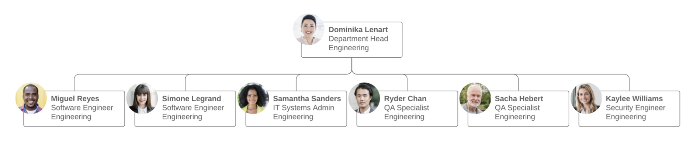

| Pros                                                      | Cons                                                                             |
|:----------------------------------------------------------|----------------------------------------------------------------------------------|
| Gives employees more responsibility                       | Can create confusion since employees do not have a clear supervisor to report to |
| Fosters more open communication                           | Can produce employees with more generalized skills and knowledge                 |
| Improves coordination and speed of implementing new ideas | Can be difficult to maintain once the company grows beyond start-up status       |

##### 4. Divisional org structure

* In divisional organizational structures, a company's **divisions**
**have control** over their own **resources**, essentially operating
like their own company within the **larger organization**.
* Each division can have its own **marketing** team, **sales** team, **IT**
team, etc.
* This structure works well for large companies as it **empowers**
the various **divisions** to **make decisions** without everyone
having to report to just a **few executives**.
* Depending on the organization's focus, there's a few **variations**
to consider.

| Pros                                                                | Cons                                                                                      |
|---------------------------------------------------------------------|-------------------------------------------------------------------------------------------|
| -Helps large companies stay flexible                                | Can easily lead to duplicate resources                                                    |
| Allows for a quicker response to industry changes or customer needs | Can mean muddled or insufficient communication between the headquarters and its divisions |
| Promotes independence, autonomy, and a customized approach          | Can result in a company competing with itself                                             |

###### 4.1 Market-based divisional org structure

Divisions are separated by **market**, **industry**, or **customer type**.
A large consumer goods company, like Target or Walmart,
might separate its durable goods (clothing, electronics,
furniture, etc.) from its food or logistics divisions.

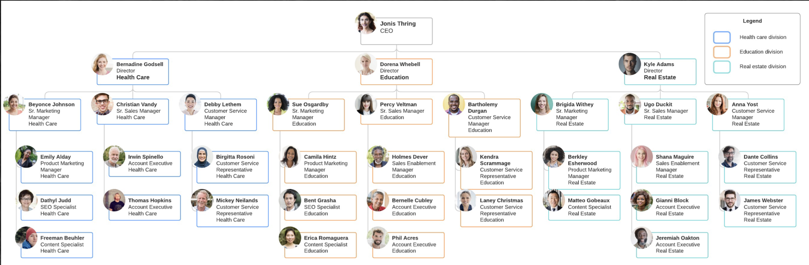

##### 4.2 Product-based divisional org structure

Divisions are separated by **product line**. For example, a **tech company** might have a division dedicated to its **cloud offerings**, while the rest of the divisions focus on the **different software offerings** - e.g., **Adobe** and its creative suite of Illustrator, Photoshop, InDesign, etc.

##### 4.3 Geographic divisional org structure

Divisions are separated by **region**, **territories**, or **districts**, offering **more effective localization** and logistics. Companies might establish **satellite offices** across the country country or the globe in order to stay **close to their customers**.

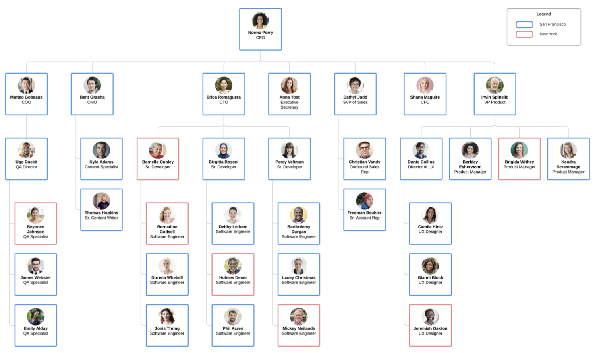

##### 5. Matrix org structure

A matrix organizational chart looks like a **grid**, and it shows **cross functional teams** that form for **special projects**. For example, an **engineer** may regularly belong to the **engineering department** (led by an engineering director) but work on a **temporary project** (led by a project manager). The matrix org chart accounts for both of these roles and reporting relationships.

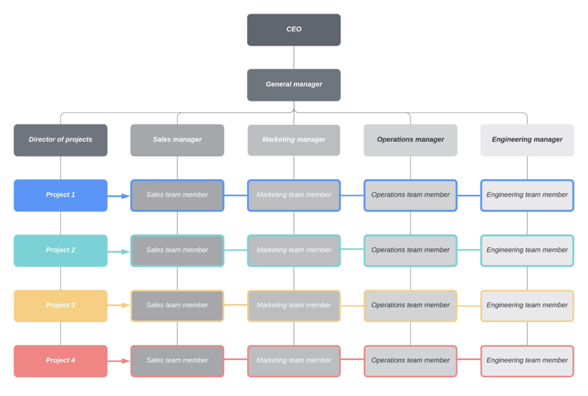

| Pros                                                                                           | Cons                                                                 |
|------------------------------------------------------------------------------------------------|----------------------------------------------------------------------|
| Allows supervisors to easily choose individuals by the needs of a project                      | Presents a conflict between department managers and project managers |
| Gives a more dynamic view of the organization                                                  | Can change more frequently than other organizational chart types     |
| Encourages employees to use their skills in various capacities aside from their original roles |                                                                      |

##### 6. Team-based org structure

It'll come as no surprise that a team-based organizational structure **groups employees** according to (what else?) teams - think **scrum teams** or tiger teams. A team organizational structure is meant to **disrupt the traditional hierarchy**, focusing more on **problem solving, cooperation**, and giving **employees more control**.

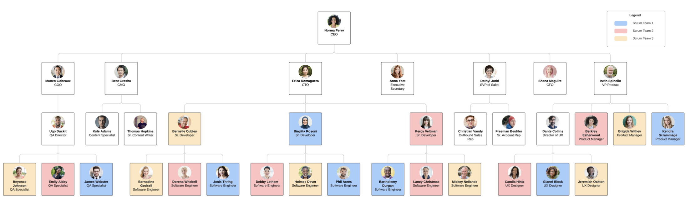

| Pros                                                                         | Cons                                                                                |
|------------------------------------------------------------------------------|-------------------------------------------------------------------------------------|
| Increases productivity, performance, and transparency by breaking down silos | Goes against many companies' natural inclination of a purely hierarchical structure |
| Changes the traditional career models by getting people to move laterally    | Might make promotional paths less clear for employees                               |
| Values experience rather than seniority                                      |                                                                                     |
| Requires minimal management                                                  |                                                                                     |
| Fits well with agile companies with scrum or tiger teams                     |                                                                                     |

##### 7. Network org structure

* These days, few businesses have all their **services under one roof**, and juggling the **multitudes of vendors**, **subcontractors**, **freelancers**, **offsite locations**, and **satellite offices** can get confusing.
* A network organizational structure makes sense of the **spread of resources**. It can also describe an **internal structure** that focuses more on **open communication** and **relationships** rather than **hierarchy**.

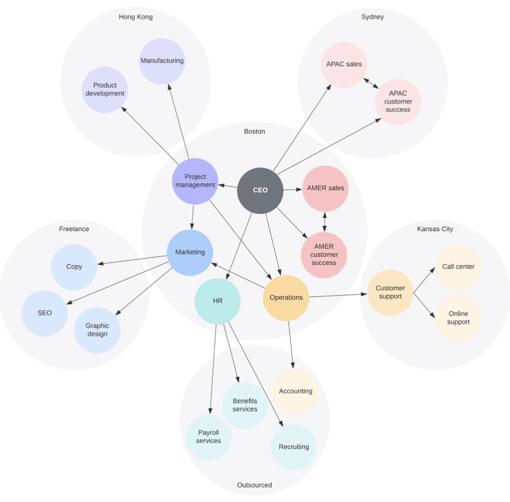

| Pros                                                                                  | Cons                                                                          |
|---------------------------------------------------------------------------------------|-------------------------------------------------------------------------------|
| Visualizes the complex web of onsite and offsite relationships in companies           | Can quickly become overly complex when dealing with lots of offsite processes |
| Allows companies to be more flexible and agile                                        | Can make it more difficult for employees to know who has final say            |
| -Give more power to all employees to collaborate, take initiative, and make decisions | 
Helps employees and stakeholders understand workflows and processes           |
                                                                                                                                                            

#### Jack Welsh on Leadership

1. Fire the loosers
2. It's all about **communication**
3. It's all in the execution (just f*** do it)
4. Build great teams
5. Give your team a vision
6. Change (what's in for those who are affected by the changes - no one likes change) 
7. Have a generosity gene (don't be jealous if a subordinate makes more money than you do)
8. Be yourself (authentic)
9. Get rid of the clutter (just like playing curling - broom)
10. Change lives (make sure it matters what you do)

### 3. Communication

Designs own communication behavior consciously and according to the situation and establishes an appreciative communication culture in the team.

#### Knowledge required for action

Designs own **communication behavior** consciously and according to the **situation** and establishes an **appreciative communication culture** in the team.

* Knows **basic communication models** (e.g. **four ears model** according to
Schultz von Thun, **non-violent communication** according to B.
Rosenberg) and can explain their **significance** for one's own
**communication behavior**.
* Knows the **rules** for **giving** and **receiving feedback**.

#### Communication

* Even if communication partners speak the **same language** it is not always possible to **avoid misunderstanding**.
* **Verbal messages** are **not** as **simple** and **plain** as they sometimes seem to be.

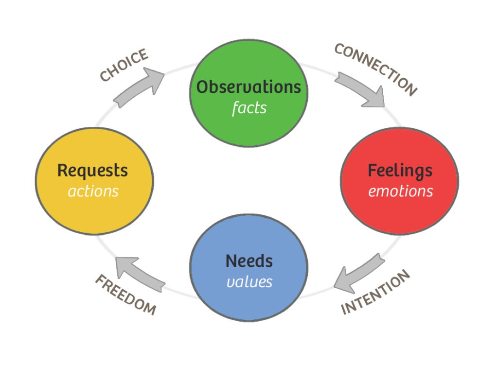
*Nonviolent Communication -(Rosenberg)*

#### Four Ear Model (F. Schulz von Thun)

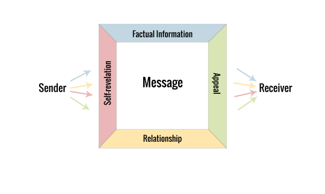
*Four Ear Model - (Schultz von Thun)*

* A **classical model** by the German psychologist and communication expert **Friedemann Schulz von Thun** shows that **every verbal expression** has **four "sides"** that have to be respected and taken into consideration.
* Neglecting some of these sides **increases the risk** that **sender** and **receiver** of the message **misunderstand** each other.
* This is particularly true when sender and receiver come from **different cultural backgrounds**, for example when volunteers work with refugees and asylum seekers.

##### The Model

* The **model** says that every **message** has **four facets**, though not the same emphasis might be put on each.
* A message (**communication**) can therefore be sent as well as received as one of the **four sides of information**.
* The model has **two personas** and a couple of elements:
    * **The Sender**: The person delivering a message, i.e. saying/writing something
    * **The Receiver**: The person receiving a message, i.e. listening/reading
    * **The Message**: What is being said - the actual spoken or written words (if there was a recording everyone would hear the same words)

###### The four sides of the message

* The four sides are types of "**hidden**" or "**implicit**" information involved in the message.
* They comprise the **sender's intention** and the **receiver's perception**.
    * **Factual Information:** Objective or matter of fact information, such as facts and data
    * **Appeal:** Desire, advice, instructions, commands that the sender is intending
    * **Relationship:** Information on the relationship between sender and receiver; how they get along; what they think of each other
    * **Self-Revelation:** Implicit information (conscious or intended) about the sender; his motives, values, emotions, likes/dislikes, etc.

###### Beaks and Ears

* Metaphorically we can speak of **four beaks** through which the **sender speaks**.
* As the receiver you listen through one of **four ears**.

###### Example

A volunteer helper, female, 60 years old (sender), talks to an
asylum seeker, male, 23 years old (receiver).

* She asks: "Did you go to the employment agency?"
* Here the four sides of the sender's message:
    * **Factual information**: I would like to know if you were at the employment agency.
    * **Self-revelation**: I would like to be informed about your activities.
    * **Relationship**: I care for your integration/ I am interested in your activities/ I want to control you.
    * **Appeal**: You should go to the employment agency!

* And the four sides of the message the **receiver hears**:
    * **Factual information**: She wants to know if I went to the employment agency.     
    * **Self-revelation**: She wants to be informed/ she is impatient.
    * **Relationship**: She is interested in my integration/ she cares for me/ she gives orders to me/ she thinks that I am lazy.
    * **Appeal**: Go to the employment agency!

* Maybe the **sender** wants to **express interest** and **sympathy** whereas the **receiver** hears **impatience**, **control** and **orders**.
* His reply then can be: "This is not your business!"
* The example shows that sender and receiver championed the **art of misunderstanding** each other.
* It also shows that every conversation carries a huge **potential** of **misunderstanding**, particularly in **intercultural contexts** and situations.

#### Non-violent communication (NVC)

* **NVC** is an approach to **nonviolent living** developed by **Marshall Rosenberg** beginning in the 1960s.
* NVC is based on the **assumption** that **all human beings** have capacity for **compassion** and **empathy** and that people only resort to violence or behavior harmful to others when they do not **recognize** more **effective strategies** for **meeting needs**.
* NVC proposes that people should **identify shared needs**, which are revealed by the **thoughts** and **feelings surrounding** these **needs**, and then they should **collaborate** to **develop strategies** and **make requests of each other** to meet each other's needs.
* The goal is **interpersonal harmony** and learning for future cooperation.

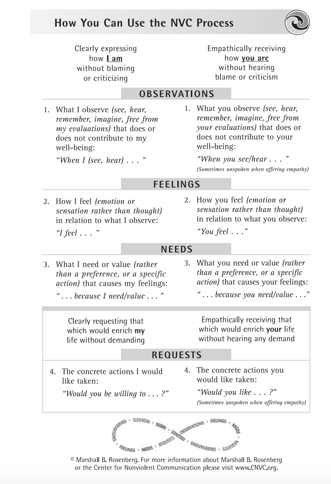

#### Some Rules for Effective Feedback
* **Ask permission** to provide feedback (potentially drop the issue if answered no)
* Be **timely** (feedback as close as possible to the **time** the **behavior occurred**)
* Be **specific** (explain **specifically** what you **like** or **want changed** in a person's behavior)
* Concentrate on **behaviors** (rather than **emotions** that one cannot control)
* Describe what you've **seen**, not what **others told you** (avoid the question "Who told you that!?")
* **Respect** the **person's privacy** (don't provide feedback publicly)

#### The Pendleton Method of Giving Feedback

1. **Ask** vour **staff member** or **volunteer** to **tell** you what they **think went well** / they did well.
    * Sometimes people struggle with this step. They might shrug their shoulders or use a phrase like "**I Don't Know**" or "**Nothing Much**". Don't let them off the hook. Thev need to find at least one thing they thought **went well** - no matter how small.
2. **Acknowledge** those **successes** and then **add** to them by saying "What I thought went well / you did well was..."
    * Reflect on the successes that they share, but then make a real effort to find other examples of things that went well. This shows your staff member or volunteer that you notice everything - not just the areas that need improvement.
3. **Ask** your **staff member** or **volunteer** if there was anything they would do **differently** next time.
    * Notice this question is not about what went wrong or what they could do better, it is simply about what they could do differently. This removes an judgement and makes the question simply about exploring options.
4. **Acknowledge** their **ideas** and add to them by saying "What I might have tried / done differently was.."
    * Providing examples of how you might do something simply adds to the options for next time. You are not necessarily saying this is the only way to do something, but you are suggesting it might be something worth trying.

* The Pendleton Method is a simple way to give feedback in a constructive manner

**The 4 steps are:**
1. **Ask** vour **staff member** or **volunteer** to **tell** you what they **think went well** / they did well.
2. **Acknowledge** those **successes** and then **add** to them by saying "What I thought went well / you did well was..."
3. **Ask** your **staff member** or **volunteer** if there was anything they would do **differently** next time.
4. **Acknowledge** their **ideas** and add to them by saying "What I might have tried / done differently was.."

> One of the things that makes this method of feedback **effective**, is that it gives staff members or volunteers an opportunity to carry out their **own reflection first**.
> In doing this, they will often **highlight areas** one wants to address and it makes it much **easier** to **offer constructive feedback** and **suggestions**.

### 4. Team Building and Roles

Actively promotes the team building process and facilitates role clarification within the team.

#### Knowledge Needed for Action

Actively **promotes** the **team building process** and facilitates role clarification within the team.

1. Knows the **difference** between a **group** and a **team**.
2. Knows the **five phases of team building** according to **Tuckman** (Forming, Storming, Norming, Performing, and Adjourning) and can explain the **characteristics** of each phase.
3. Knows **role models** in a team (e.g., **team roles** according to **Belbin**), knows the difference between performing a role (role making) and **actively assuming a role** (role taking), and can explain the importance of **role composition** to performance in a team.

#### 4.1 Difference between a Group and a Team

* A *group* is a **collection of individuals** who **coordinate their individual efforts**.
* A *team* is a **group of people** who **share a common team purpose** and a number of challenging goals. Members of the team are **mutually committed** to the **goals** and to each other. This mutual commitment also creates **joint accountability** which creates a **strong bond** and a **strong motivation** to perform.
* The *purpose* must be **worthwhile** and **create a sense of doing something important** together.
* The *goals* must be **challenging** and **specific** so that each member can understand how they contribute to the success of the team.
* A well-defined *strategic plan* outlining the **purpose**, **values**, **goals** and **objectives** of the team becomes the glue that binds the group together and helps transform them into a team.
* **Participation** in **developing** that **plan** helps to build understanding, consensus, and commitment.
* As a **leader**, you use the plan to **set expectations** for **individuals** and the **team** as a whole.
* The *power of a team* emerges from the **sense of community** that develops and exerts strong influence on the attitudes and behaviors of the participants.
* **Peer pressure** and a **desire** to be a **productive member** of the team helps to **shape priorities** and **direct efforts** where they will support the **team goals**.
* As a *leader*, you are no longer limited to **managing individuals**. You have an opportunity to **manage the team** as a whole and enlist the **support of the team** to help **manage the individuals**.

#### 4.2 Knows the five phases of team building according to Tuckman 

As the team develops maturity and ability, relationships establish, and the **leader** changes leadership style - beginning with a **directing style**, moving through coaching, then **participating**, finishing **delegating** and almost **detached**.

The progression is:
1. Forming
2. Storming
3. Norming
4. Performing
5. (Adjourning)

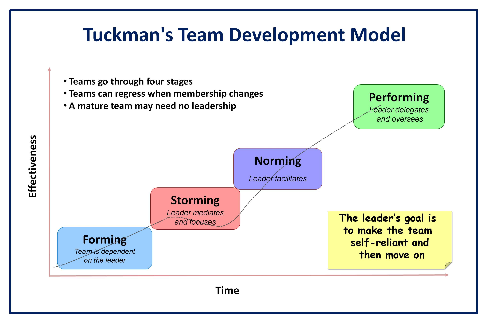

##### 1. Forming

* **High dependence on leader** for guidance and direction
* **Little agreement** on **team aims** other than received from leader
* Individual **roles** and **responsibilities** are **unclear**
* **Leader answer** lots of **questions** about the team's purpose, objectives and external relationships
* **Processes** are often **ignored**
* Members **test tolerance** of **system** and **leader**
* *Leader* **directs**

##### 2. Storming

* **Decisions** don't come easily within group
* **Team members** vie for **position** as they attempt to establish themselves in relation to other team members and the leader, who might receive **challenges** from team members
* **Clarity of purpose increases** but plenty of uncertainties persist
* **Cliques** and **factions form** and there may be **power struggles**
* The **team** needs to be **focused on** its **goals** to avoid becoming distracted by relationships and emotional issues
* **Compromises** may be required to enable progress
* *Leader* **coaches**

##### 3. Norming

* **Agreement** and consensus is largely formed **among team**, who respond well to **facilitation by leader**
* Roles and responsibilities are clear and accepted
* **Big decisions** are made by **group agreement**; smaller decisions may be delegated to individuals or small teams within group
* **Commitment** and **unity** is strong
* The team discusses and develops its **processes** and working style
* *Leader* **facilitates and enables**

##### 4. Performing

* **Team** has a **high degree of autonomy**
* **Disagreements** occur but now they are **resolved** within the **team** positively and necessary changes to processes and structure are made by the team
* Able to work towards **achieving the goal**, and also to attend to relationship, style and process issues along the way
* Requires **delegated tasks** and projects from the leader
* Might ask for **assistance from the leader** with personal and interpersonal development
* *Leader* **delegates and oversees**

##### 5. Adjourning

* Once a project ends, the team disbands. This phase is sometimes known as **mourning** because **members** have **grown close** and **feel a loss** now that the experience is over.
* It is, therefore, important to **recognize** the **group members** for their **accomplishments** and **celebrate** the **group's overall success**.
* Members may also feel some **uncertainty** or insecurity about the **future**.
* Team *leaders* and managers can alleviate these feelings through **appropriate plans** for the **transition**.

##### Legacy of Tuckman's Model

* **Tuckman's model** describes the **general stages** that groups move through as they **mature** and **develop**.
* The **5-stage model** reveals what happens from the time a newly formed group gets acquainted until the members become united in their pursuit of a commonly accepted goal.
* The group becomes **better** able to **achieve the desired results** as it moves through the stages. Each stage will vary from group to group, and there is **no firm line between the stages**.
* However, **each stage is necessary** and inevitable in the **development process**.

#### 4.3 Role Models

##### Roles: Definition

* A **role** comprises a **set of patterns of behavior**, **rights**, and **duties** which are **temporarily assigned** to various persons.
* For example, in **different settings** a person will be seen as
    * a **child** when the person is visiting his or her parents,
    * a **student** when he or she is at university,
    * a **discussion member** where he/she can take the role of a facilitator to push the group forward
* The role that one assumes is **dependent** on the **context** of the **social setting** and differ within societies.
* Accordingly, a **set of expectations** are addressed and communicated to the person who assumes the role.

##### Roles are Products of Social Interaction

* **Roles** are also **developed dynamically** in **social systems** by **repetitively perceiving social interaction patterns** and **expectations** (e.g., the moderator, the decision maker, the informal leader, and the opinion leader).
* The **shaping** of **(new) roles** depends on the **characteristics** of the **persons who assume a role** and on **how they play it** (role-making) as well as on those who assign a role to others.
* However, these simply circumscribed **dynamics** are embedded in **complex social structures** within an **organization**, **community**, or **society**

##### Teamwork

* **Teamwork** involves the **interaction of individuals** to a **common purpose** where the **interests of the individual** are **secondary** to **group unity** and the **efficiency** of the group to **perform** the **task** assigned.
* Creating **productive environments** requires workers with **highly developed communication** and **interpersonal skills** and an organizational structure that **promotes collaboration**.
* Teamwork helps accomplish **projects** which are **too complex** for an **individual**. A group approach increases the chances of **detecting flaws** in a **solution** an individual might miss.

##### Belbin Team Roles

* The research of **Dr Meredith Belbin** in the **1970's** lead to the development of Belbin Team Roles, **nine clusters of behavior** that individuals adopt when **participating in a team**.
* During extensive experiments at Henley Management College it became clear that teams **comprising a balanced mix** of Team Roles **outperformed unbalanced teams**.
* Subsequent research has also demonstrated that **teams** consistently **outperform individuals** when dealing with **high risk - high complex issues** where a **wide range** of **complementary behaviors** is **required**.

##### The Nine (9) Belbin Team Roles People

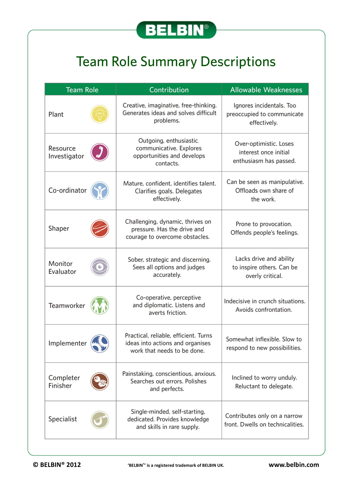

##### Belbin Team Roles

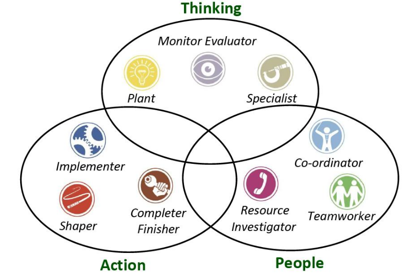

#### Patterns of Role Dynamics

The **most relevant patterns** of role dynamics are role-assignment, role-taking, and role-making which are defined as follows:

1. **Role-assignment**
2. **Role-taking**
3. **Role-making**
4. **Inter-role-conflict**

##### 1. Role-assignment

* There are **various types** of **role-assignments**.
* A person **assigns** a **concrete role** to **another person** by either **urging** him or her to **assume** it. This may happen by **applying means of social sanctions** (e.g., threats of negative consequences).
* Or a person is **allowed by others** to **take a role voluntarily**.
* Furthermore, persons may decide **independently to take over a concrete role** and other people (within the social system) will **agree** more or less **explicitly**

##### 2. Role-taking

* **Role-taking** indicates that a person acts due to the **expectations of a specific role**. These expectations can potentially be **enforced by sanctions** being imposed on the role actor.
* People develop an **individual understanding** regarding the **expectations of a role** - even if they have already taken it - and they are able to reflect on their role. This so-called **role-distance** means looking at one's own way of role-taking at a **remove**.
* Role-distance includes a **competent**, **critical**, **evaluative attitude** toward the **expectations** which **influence a role**. A person need not to stick to a single role but can take several roles or switch between them.

##### 3. Role-making

* **Role-making** characterizes how a person **lives (plays) a role**, and how he or she **transforms the expectations** into **concrete behavior**. Role-making takes place in **social interaction**, where people **"negotiate"** the **expectations** which are significant for a role.
* In general, this **negotiation proceeds implicitly** and is often **not reflected by the actors**.
* The **driving force** of role-making is the **difference** between the **role-taker's individual attitude** toward the role on the one hand and the **expectations** which are assigned to the role by its social context (e.g., given by the society, community, group, or organization).

##### 4. Inter-role-conflict

* If a **person** within a **social network**, organization, or community takes **more than one role** at the same time or switches frequently, a **conflict between** the roles can occur.
* This results from **different demands** on **different roles**.
    * For example, a person takes two roles such as **moderator** and **participant** at the same time.
    * In the first situation, he or she **structures the participants' discussion** and therefore should take a neutral position.
    * In the second role, he or she **provides** his or her **own input** and **argues** for his or her **own opinion**.
    * Thus, there is a **conflict** between the **person's competing interests**.

    
### 5. Motivation

#### Knowledge Needed for Action

Creates the framework for a team to work in a motivated manner.

1. Knows basic models from motivation theory (e.g. Maslow, Herzberg) and can explain their significance for practice.
2. Knows the difference between extrinsic and intrinsic motivation.

#### Introduction to Motivation

* **Motivation** is an **urge to behave or act** in a way that will satisfy certain conditions, such as wishes, desires, or goals.
* Psychologists believe that motivation is **rooted** in a **basic impulse** to **optimize well-being**, **minimize physical pain**, and **maximize pleasure**.
* **Motivations** are commonly **separated** into *drives* (which are primarily biological, like thirst or hunger) and *motives* (which are primarily driven by **social** and **psychological mechanisms**).
* In addition to **biological drives**, motivations can be *intrinsic* (arising from internal factors) or *extrinsic* (arising from external factors).
* In reality, **our motivations** are often a **mix** of both **intrinsic** and **extrinsic** factors, and the nature of the mix can change over time.

#### Drives and Motives

* **Drives** are primarily biological, like thirst, hunger, sleepiness, and the need to reproduce -all of which lead us to seek out and take part in certain activities. Drives are believed to **originate within a person** and may not require external stimuli to encourage behavior.
* **Motives**, on the other hand, are primarily driven by social and psychological mechanisms, such as **work**, **family**, and **relationships**. They include factors like **praise** and **approval**.
* Both drives and motives can be **manipulated** by **stimulation** and **deprivation**. Motivation can be stimulated by **uncomfortable** or **aversive conditions** or events (shocks, loud noise, or excessive heat or cold can motivate us to seek better conditions) or by **attractions** to **positive or pleasurable conditions** or events (such as food or sex).

#### Motivation vs. Emotion

* While **motivation** and emotion can be intricately linked, they are two **fundamentally different things**.
* **Motivation** describes the **wants** or **needs** that direct behavior toward a **goal**; in contrast, an **emotion** is a **subjective state** of being that we often describe as a **feeling**.
* Emotion and motivation are **linked** in several ways: both **influence behavior** and can lead us to **take action**, and emotion itself can act as a **motivator**.
* For example, the **emotion of fear** can **motivate** a person to **leave** a stressful situation, while the **emotion of happiness** can motivate a person to be more **productive** on a project that reinforces that emotion.

#### Some Motivation Models

1. Maslow's Need Hierarchy Theory
2. Herzberg's Motivation Hygiene Theory
3. McClelland's Need Theory
4. McGregor's Participation Theory
5. Urwick's Theory Z
6. Argyris's Theory
7. Vroom's Expectancy Theory
8. Porter and Lawler's Expectancy Theory.

##### Maslow's Need Hierarchy Theory

* **Maslow's theory** is based on the **human needs**. Drawing chiefly on his **clinical experience**, he classified all human needs into a hierarchical manner from the lower to the higher order.
* In essence, he believed that once a **given level of need is satisfied**, it **no longer serves to motivate** man. Then, the **next higher level** of need has to be **activated** in order to motivate the man.
* Maslow identified **five levels** in his need hierarchy

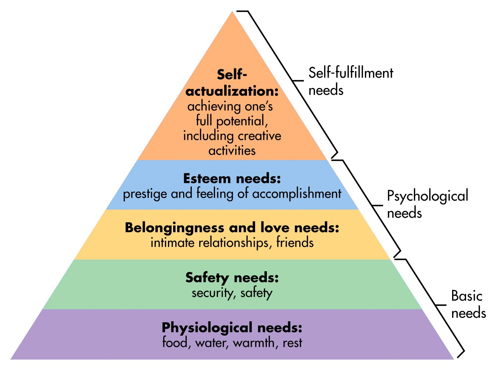

###### 1. Physiological Needs

* These needs are basic to **human life** and, hence, include **food**, clothing, shelter, air, water and necessities of life.
* These needs relate to the **survival** and **maintenance of human life**.
* They exert **tremendous influence** on **human behavior**.
* These needs are to be **met first** at least **partly** before higher level needs emerge.
* Once **physiological needs are satisfied**, they **no longer motivate** the man.

###### 2. Safety Needs

* After satisfying the **physiological needs**, the next needs felt are called **safety** and **security needs**.
* These needs find expression in such desires as **economic security** and **protection from physical dangers**.
* Meeting these needs requires more **money** and, hence, the **individual is prompted to work more**.
* Like physiological needs, these **become inactive** once they are **satisfied**.

###### 3. Social Needs

* **Human** being is a **social being**.
* He is, therefore, interested in **social interaction**, **companionship**, **belongingness**, etc.
* It is this socializing and belongingness why individuals prefer to work in **groups** and especially **older people** go to work.

###### 4. Esteem Needs

* These needs refer to **self-esteem** and **self-respect**.
* They include such needs which indicate **self-confidence**, **achievement**, **competence**, **knowledge** and **independence**.
* The **fulfillment** of esteem needs leads to **self-confidence**, **strength** and **capability** of being **useful in the organization**.
* However, **inability** to fulfill these needs results in feeling like **inferiority**, **weakness** and **helplessness**.

###### 5. Self-Actualization Needs

* This level represents the **culmination of all the lower**, intermediate, and higher needs of human beings.
* In other words, the final step under the need hierarchy model is the need for self-actualization. This refers to **fulfillment**.
* -The term self-actualization was coined by *Kurt Goldstein* and means to **become actualized** in what one is **potentially good at**. In effect, self- actualization is the person's motivation to **transform perception** of self into **reality**.

###### Main Criticisms of the Theory

1. The needs may or may not follow a **definite hierarchical order**. So to say, there may be **overlapping in need hierarchy**. For example, even if **safety need** is not satisfied, the **social need** may emerge.
2. The need priority model may not apply **at all times in all places**.
3. Researches show that man's behavior at any time is mostly guided by **multiplicity of behavior**. Hence, Maslow's preposition that one need is satisfied at one time is also of doubtful validity.
4. In case of some people, the **level of motivation** may be **permanently lower**. For example, a person suffering from chronic unemployment may remain satisfied for the rest of his life if only he/she can get **enough food**.

##### Herzberg's Motivation Hygiene Theory

* The **psychologist Frederick Herzberg** extended the work of **Maslow** and proposed a new motivation theory popularly known as Herzberg's Motivation Hygiene (**Two-Factor**) Theory.
* Herzberg conducted a widely reported motivational study on **200 accountants** and **engineers** employed by firms in and around Western Pennsylvania.
* The main use of his recommendations lies in **planning** and **controlling** of employees work.

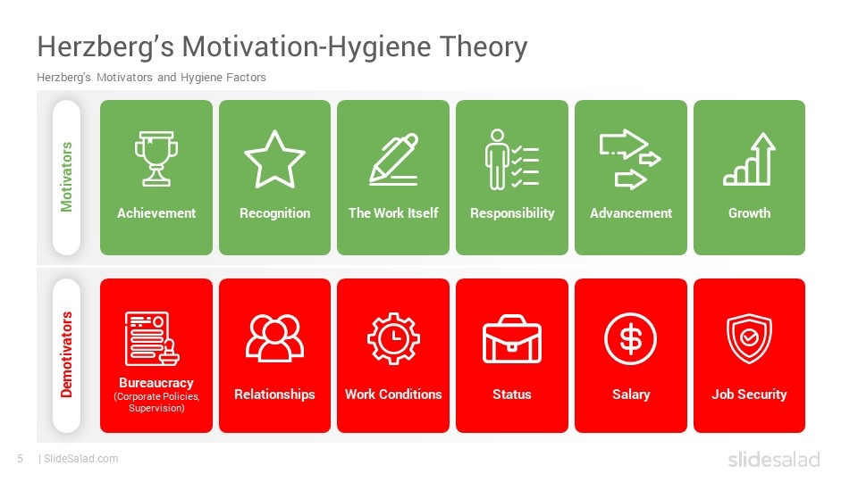

* *Key questions* Herzberg asked:
    1. When did you feel particularly **good** about your **job**
    2. When did you feel exceptionally **bad** about your **job**

* Reported **good feelings** were generally associated with **job satisfaction**, whereas **bad feeling** with **job dissatisfaction**.
* Herberg labelled the job **satisfiers** *motivators*, and he called job **dissatisfies** *hygiene* or *maintenance factors*.
* Taken together, the **motivators** and **hygiene factors** have become known as **Herzberg's two-factor theory of motivation**
* According to Herzberg, the **opposite** of **satisfaction** is **not dissatisfaction**.
* The underlying reason, he says, is that **removal of dissatisfying characteristics** from a job does not necessarily make the job satisfying.
* He believes in the existence of a *dual continuum*. The opposite of '**satisfaction**' is '**no satisfaction**' and the opposite of '**dissatisfaction**' is '**no dissatisfaction**'

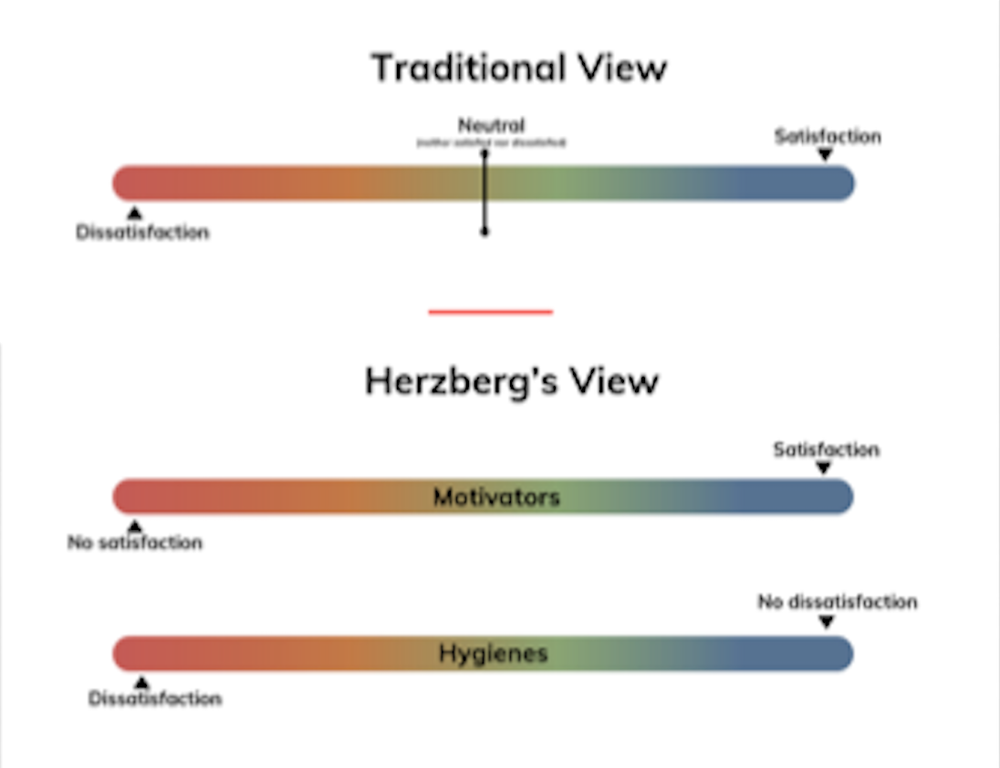

###### Criticism

* People generally tend to take **credit themselves** when things go **well**. They **blame failure** on the **external environment**.
* The theory basically explains **job satisfaction**, **not motivation**.
* Even job satisfaction is not measured on an **overall basis**. It is not unlikely that a person may **dislike part** of his/ her job, still thinks the **job acceptable**.
* This **theory neglects situational variable** to motivate an individual.

##### Intrinsic Motivation

* **Intrinsically-motivated behaviors** are generated by the **sense of personal satisfaction** that they bring. They are **driven by** an **interest** or **enjoyment** in the **task itself** that comes from the **individual**, not society.
* For example, if you are in **college** because you **enjoy learning** and want to make yourself a more **well-rounded individual**, you are **intrinsically motivated**.
* Intrinsic motivation is a critical element in cognitive, social, and physical development; those individuals who are **intrinsically motivated** are likely to **perform better** and **improve their skills** at a given task.

##### Extrinsic Motivation

* **Extrinsically-motivated behaviors**, in contrast, are performed in order to **receive something from others**. They do not come from within the individual, but from society-other people.
* For example, **employees** might do their **work** because they want the company to **pay** them, not because they **love the work**. Many athletes are driven by the **goal of winning**, **beating the competition**, and **receiving praise** from fans; they are not driven by the intrinsic satisfaction they get from playing the sport.
* Similarly, if you are in **college** because you want to make yourself more **marketable** for a **high-paying career** or to **satisfy the demands** of your **parents**, then your motivation is more extrinsic in nature.

### 6. Conflict Management

#### Knowledge required for action

* Recognizes **potential for conflict** and **conflict within the team**
and initiates appropriate **measures** to **prevent**, defuse or
clarify it.
    1. Knows the **characteristics** and **dynamics** of **conflict**.
    2. Knows **measures for conflict prevention** and **conflict management**.

##### Conflicts

* **Workplace conflicts** occur because team members don't always **agree** or know how to work together despite their differences.
* These differences could be in the way they **manage their tasks**, **their work styles** or **personalities**.
* For a **team** to **work** together **effectively**, conflicts need to be **resolved** in a **timely** and **professional manner** that **minimizes disruption** to productivity.
* The ability to **resolve team conflicts** is crucial to the success of any organization.

##### Team Conflicts

* **Team conflicts** arise when there are **disagreements** over their **goals**, **methods** or **needs** of the team.
* Conflicts can also occur when there are differing **personalities**. At first, these conflicts may seem commonplace, but failing to resolve them could hurt productivity and overall morale.
* Addressing disagreements and coming to a **mutual understanding** allows everyone to **collaborate productively**.
* **Conflict resolution** is a **valuable leadership skill**. Individuals with the ability to **recognize conflicts**, **acknowledge differences** and find **quick** and **peaceful resolution** are essential to any organization.

##### Types of Team Conflicts

1. Task-based conflicts
2. Leadership conflicts 
3. Work style conflicts 
4. Personality clashes

###### 1. Task-based conflicts

* **Task-based conflicts** occur in situations when **team members rely on each other** to complete a task or project.
* When one person on the team doesn't complete their part of the task, it can **affect another team member's ability** to **finish their part** on time.
    * For example, if an employee always turns in their reports late, it causes the accountant to be late with their reports as well.
* To **avoid** these **conflicts**, make sure everyone on the team knows what they should be doing in their **position** so tasks can be **accomplished efficiently** and on **deadline**.

###### 2. Leadership conflicts

* Some conflicts occur because of **differences in leadership styles**.
* Everyone has their **own way of leading their teams**. Some leaders are **directive**, while others are **more open, inclusive** and **encourage collaboration** with their team.
* To prevent leadership style conflicts, it's important to **recognize** and **appreciate** these **differences** throughout the team.
* It may be necessary to **make adjustments** to ones leadership style to **accommodate** the **different needs** and **personalities** of your **team members**.

###### 3. Work style conflicts

* Just as there are differences in leadership styles, there are **differences** in **work styles** as well.
* Work style conflicts occur because team members have **different preferences** on how to **accomplish tasks**.
    * Some **work quickly** and move onto the next task as soon as possible, while others prefer to complete tasks slowly and mindfully.
    * Some people are **self-starters** who require **little to no direction** to finish a task, and others need guidance every step of the way.
* The best way to **avoid** these types of **conflicts** is to recognize that everyone's **work style is different** and find ways to **collaborate** to achieve the **same goal** despite those differences.

###### 4. Personality clashes

* **Personality clashes** are some of the **most common types** of team conflicts.
* These types of conflicts are caused by **differences in personality** among team members.
* You're not always going to get along with or like every person you meet, whether they're your coworker, supervisor or peer. It can be **challenging** to work with someone whose personality disagrees with your own.
* However, it's important to **try to understand** their differences and learn how to work together **productively**.

##### Managing & Avoiding Conflicts

* **Conflict** can be **healthy** and lead to **growth** both **individually** and **externally**.
* Sometimes our relationships both with others and ourselves deepen after conflict but it does take a few important **ingredients** for this to happen.

##### Key Lessons Learned

* Practice **reflection** after conflict. What you did well, what you could improve on. Recognize what aspects of the issue are yours, what are theirs. The more you practice self-reflection the more **self-aware** and **prepped** for **future conflict** you can be.
* **Reflect** on where the **real issue** lies and why you feel the way you feel. This may be helpful both before and after the conflict. Sometimes we can intentionally or unintentionally cover up **primary emotions** (more vulnerable emotions such as sadness, hurt, fear, shame) that are uncomfortable with more reactive **secondary emotions** (reactive- anger, frustration, jealousy).
* You are allowed to feel what you feel, your **feelings** are **important**, as are everyone's. Being angry or upset in conflict can be helpful. What matters is HOW you communicate your feelings, doing it respectfully, not attacking and being honest.
* If you go into conflict **blaming** the other person, they will most likely get **defensive** and effective conflict management is very unlikely. Blaming can lead to **power imbalances** in the relationship and disempower people, which can lead to a build up of **resentment**.
* Try to focus on **blame behavior** not the individual. When people have clear examples of behaviors that they engage in and how this affected you it is easier for them to understand.
* Try to be **open** and **understand** where the other person is coming from and reflect your understanding to them.
* **Owning** your own **emotions**. No one has made you feel this way, this is how your brain has **interpreted** the event. Of course, it is important to acknowledge that events/people can certainly have a large influence over your feelings but still, your **brain** is the **filter** for how you **interpret** this **information**.
* **Compromise** where possible.
* Sometimes the **conflict won't get resolved**. But, how you manage the conflict and your courage to be assertive is a huge growth opportunity that you can reflect on and be proud of.

### 7. Change Management

#### Knowledge required for action

* Plans change processes and supports those affected in reducing resistance and managing change.
    1. Knows typical phases in change processes and can explain the characteristics of the phases.
    2. Knows the success factors (e.g., awareness of urgency, quick wins, communication) and risks in change processes.
    3. C. Knows typical signs of anxiety and resistance and can explain appropriate approaches for dealing with them.

#### Change Management (Kotter)

1. Creating an **Urgency** (Burning Platform)
2. Forming Powerful Guiding **Coalitions**
3. Developing a **Vision** and a **Strategy**
4. **Communicating** the Vision
5. Removing **Obstacles**
6. Creating **Short-Term Wins**
7. Consolidating **Gains**
8. **Anchoring Change** in the Corporate Culture

##### 1. Creating an Urgency (Burning Platform)

* Identifying and highlighting the potential threats and the repercussions which might crop up in the future.
* Examining the opportunities which can be tapped through effective interventions.
* Initiate honest dialogues and discussions to make people think over the prevalent issues and give convincing reasons to them.
* Request the involvement and support of the industry people, key stakeholders and customers on the issue of change.

