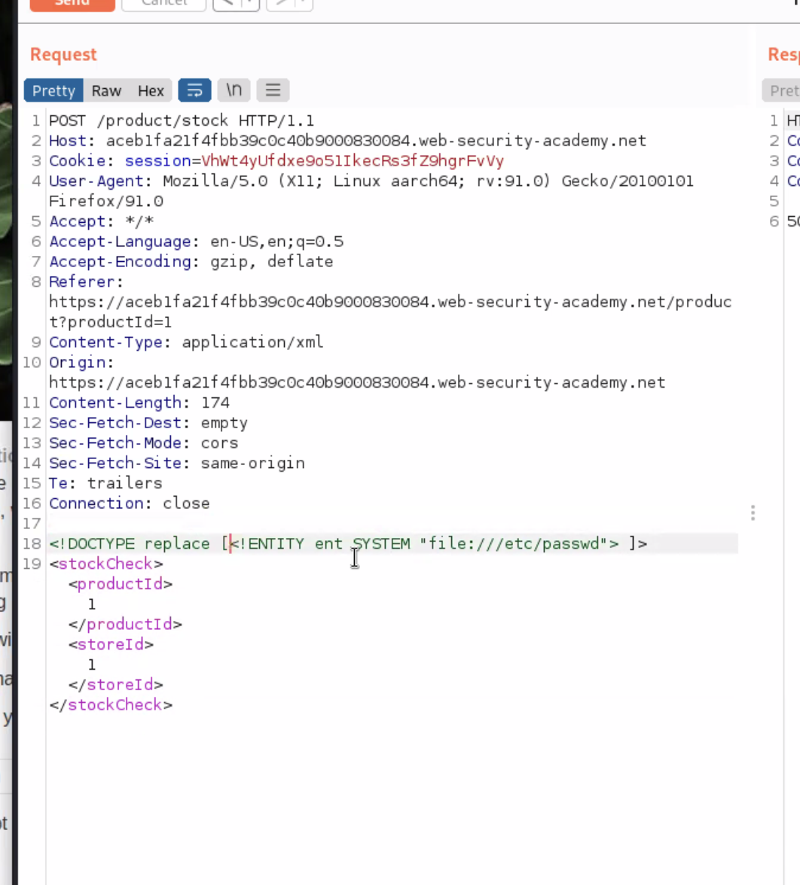

# Web Application Penetration Testing

## ⭐️ Useful Tools

* [sqlmap](../../Tools/sqlmap/README.md) - Detecting and exploiting SQL injection flaws and taking over of database servers

## Access control vulnerabilities

## Cross-origin resource sharing (CORS)

## Cross-site scripting

## Cross-site request forgery (CSRF)

## Insecure deserialization

## DOM-based vulnerabilities

## Directory traversal

## File upload vulnerabilities

## HTTP Host header attacks

## Information disclosure

## Business logic vulnerabilities

## OAuth authentication

## HTTP request smuggling

## Server-side template injection

* [SSTI Payloads on GitHub](https://github.com/payloadbox/ssti-payloads)

## SQL injection

### Cheat Sheet's
* [PortSwigger's SQL injection cheat sheet](https://portswigger.net/web-security/sql-injection/cheat-sheet)

### Payload
* [SQL Injection Payload List on GitHub](https://github.com/payloadbox/sql-injection-payload-list)

### Tools
* ➡️ [sqlmap](../../Tools/sqlmap/README.md)

### Articles
*  [SQL injection UNION attacks @ portswigger.net](https://portswigger.net/web-security/sql-injection/union-attacks)
*  [SQL injection UNION attack @ medium.com](https://medium.com/@nyomanpradipta120/sql-injection-union-attack-9c10de1a5635) 

## Server-side request forgery (SSRF)

## Authentication

## Web cache poisoning

## XML external entity (XXE) injection

* [XXE Injection Payload List on GitHub](https://github.com/payloadbox/xxe-injection-payload-list)

https://github.com/payloadbox/xxe-injection-payload-list

